# Cloud Architect Documentation 

The Cloud Architect is responsible for designing and implementing scalable, reliable, and cost-effective cloud solutions that align with business and user needs. The role encompasses architecture design, infrastructure setup, collaboration with the team on implementation plans, and ensuring proper documentation throughout the project lifecycle.

---

## BigDawgBank Functional and Non-Functional Requirements

### Functional Requirements (FR)

The following functional requirements outline the behavior and features of the IE Bank Application. Each requirement is linked to the respective user story and associated test cases where applicable.

---

#### FR01: Default Admin Account
**Requirement:** The application must provide a default administrator account (username and password) upon system setup.  
**User Story:** As an admin, I want a default admin account to be created during system setup so that I can log in and start managing the system immediately.    

---

#### FR02: Admin User Management
**Requirement:** The admin portal must allow administrators to create, update, delete, and list user accounts.  
**User Story:** As an admin, I want to create, update, and delete user accounts so that I can manage access to the system.   

---

#### FR03: Password Reset for Users
**Requirement:** Administrators must be able to reset user passwords to assist users who cannot log in.  
**User Story:** As an admin, I want to reset user passwords so that I can assist users who cannot log in.    

---

#### FR04: Role and Permissions Management
**Requirement:** Administrators must be able to assign roles and permissions to users to control access to specific system parts.  
**User Story:** As an admin, I want to assign roles and permissions to users so that I can control their access to different parts of the system.  

---

#### FR05: New User Registration
**Requirement:** New bank users must be able to register using a registration form (username, password, and password confirmation). A default account with a random account number must be created upon successful registration.  
**User Story:** As a new user, I want to register for an account so that I can access the system.
- **Test:** [test_create_user](https://github.com/bigdawgbank/ie-bank/blob/main/backend/tests/unit/test_auth_model.py) 

---

#### FR06: Invalid Repeated Email Check
**Requirement:** The system must reject accounts that are created with the same email as another.  
**User Story:** As an admin, I want users who are creating more than one user to not be allowed the use of the same email when creating another one.  
- **Test:** [test_user_unique_email](https://github.com/bigdawgbank/ie-bank/blob/main/backend/tests/unit/test_auth_model.py)  
- **Test:** [test_register_duplicate_user](https://github.com/bigdawgbank/ie-bank/blob/main/backend/tests/functional/test_auth.py#test_register_duplicate_user)  

---

#### FR07: Multiple accounts per User
**Requirement:** The system must allow users to create more than one account under the assumption that they use different emails for the new accounts.  
**User Story:** As a user, I want to ensure that I can register multiple bank accounts to the system so I can better handle my finances.  

---

#### FR08: Secure User Login
**Requirement:** Bank users must log in securely using their username and password to access their accounts.  
**User Story:** As a user, I want to log in securely so that I can access my account.
- **Test:** [test_protected_route](https://github.com/bigdawgbank/ie-bank/blob/main/backend/tests/functional/test_auth.py)
- **Test:** [test_authentication_required](https://github.com/bigdawgbank/ie-bank/blob/main/backend/tests/functional/test_auth.py) 
- **Test:** [test_login_failure](https://github.com/bigdawgbank/ie-bank/blob/main/backend/tests/functional/test_auth.py)  

---

#### FR09: View Account and Transactions
**Requirement:** Bank users must view their accounts and associated transactions after logging in.  
**User Story:** As a user, I want to view my account details and recent transactions so that I can manage my finances effectively.  
**Test:**  To be Added!

---

#### FR10: Money Transfer
**Requirement:** Bank users must be able to transfer money to other accounts by entering the recipient’s account number and transfer amount. The transfer amount must not exceed the available balance.  
**User Story:** As a user, I want to transfer money to other accounts so that I can make payments easily.  
- **Test** [test_bank_transfer_process_route](https://github.com/bigdawgbank/ie-bank/blob/feat/money-transfer/backend/tests/functional/test_routes.py#test_bank_transfer_process_route)
- **Test** [test_bank_transfer_object_process](https://github.com/bigdawgbank/ie-bank/blob/feat/money-transfer/backend/tests/unit/test_bank_transfer_object.py)

---

#### FR11: Secure Password Handling
**Requirement:** All user passwords must be hashed and stored securely to prevent data breaches.  
**User Story:** As a developer, I want all passwords to be securely hashed so that user data is protected from breaches.  
- **Test:** [test_create_user](https://github.com/bigdawgbank/ie-bank/blob/main/backend/tests/unit/test_auth_model.py)  

---

#### FR12: Session Management
**Requirement:** User sessions must expire after inactivity to ensure account security.  
**User Story:** As a user, I want my session to expire after inactivity so that my account remains secure.  

---

#### FR13: Intuitive Admin UI
**Requirement:** The admin portal must have an intuitive UI for efficient user and permission management.  
**User Story:** As an admin, I want a clean and intuitive UI for the portal so that I can efficiently manage users and permissions.  

---

### Non-Functional Requirements (NFR)

The following non-functional requirements define the performance, security, and usability standards for the IE Bank Application. Where applicable, links to potential tests have been suggested.

---

#### NFR01: Basic Authentication
**Requirement:** The web application must implement a basic authentication system requiring username and password login. Credentials must be hashed and encrypted in the database.  
- **Test:** [test_authentication_required](https://github.com/bigdawgbank/ie-bank/blob/main/backend/tests/functional/test_auth.py)  

---

#### NFR02: Simple Frontend Interface
**Requirement:** The web application must have a simple and functional frontend UI without requiring advanced aesthetics or responsiveness.  

---

#### NFR03: System Availability
**Requirement:** The system must achieve 99.95% uptime in the production environment. Downtime should be limited to scheduled maintenance outside peak hours.  

---

#### NFR04: Cost Optimization
**Requirement:** Azure resources must be provisioned with cost-effective configurations, leveraging reserved instances and auto-scaling to manage resource costs.  

---

#### NFR05: Handling Peak Loads
**Requirement:** The system must support up to 500 concurrent users in the production environment without performance degradation.  

---

#### NFR06: Secure Secrets Management
**Requirement:** Secrets such as database connection strings and API keys must be stored securely using Azure Key Vault.  

---

#### NFR07: Logging and Monitoring
**Requirement:** The application must implement robust logging and monitoring through Azure Application Insights, ensuring errors and performance metrics are captured.  

---

#### NFR08: Compliance
**Requirement:** The application must comply with GDPR and other relevant data protection regulations to ensure user data privacy.  

---

#### NFR09: Scalability
**Requirement:** The application must support horizontal scaling for the frontend and backend to accommodate increased user demand.  

---

#### NFR10: Backup and Recovery
**Requirement:** The system must include point-in-time restore for the database and deployment rollback capabilities in case of failure.  

---

## Infrastructure Architecture Design

This section provides an in-depth overview of the infrastructure components and their configurations for the BigDawgBank MVP. The architecture ensures scalability, reliability, and security while adhering to cost-effective design principles.

---

### GitHub
#### Description
We will utilize GitHub as the central repository for version control, CI/CD pipelines, and documentation hosting. It integrates with Azure and other tools to streamline deployment and collaboration within our team. 

#### Key Features
- **Version Control**: 
  - Repositories for frontend, backend, and infrastructure code.
  - Supports feature branching for isolated code development.
- **GitHub Pages**: 
  - Hosts the Design Document for the project.
  - Provides role-based pages for team collaboration and documentation.
- **GitHub Actions**: 
  - Automates CI/CD pipelines for application and infrastructure.
  - Includes workflows for building, testing, and deploying to Azure environments(Dev, UAT and PROD).
- **Integration with Azure**:
  - Deploys infrastructure using Bicep templates.
  - Pushes Docker images to Azure Container Registry through Github actions.

---

### App Service for Containers
#### Description
We need and use the Azure App Service for Containers to host our backend Flask application, running in Docker containers. This service will allow us serverless scalability and ease of management.

#### Key Features
- **Containerized Backend**: 
  - Supports deploying custom-built Docker images.
  - Enables seamless updates through CI/CD pipelines.
- **Scaling Options**:
  - Auto-scaling based on HTTP traffic or CPU/memory utilization.
  - Manual scaling during predictable traffic spikes.
- **Configuration**:
  - Environment variables for secrets, database connections, and runtime settings.
  - Integrated with Azure Key Vault for secure credential storage.
- **Security**:
  - HTTPS enforced for secure communication.
  - Built-in Azure security monitoring and alerts.

---

### App Service Plan
#### Description
We're using the App Service Plan to provide us with the compute resources for hosting the App Service for Containers. It defines the cost and performance tiers for the backend.

#### Key Features
- **Pricing Tiers**:
  - Uses Basic (B1) or higher tier for cost-efficient development and testing.
  - Production environments may use Standard or Premium tiers for enhanced performance.
- **Auto-Scaling**:
  - Configured to scale out during high-traffic periods.
  - Scale-in rules to optimize costs during low usage.
- **Environment Isolation**:
  - Separate plans for Development, UAT, and Production environments.
- **Region-Specific Deployment**:
  - Hosted in Europe to ensure compliance with data protection regulations.

---

### PostgreSQL Database
#### Description
We will use Azure PostgreSQL Flexible Server as our managed database service for storing user profiles, account information, and transaction history.

### Key Features
- **High Availability**:
  - Configured with zone redundancy to ensure uptime during failures.
  - Automated failover for seamless recovery.
- **Data Encryption**:
  - SSL enforced for data in transit.
  - Transparent Data Encryption (TDE) for data at rest.
- **Performance**:
  - Optimized read and write performance with intelligent caching.
  - Configurable resource scaling for handling peak loads.
- **Configuration**:
  - Daily automated backups with a 30-day retention policy.
  - Role-based access control for secure database connections.

---

### Static Web App 
#### Description
We use the Azure Static Web Apps to host the Vue.js frontend of our banking application, ensuring fast and reliable delivery of the user interface.

#### Key Features
- **Global Content Delivery**:
  - Distributed through Azure CDN for low-latency access worldwide.
  - Redundant caching for improved page load speeds.
- **Custom Domains**:
  - Configured for easy branding with UAT and Production-specific domains.
  - SSL certificates for secure communication.
- **Automated Deployments**:
  - GitHub Actions automatically deploys changes upon commits to the `main` or `uat` branches.
- **Integrated Backend Routing**:
  - API endpoints for the backend are routed seamlessly.

---

### Azure Container Registry(ACR)
#### Description
We will use the Azure Container Registry(ACR) to effectively store and manage the Docker images used for our backend application.

#### Key Features
- **Private Registry**:
  - Secure storage for container images, accessible only to authorized Azure services.
- **Tagging and Versioning**:
  - Tags images with version numbers to ensure traceability and rollback capabilities.
- **Integration with CI/CD**:
  - Automatically updates with new images pushed from GitHub Actions.
- **Region-Specific Storage**:
  - Ensures low-latency access by hosting the registry in the same region as App Service.

---

### Key Vault
#### Description
Azure Key Vault securely manages sensitive information such as database credentials, API keys, and other secrets.

#### Key Features
- **Secrets Management**:
  - Stores PostgreSQL connection strings and admin credentials securely.
  - Automatically rotates keys to prevent stale secrets.
- **Access Control**:
  - Uses Managed Identity to grant App Services secure access without exposing credentials.
- **Audit Logging**:
  - Tracks access to secrets for compliance and monitoring purposes.

---

### Log Analytics Workspace
#### Description
We will use the Log Analytics Workspace to consolidate logs and metrics from Azure resources, giving centralized monitoring and diagnostics for BigDawgBank.

#### Key Features
- **Centralized Logging**:
  - Collects logs from App Services, PostgreSQL, and other Azure resources.
- **Querying Capabilities**:
  - Kusto Query Language (KQL) for creating advanced queries and visualizations.
- **Alerting**:
  - Real-time alerts for errors, unusual traffic patterns, and resource exhaustion.

---

### Application Insights
#### Description
We will use Azure Application Insights built on top of our Log Analytics to provide us with real-time monitoring and telemetry for the BigDawgBank application, covering both frontend and backend performance.

#### Key Features
- **Performance Metrics**:
  - Tracks request latency, error rates, and resource consumption.
  - Provides dependency tracking for APIs and database queries.
- **Environment Segmentation**:
  - Configures separate Application Insights instances for Development, UAT, and Production.
- **Real-Time Dashboards**:
  - Displays key metrics for operational health and performance monitoring.

---

### Azure Workbook:
#### key Features

---
### Infra Architecture Design Diagram:

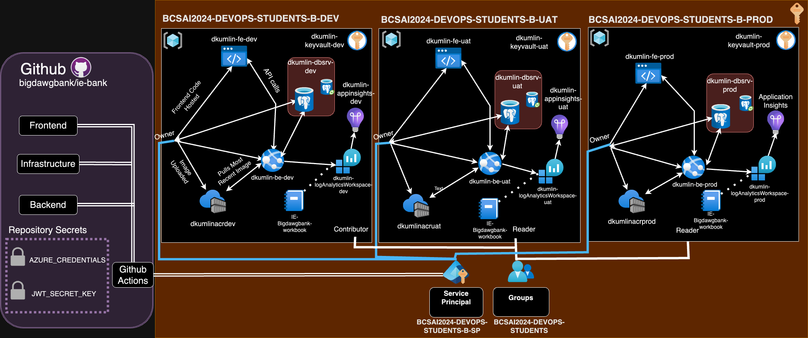

### INPUT DESCRIPTION HERE

---

# Environment Design

## Description
Collaborate with the Infrastructure Developer and Full Stack Developer to document and update the environments required for development, UAT, and production. This section includes the configuration for each Azure service in each environment.

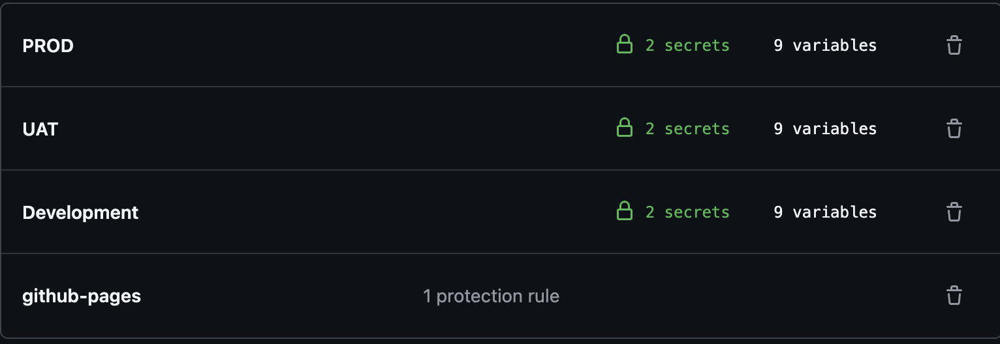

---

## Environments

### Development Environment
The development environment is used as a controlled environment for building and testing BigDawgBank's new features. It is used for experimental deployments and testing infrastructure configurations. It is designed to be flexible and allow for rapid changes.

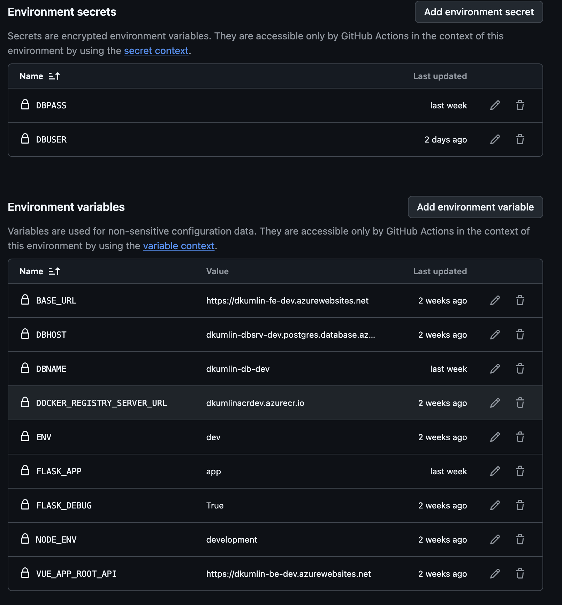

- **Azure App Service**: 
  - **Configuration**: 
    - Plan: Basic
    - Instance Count: 1
    - SKU: B1
    - Location: `North Europe`
    - Name: `dkumlin-be-dev`
    - Environment Variables:
      - `ENV`: Development
      - `DBHOST`: Development Database Host
      - `DBNAME`: Development Database Name
      - `DBPASS`: Development Database Password
      - `DBUSER`: Development Database User
      - `FLASK_APP`: Flask Application Name
      - `FLASK_DEBUG`: True
      - `JWT_SECRET_KEY`: Development JWT Secret Key

- **Azure Database for PostgreSQL**: 
  - **Configuration**: 
    - Server Name: `dkumlin-dbsrv-dev`
    - Database Name: `dkumlin-db-dev`
    - SKU: Basic
    - Backup Retention: 7 days
    - Location: `North Europe`

- **Azure Key Vault**: 
  - **Configuration**: 
    - Name: `dkumlin-keyvault-dev`
    - Location: `North Europe`
    - Access Policies: Development team access

- **Azure Log Analytics Workspace**: 
  - **Configuration**: 
    - Name: `dkumlin-logAnalyticsWorkspace-dev`
    - Location: `North Europe`

- **Azure Application Insights**: 
  - **Configuration**: 
    - Name: `dkumlin-appInsights-dev`
    - Location: `North Europe`
    - Linked Log Analytics Workspace ID: `dkumlin-logAnalyticsWorkspace-dev`
    - Retention In Days: 90
    - Ingestion Mode: LogAnalytics
    - Public Network Access for Ingestion: Enabled
    - Public Network Access for Query: Enabled

- **Azure Container Registry**: 
  - **Configuration**: 
    - Name: `dkumlinacrdev`
    - Location: `North Europe`
    - Admin Username: Stored in Key Vault
    - Admin Password: Stored in Key Vault

### UAT Environment
The UAT (User Acceptance Testing) environment is used by our team at BigDawgBank for extensive stakeholder testing. It mirrors the production environment closely to ensure that the application behaves as expected before going live, gauging errors and allowing us to fix any faulty functionality of the application.

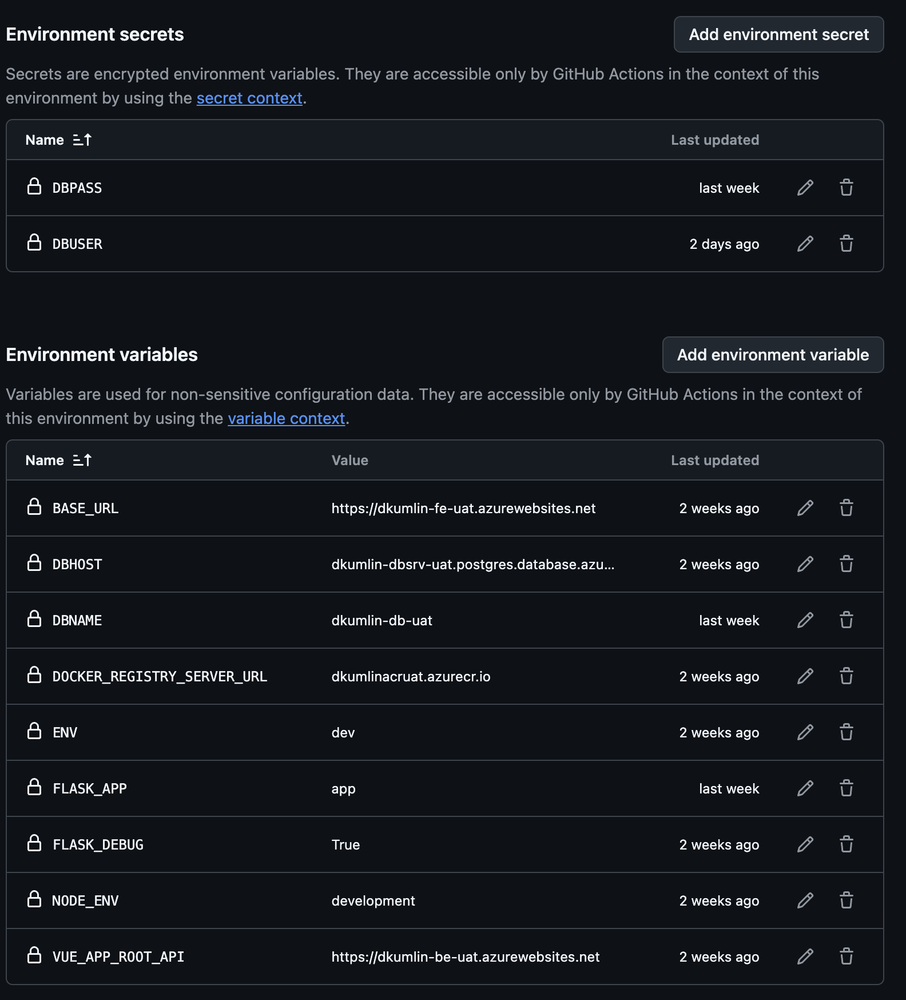

- **Azure App Service**: 
  - **Configuration**: 
    - Plan: Standard
    - Instance Count: 2
    - SKU: S1
    - Location: `North Europe`
    - Name: `dkumlin-be-uat`
    - Environment Variables:
      - `ENV`: UAT
      - `DBHOST`: UAT Database Host
      - `DBNAME`: UAT Database Name
      - `DBPASS`: UAT Database Password
      - `DBUSER`: UAT Database User
      - `FLASK_APP`: Flask Application Name
      - `FLASK_DEBUG`: False
      - `JWT_SECRET_KEY`: UAT JWT Secret Key

- **Azure Database for PostgreSQL**: 
  - **Configuration**: 
    - Server Name: `dkumlin-dbsrv-uat`
    - Database Name: `dkumlin-db-uat`
    - SKU: Standard
    - Backup Retention: 14 days
    - Location: `North Europe`

- **Azure Key Vault**: 
  - **Configuration**: 
    - Name: `dkumlin-keyvault-uat`
    - Location: `North Europe`
    - Access Policies: UAT team access

- **Azure Log Analytics Workspace**: 
  - **Configuration**: 
    - Name: `dkumlin-logAnalyticsWorkspace-uat`
    - Location: `North Europe`

- **Azure Application Insights**: 
  - **Configuration**: 
    - Name: `dkumlin-appInsights-uat`
    - Location: `North Europe`
    - Linked Log Analytics Workspace ID: `dkumlin-logAnalyticsWorkspace-uat`
    - Retention In Days: 90
    - Ingestion Mode: LogAnalytics
    - Public Network Access for Ingestion: Enabled
    - Public Network Access for Query: Enabled

- **Azure Container Registry**: 
  - **Configuration**: 
    - Name: `dkumlinacruat`
    - Location: `North Europe`
    - Admin Username: Stored in Key Vault
    - Admin Password: Stored in Key Vault

---

### Production Environment
The production environment is the live environment where the BigDawgBank application will be available to end-users. It is designed for high availability, scalability, and security.

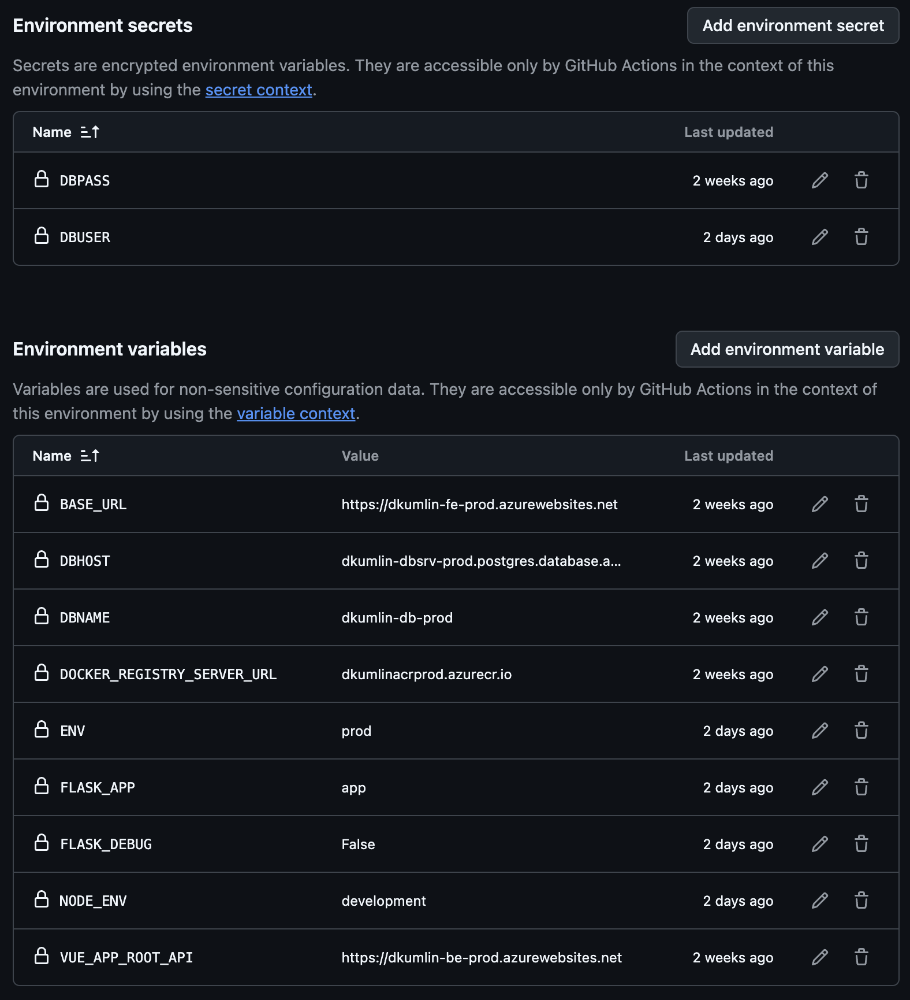

- **Azure App Service**: 
  - **Configuration**: 
    - Plan: Premium
    - Instance Count: 3
    - SKU: P1V2
    - Location: `North Europe`
    - Name: `dkumlin-be-prod`
    - Environment Variables:
      - `ENV`: Production
      - `DBHOST`: Production Database Host
      - `DBNAME`: Production Database Name
      - `DBPASS`: Production Database Password
      - `DBUSER`: Production Database User
      - `FLASK_APP`: Flask Application Name
      - `FLASK_DEBUG`: False
      - `JWT_SECRET_KEY`: Production JWT Secret Key

- **Azure Database for PostgreSQL**: 
  - **Configuration**: 
    - Server Name: `dkumlin-dbsrv-prod`
    - Database Name: `dkumlin-db-prod`
    - SKU: Premium
    - Backup Retention: 35 days
    - Location: `North Europe`

- **Azure Key Vault**: 
  - **Configuration**: 
    - Name: `dkumlin-keyvault-prod`
    - Location: `North Europe`
    - Access Policies: Production team access

- **Azure Log Analytics Workspace**: 
  - **Configuration**: 
    - Name: `dkumlin-logAnalyticsWorkspace-prod`
    - Location: `North Europe`

- **Azure Application Insights**: 
  - **Configuration**: 
    - Name: `dkumlin-appInsights-prod`
    - Location: `North Europe`
    - Linked Log Analytics Workspace ID: `dkumlin-logAnalyticsWorkspace-prod`
    - Retention In Days: 90
    - Ingestion Mode: LogAnalytics
    - Public Network Access for Ingestion: Enabled
    - Public Network Access for Query: Enabled

- **Azure Container Registry**: 
  - **Configuration**: 
    - Name: `dkumlinacrprod`
    - Location: `North Europe`
    - Admin Username: Stored in Key Vault
    - Admin Password: Stored in Key Vault

---

## Configuration Variables
To determine different configuration options for each environment, we will make use of the files under the `parameters` folder.
- File `parameters/dev.parameters.json` contains the configuration for the development environment.
- File `parameters/uat.parameters.json` contains the configuration for the UAT environment.
- File `parameters/prod.parameters.json` contains the configuration for the production environment.

---

## Continuous Delivery
The CI/CD pipelines for each environment are defined in the following GitHub Actions workflow files:
- `.github/workflows/ie-bank-backend.yml` for the backend.
- `.github/workflows/ie-bank-frontend.yml` for the frontend.
- `.github/workflows/ie-bank-infra.yml` for the infrastructure.

### GitHub Secrets
The workflows use the following GitHub secrets:
- `AZURE_CREDENTIALS`: Azure credentials to authenticate to Azure via Service Principal.
- `DBUSER`: Username for the PostgreSQL server.
- `DBPASS`: Password for the PostgreSQL server.
- `DBHOST`: Hostname for the PostgreSQL server.
- `DBNAME`: Name for the PostgreSQL database.

---

### GitHub Variables
The workflows use the following GitHub variables:
- `ENV`: Environment name.
- `FLASK_APP`: Name of the Flask app to run.

---

Here we've showcased BigDawgBanks' environment design and configuration for each Azure service in the development, UAT, and production environments. It ensures that all our team members are aligned and aware of the infrastructure setup and deployment processes.

## Well-Architected Framework Design

### 1. Reliability Pillar
- **Description**: Collaborate with the Site Reliability Engineer to document decisions related to system reliability.

#### Points Considered When Taking Design Decisions
- **Design for Business Requirements**
- **Design for Resilience**
- **Design for Recovery**
- **Design for Operations**
- **Keep it Simple**

We have taken all of these points into deep consideration when Designing the reliability for our application, this was mainly done by our taleneted SRE.

#### Reliability Checklist With BigdawgBank:

- **RE:01.** Design your workload to align with business objectives and avoid unnecessary complexity or overhead.
  - The BigDawgBank application is designed to meet specific business objectives, such as providing a secure and user-friendly banking platform. The architecture avoids unnecessary complexity by using well-defined infrastructure components and services.

- **RE:02.** Identify and rate user and system flows.
  - User and system flows are identified and rated based on their importance and impact. For our team critical flows were identified, such as account management and money transfers, are prioritized to ensure reliability.

- **RE:03.** Use failure mode analysis (FMA) to identify and prioritize potential failures in your solution components.
  - BigDawgBank has not yet implemented this.

- **RE:04.** Define reliability and recovery targets for the components.
  - Reliability and recovery targets are defined for each component. For example, the frontend aims for 99.95% uptime, and the backend ensures API response times do not exceed 2 seconds.

- **RE:05.** Add redundancy at different levels, especially for critical flows.
  - Redundancy is added at various levels to ensure reliability. For instance, the database uses replicas, and load balancing is implemented for frontend and backend services.

- **RE:06.** Implement a timely and reliable scaling strategy at the application, data, and infrastructure levels.
  - A reliable scaling strategy is implemented to handle varying workloads. Horizontal scaling is used for the frontend and backend to accommodate increased user demand.

- **RE:07.** Strengthen the resiliency and recoverability of your workload by implementing self-preservation and self-healing measures.
  - Self-preservation and self-healing measures are implemented to enhance resiliency. BigDawgBank has an automated and clear release strategy in case of a crash. We also have Deployment rollback capabilities that are in place to recover from failures.

- **RE:08. NOT DONE** Test for resiliency and availability scenarios by applying the principles of chaos engineering in your test and production environments.
  - Chaos engineering principles are applied to test the system's behavior under failure conditions. This helps ensure that the application can handle unexpected disruptions.

- **RE:09. NOT DONE!!** Implement structured, tested, and documented business continuity and disaster recovery (BCDR) plans that align with the recovery targets.
  - Structured and documented BCDR plans are implemented and tested regularly. These plans align with the defined recovery targets to ensure minimal disruption during failures. 

- **RE:10.** Measure and model the solution's health signals.
  - The health of the solution in BigDawgBank is continuously measured and modeled using monitoring tools like Azure Monitor, Application Insights, Log Analytics and Azure Workbook. This helps detect and address issues proactively.

To ensure reliability for the  BigDawgBank application, several strategies and practices have been implemented across different parts of our organization. Here are some key aspects:

#### Service Level Objectives (SLOs) and Indicators (SLIs):
The Site Reliability Engineer (SRE) outlines specific SLOs and SLIs to measure and ensure reliability:
- **Frontend Availability**: Maintain 99.95% uptime for the frontend.
- **Backend Latency**: Ensure API response times do not exceed 2 seconds.
- **Database Performance**: Guarantee query response times of less than 500ms.
- **Error Rate**: Keep application error rates below 0.1% over a rolling 24-hour window.
- **Incident Resolution**: Resolve critical incidents within 1 hour of detection.

#### Monitoring and Alerts:
The monitoring strategy includes:
- **Monitoring Tools**: Use tools like Azure Monitor, Application Insights, and Log Analytics for tracking metrics.
- **Alerts**: Configure alerts for key performance indicators (e.g., high response times, downtime).
- **Dashboards**: Create real-time dashboards to visualize critical metrics.
- **Log Analysis**: Implement log monitoring for identifying trends and potential issues.

#### Incident Response Plan:
The incident response plan includes:
- **Incident Detection**: Use monitoring tools and alerts to detect incidents promptly.
- **Incident Triage**: Classify incidents based on severity and impact.
- **Incident Resolution**: Define procedures for diagnosing and resolving incidents quickly.
- **Post-Incident Review**: Conduct reviews to identify root causes and prevent recurrence.

#### Automated Testing and CI/CD Pipelines
Automated tests and CI/CD pipelines ensure that code changes do not introduce reliability issues:
- **Functional Tests**: Functional tests for routes like [`test_wire_transfer_money_route`](https://github.com/bigdawgbank/ie-bank/blob/main/backend/tests/functional/test_routes.py) and [`test_bank_transfer_process_route`](https://github.com/bigdawgbank/ie-bank/blob/main/backend/tests/functional/test_routes.py) ensure that critical functionalities work as expected.
- **CI/CD Pipelines**: GitHub Actions workflows like `.github/workflows/ie-bank-frontend.yml`and `.github/workflows/ie-bank-backend.yml` automate the build, test, and deployment processes, ensuring consistent and reliable deployments.

#### Infrastructure as Code (IaC):
Using Bicep templates for infrastructure provisioning ensures that the infrastructure is consistently deployed and configured:
- **Bicep Templates**: The `infra/main.bicep` file defines the infrastructure components, ensuring that the infrastructure is reproducible and reliable.

#### Scalability and Fault Tolerance:
The application is designed to handle peak loads and ensure fault tolerance:
- **Horizontal Scaling**: The application supports horizontal scaling for the frontend and backend to accommodate increased user demand.
- **Fault Tolerance**: Design fault-tolerant systems to minimize the impact of failures.

#### Backup and Recovery:
The system includes backup and recovery mechanisms:
- **Point-in-Time Restore**: Our PostgresSQL database supports point-in-time restore.
- **Deployment Rollback**: Deployment rollback capabilities are in place in case of failure.

#### Environment Design:
The environment design includes separate environments for development, UAT, and production, ensuring that changes are tested thoroughly before reaching production.

---
By implementing these strategies and practices, the BigDawgBank ensures the highest possible reliability, minimizing downtime and ensuring a consistent user experience which is what we strive for. For more in depth information please refer to [Site Reliability Engineer](./Sitereliable.md)

### 2. Security Pillar
- **Description**: Collaborate with the Cybersecurity Engineer to document security decisions.

#### Security Design Principles in BigDawgBank

- **Design to Protect Confidentiality**
- **Design to Protect Integrity**
- **Design to Protect Availability**
- **Sustain and Evolve Your Security Posture**

#### **Security Checklist**:

- **SE:01.** Establish a security baseline that's aligned to compliance requirements, industry standards, and platform recommendations.
  - The BigDawgBank application establishes a security baseline by adhering to industry standards and platform recommendations. This includes using HTTPS for all communications and enforcing encryption for data at rest and in transit.

- **SE:02.** Maintain a secure development lifecycle.
  - The development lifecycle includes security practices such as code reviews, automated security testing, and dependency scanning using Dependabot as configured in `.github/dependabot.yml`.

- **SE:03.** Classify and consistently apply sensitivity and information type labels.
  - BigDawgBank has not yet implemented this.

- **SE:04.** Create intentional segmentation and perimeters in your architecture design and in the workload's footprint on the platform.
  - The architecture design includes segmentation of different environments (development, UAT, production) and the use of network security groups (NSGs) to isolate backend resources from public access.

- **SE:05.** Implement strict, conditional, and auditable identity and access management (IAM) across all workload users, team members, and system components.
  - Role-Based Access Control (RBAC) is enforced in Azure, restricting administrative functions to authorized personnel. GitHub repository access is also controlled with appropriate permissions.

- **SE:06.** Isolate, filter, and control network traffic across both ingress and egress flows.
  - Network traffic is controlled using NSGs and firewalls to restrict access to the Azure Database for PostgreSQL to specific IP addresses.

- **SE:07.** Encrypt data by using modern, industry-standard methods to guard confidentiality and integrity.
  - Data is encrypted at rest using Azure-managed disk encryption and in transit using TLS for database and API communications.

- **SE:08.** Harden all workload components by reducing extraneous surface area and tightening configurations to increase attacker cost.
  - The GitHub repository is hardened with branch protection rules, signed commits, required pull request approvals, and automated checks before merging.

- **SE:09.** Protect application secrets by hardening their storage and restricting access and manipulation and by auditing those actions.
  - Secrets such as database credentials and API keys are securely managed using Azure Key Vault and GitHub repository secrets.

- **SE:10.** Implement a holistic monitoring strategy that relies on modern threat detection mechanisms that can be integrated with the platform.
  - Azure Security Center and Advanced Threat Protection are integrated for anomaly detection and alerts. Azure Monitor and Application Insights are used for real-time security monitoring.

- **SE:11.** Establish a comprehensive testing regimen.
  - Automated security testing is part of the CI/CD pipelines, including static code analysis and dependency scanning.

- **SE:12.** Define and test effective incident response procedures.
  - BigDawgBank has not yet implemented this.

--- 

### 3. Cost Optimization Pillar
- **Description**: Collaborate with the Infrastructure Developer to document cost optimization strategies.

#### Cost Optimization Design Principles in BigDawgBank

- **Develop a Cost Management Discipline**
- **Design with a Cost-Efficiency Mindset**
- **Design for Usage Optimization**
- **Design for Rate Optimization**
- **Monitor and Optimize Over Time**

#### **Cost Optimization Checklist**:

- **CO:01.** Create a culture of financial responsibility.
  - The BigDawgBank team fosters a culture of financial responsibility by regularly reviewing budget, expenses, and cost tracking. This ensures that all team members are aware of the financial implications of their decisions.

- **CO:02.** Create and maintain a cost model. A cost model should estimate the initial cost, run rates, and ongoing costs.
  - A cost model is maintained to estimate initial costs, run rates, and ongoing costs. This helps in planning and budgeting for the project.

- **CO:03.** Collect and review cost data. Data collection should capture daily costs.
  - Cost data is collected and reviewed regularly to capture daily costs. This helps in identifying areas where cost savings can be achieved.

- **CO:04.** Set spending guardrails.
  - Spending guardrails are set to ensure that the project stays within budget. This includes setting limits on spending for different components and environments.

- **CO:05.** Get the best rates from providers.
  - The team negotiates with providers to get the best rates for services. This includes leveraging reserved instances and other cost-saving options offered by Azure.

- **CO:06.** Align usage to billing increments.
  - Usage is aligned to billing increments to ensure that resources are used efficiently and costs are minimized.

- **CO:07.** Optimize component costs.
  - Component costs are optimized by selecting cost-effective options for each component. For example, using Azure Static Web Apps for the frontend minimizes hosting costs.

- **CO:08.** Optimize environment costs. Align spending to prioritize preproduction, production, operations, and disaster recovery environments.
  - Environment costs are optimized by aligning spending to prioritize preproduction, production, operations, and disaster recovery environments. This ensures that resources are allocated efficiently.

- **CO:09.** Optimize flow costs. Align the cost of each flow with flow priority.
  - Flow costs are optimized by aligning the cost of each flow with its priority. This ensures that critical flows receive the necessary resources while minimizing costs for less critical flows.

- **CO:10.** Optimize data costs.
  - Data costs are optimized by implementing retention policies for logs and backups. This helps in managing storage costs effectively.

- **CO:11.** Optimize code costs. Evaluate and modify code to meet functional and nonfunctional requirements with fewer or cheaper resources.
  - Code costs are optimized by evaluating and modifying code to meet functional and nonfunctional requirements with fewer or cheaper resources. This includes optimizing database queries and container orchestration.

- **CO:12.** Optimize scaling costs. Evaluate alternative scaling within your scale units.
  - Scaling costs are optimized by evaluating alternative scaling options within scale units. This includes configuring auto-scaling rules for Azure App Services and databases based on performance metrics.

- **CO:13.** Optimize personnel time. Align the time personnel spends on tasks with the priority of the task. The goal is to reduce the time spent on tasks without degrading the outcome.
  - Personnel time is optimized by aligning the time spent on tasks with the priority of the task. This helps in reducing the time spent on tasks without degrading the outcome.

- **CO:14.** Consolidate resources and responsibility.
  - Resources and responsibilities are consolidated to ensure efficient use of resources and minimize costs.

#### Static Web App for Frontend

The BigDawgBank application leverages a **Static Web App** for its frontend, ensuring a cost-efficient and scalable solution while maintaining a high-quality user experience. Cost optimization is a critical design pillar, and using a static web app aligns with this principle by reducing operational expenses and resource usage.

- 1. **Pay-as-You-Go Pricing Model**
  - Azure Static Web Apps operate on a consumption-based pricing model, ensuring you only pay for the resources you use.
  - Ideal for workloads with varying traffic, as costs scale with demand.

- 2. **Free Tier for Basic Usage**
  - The free tier includes custom domain support, SSL certificates, and basic hosting for static content, which significantly reduces costs for development and testing environments.

- 3. **Elimination of Server Costs**
  - Static Web Apps do not require dedicated servers to host the frontend, as all content is pre-rendered and served via a global content delivery network (CDN).
  - This removes the need for virtual machines or traditional web servers, saving infrastructure costs.

- 4. **Integrated CI/CD Workflow**
  - Built-in GitHub Actions integration for CI/CD eliminates the need for external deployment tools, reducing additional expenses on third-party services.
  - Automated builds and deployments streamline the process without incurring extra operational overhead.

- 5. **Global Content Delivery**
  - Static Web Apps leverage Azure's global CDN to cache and serve content closer to end-users, minimizing latency and optimizing bandwidth usage.
  - Efficient delivery reduces data transfer costs, especially during high traffic periods.

- 6. **Reduced Maintenance Costs**
  - Static content requires minimal maintenance compared to dynamic servers, which reduces the time and resources spent on operational support.
  - Security updates, server patching, and backend dependencies are minimized, leading to long-term cost savings.

- 7. **Efficient Scaling**
  - Static Web Apps automatically scale based on demand without additional configuration or costs for scaling infrastructure.
  - This ensures consistent performance without incurring expenses associated with over-provisioning.
- **Other Key points:**
  - **Free SSL Certificates**
    - The frontend benefits from built-in SSL certificates at no additional cost, ensuring secure communications while keeping expenses low.

  - **Lightweight Design**
    - The static nature of the app ensures that only essential resources are loaded, reducing bandwidth usage and associated costs.

  - **Integrated Application Insights**
    - Performance monitoring and usage analytics are included without requiring a separate service, saving costs while enabling data-driven optimizations.

  - **Multi-Environment Deployment**
    - Separate instances for our **Development**, **UAT**, and **Production** environments are configured with cost-effective tiers, using the free tier where applicable for non-production environments to save significant costs.

---

### 4. Operational Excellence Pillar
- **Description**: Collaborate with the Full Stack Developer to document operational excellence strategies.

#### Operational Excellence Design Principles in BigDawgBank

- **Embrace DevOps Culture**
- **Establish Development Standards**
- **Evolve Operations with Observability**
- **Deploy with Confidence**
- **Automate for Efficiency**
- **Adopt Safe Deployment Practices**

#### **Operational Excellence Checklist**:

- **OE:01.** Determine workload team members' specializations and integrate them into a robust set of practices to design, develop, deploy, and operate your workload to specification.
  - The BigDawgBank team identifies and leverages the specializations of its members, integrating them into a cohesive set of practices for designing, developing, deploying, and operating the workload.

- **OE:02.** Formalize the way you run routine, as needed, and emergency operational tasks by using documentation, checklists, or automation.
  - Routine, as-needed, and emergency operational tasks are formalized through detailed documentation, checklists, and automation to ensure consistency and reliability.

- **OE:03.** Formalize software ideation and planning processes.
  - Software ideation and planning processes are formalized to ensure structured and efficient development cycles.

- **OE:04.** Optimize software development and quality assurance processes by following industry-proven practices for development and testing.
  - Software development and quality assurance processes are optimized by adhering to industry-proven practices, ensuring high-quality code and efficient testing.

- **OE:05.** Prepare resources and their configurations by using a standardized infrastructure as code (IaC) approach.
  - Resources and configurations are prepared using a standardized Infrastructure as Code (IaC) approach, ensuring consistency and repeatability in deployments.

- **OE:06.** Build a workload supply chain that drives proposed changes through predictable, automated pipelines.
  - Our Team has established a robus workload supply chain, enhancing efficiency and reducing manual intervention.

- **OE:07.** Design and implement a monitoring system to validate design choices and inform future design and business decisions.
  - A comprehensive monitoring system has been designed and implemented to validate design choices and inform future design and business decisions for the BigDawgBank application.

- **OE:08.** Develop an effective emergency operations practice.
  - This has not yet been implemented in the BigDawgBank Application.

- **OE:09.** Automate all tasks that don't benefit from the insight and adaptability of human intervention, are highly procedural, and have a shelf-life that yields a return on automation investment.
  - Tasks that do not benefit from human intervention, are highly procedural, and have a shelf-life that yields a return on automation investment are automated to improve efficiency and consistency.

- **OE:10.** Design and implement automation upfront for operations such as lifecycle concerns, bootstrapping, and applying governance and compliance guardrails.
  - Automation has been designed and implemented.

- **OE:11.** Clearly define your workload's safe deployment practices. Emphasize the ideals of small, incremental, quality-gated release methods.
  - Safe deployment practices are clearly defined, emphasizing small, incremental, quality-gated release methods to minimize risks.

- **OE:12.** Implement a deployment failure mitigation strategy that addresses unexpected mid-rollout issues with rapid recovery.
  - A deployment failure mitigation strategy is implemented to address unexpected mid-rollout issues and ensure rapid recovery.

The **BigDawgBank** application achieves operational excellence by leveraging the **Gateway Routing** cloud pattern, defined in the [Microsoft Well-Architectured Framework](https://learn.microsoft.com/en-us/azure/well-architected/operational-excellence/design-patterns). This design pattern supports efficient request management and ensures the modularity and scalability of the application. Gateway Routing is imperative for optimizing interactions between the frontend, backend, and database layers by centralizing API management and routing client requests to the appropriate backend services based on their intent.

By following this pattern, **BigDawgBank** achieves the core principles of optimization:

- **Efficiency**: Routing requests to specific backend services reduces overhead and ensures that only necessary components are utilized.
- **Scalability**: Decoupling the frontend and backend enables independent scaling, allowing each layer to handle increased loads effectively.
- **Security**: The centralized API layer provides a single point for implementing robust encryption (e.g., HTTPS) and secure authentication (e.g., JWT tokens).
- **Reliability**: Centralized handling of requests ensures consistent behavior across various components, reducing potential errors and ensuring smooth operations.

By integrating Gateway Routing into its architecture, **BigDawgBank** optimizes performance, simplifies request management, and strengthens security, demonstrating operational excellence in every aspect of its design.

---

### 5. Performance Efficiency Pillar
- **Description**: Collaborate with the Infrastructure Developer and Site Reliability Engineer to document performance efficiency decisions.

#### Performance Efficiency Design Principles in BigDawgBank

- **Define Performance Targets**
- **Design to Meet Capacity Requirements**
- **Achieve and Sustain Performance**
- **Improve Efficiency Through Optimization**

#### **Performance Efficiency Checklist**:

- **PE:01.** Define performance targets.
  - Performance targets are defined based on the intended user experience and pre-established business requirements. For example, the backend API response times are targeted to not exceed 2 seconds.

- **PE:02.** Conduct capacity planning.
  - Capacity planning is conducted to ensure that the system can handle anticipated demand. This includes planning for peak loads and ensuring that resources are available to meet user demand.

- **PE:03.** Select the right services. The services, infrastructure, and tier selections must support your ability to reach the workload's performance targets and accommodate expected capacity changes.
  - The BigDawgBank application uses Azure App Services and Azure Database for PostgreSQL to meet performance targets and accommodate expected capacity changes.

- **PE:04.** Collect performance data.
  - Performance data is collected using Azure Application Insights, which tracks metrics such as request latency, error rates, and resource consumption.

- **PE:05.** Optimize scaling and partitioning.
  - Auto-scaling rules are configured for Azure App Services and databases based on performance metrics to ensure efficient scaling and partitioning.

- **PE:06.** Test performance. Perform regular testing in an environment that matches the production environment.
  - Regular performance testing is conducted in the User Acceptance Testing (UAT) environment, which mimics the production environment.

- **PE:07.** Optimize code and infrastructure.
  - Code and infrastructure are optimized to meet performance targets. This includes optimizing database queries and container orchestration.

- **PE:08.** Optimize data usage.
  - Data usage is optimized by implementing retention policies for logs and backups, ensuring efficient storage management.

- **PE:09.** Prioritize the performance of critical flows.
  - The performance of critical flows, such as account management and money transfers, is prioritized to ensure a seamless user experience.

- **PE:10.** Optimize operational tasks.
  - Operational tasks are optimized through automation and efficient resource management.

- **PE:11.** Respond to live performance issues.
  - Not yet implemented in the BigDawgBank Application.

- **PE:12.** Continuously optimize performance.
  - Continuous performance optimization is achieved through regular monitoring and data-driven decision-making.

  By implementing these strategies and practices, the BigDawgBank application ensures performance efficiency, providing a responsive and reliable user experience while optimizing resource utilization and operational costs.

---

## Test Driven Design(TDD)

For developping our BigDawgBank Application, our team decided to adopt a more Test-Driven Design(TTD) in order to ensure the highest code quality, maintainability and reliability possible. TDD involves writing tests before writing the actual code, which helped in defining clear requirements and catching any of our issues early in the development process. We chose this approach over Behavior Driven Design (BDD) due to its focus on the technical aspects of the code and its ability to provide immediate feedback to our Fullstack developers. Our cycle involved first developping robust tests based on our precise User stories in the Azure Devops backlog which were developped in accordance with the new requirements of our application. After various meetings, it was agreed that the most important aspects to be tested was the authentication and the transaction process between accounts. This was because we strive for optimal user security in transport and account management considering the sensitivity of information within a bank.

The Following Table highlights our TTD approach by showcasing the various tests we implemented, along with the Functional Requirements that they were deveopped for and the related user story for said FR:

| **Functional Requirement (FR)** | **User Story** | **Test** |
|---------------------------------|----------------|----------|
| **FR05: New User Registration** | As a new user, I want to register for an account so that I can access the system. | [test_create_user](https://github.com/bigdawgbank/ie-bank/blob/main/backend/tests/unit/test_auth_model.py#L30) |
| **FR06: Invalid Repeated Email Check** | As an admin, I want users who are creating more than one user to not be allowed the use of the same email when creating another one. | [test_user_unique_email](https://github.com/bigdawgbank/ie-bank/blob/main/backend/tests/unit/test_auth_model.py#L50), [test_register_duplicate_user](https://github.com/bigdawgbank/ie-bank/blob/main/backend/tests/functional/test_auth.py#L70) |
| **FR08: Secure User Login** | As a user, I want to log in securely so that I can access my account. | [test_protected_route](https://github.com/bigdawgbank/ie-bank/blob/main/backend/tests/functional/test_auth.py#L90), [test_authentication_required](https://github.com/bigdawgbank/ie-bank/blob/main/backend/tests/functional/test_auth.py#L110), [test_login_failure](https://github.com/bigdawgbank/ie-bank/blob/main/backend/tests/functional/test_auth.py#L130) |
| **FR10: Money Transfer** | As a user, I want to transfer money to other accounts so that I can make payments easily. | [test_bank_transfer_process_route](https://github.com/bigdawgbank/ie-bank/blob/main/backend/tests/functional/test_routes.py#L50), [test_bank_transfer_object_process](https://github.com/bigdawgbank/ie-bank/blob/main/backend/tests/unit/test_bank_transfer_object.py#L10) |
| **FR11: Secure Password Handling** | As a developer, I want all passwords to be securely hashed so that user data is protected from breaches. | [test_create_user](https://github.com/bigdawgbank/ie-bank/blob/main/backend/tests/unit/test_auth_model.py#L70) |

We can see the immense focus our team had on ensuring the authentication aspect of our application was completely robust and error free. By adopting TDD, the BigDawgBank application ensures that all functional requirements are met with high code quality and reliability. The focus on writing tests before code helped our Fullstack team define clear requirements, catch issues early, and promote maintainable and modular code. This approach has proven to be effective in delivering a robust and secure banking application.

---

## Release Strategy
- **Description**: Document the release strategy, including environment design, and ensure alignment with the DevOps checklist and GitHub Security best practices.

The release strategy for the BigDawgBank application is designed to ensure a smooth and secure deployment process across different environments. This strategy aligns with the DevOps checklist and GitHub Security best practices, including the enforcement of branch protection rules to prevent direct pushes to the `main` branch.

---

### Development (Dev)
The development environment is used for initial development and testing of new features. The following practices are implemented:
- **Environment**: Development
- **CI/CD Pipeline**: The `ie-bank-frontend.yml` and `ie-bank-backend.yml` workflows are triggered on pushes to any branch except pull request branches. This ensures that changes are tested in isolation before being merged.
- **Steps**:
  - Code is checked out and dependencies are installed.
  - Linting and testing are performed to ensure code quality.
  - Docker images are built and pushed to the development container registry.
  - The application is deployed to the Azure Web App for the development environment.

---

### User Acceptance Testing (UAT)
The UAT environment is used for stakeholder testing and validation of new features before they are released to production.
- **Environment**: UAT
- **CI/CD Pipeline**: The `ie-bank-frontend.yml` and `ie-bank-backend.yml` workflows are triggered on pull requests to the `main` branch and on pushes to the `main` branch, however pushes to the main branch aren't allowed due to the appropriate branch protection rules.
- **Steps**:
  - Code is checked out and dependencies are installed.
  - Linting and testing are performed to ensure code quality.
  - Docker images are built and pushed to the UAT container registry.
  - The application is deployed to the Azure Web App for the UAT environment.

---

### Production (Prod)
The production environment is used for the live application, serving end-users.
- **Environment**: Production
- **CI/CD Pipeline**: The `ie-bank-frontend.yml` and `ie-bank-backend.yml` workflows are triggered when pull requests are merged to the `main` branch or on manual triggers.
- **Steps**:
  - Code is checked out and dependencies are installed.
  - Linting and testing are performed to ensure code quality.
  - Docker images are built and pushed to the production container registry.
  - The application is deployed to the Azure Web App for the production environment.

---

By following this release strategy, the BigDawgBank application ensures a structured and secure deployment process, minimizing the risk of errors and ensuring that only thoroughly tested code reaches the production environment. This strategy also aligns with GitHub Security best practices by preventing direct pushes to the `main` branch and enforcing code reviews through pull requests.

### Infrastructure Release Strategy
- **Description**: Document the infrastructure release strategy, including the use of IaC tools (e.g., Bicep templates, ARM templates) and GitHub Actions workflows. Detail the process for provisioning and updating infrastructure in each environment:

The infrastructure release strategy for the BigDawgBank application ensures a structured and secure deployment process across different environments. This strategy leverages Infrastructure as Code (IaC) tools such as Bicep templates and GitHub Actions workflows to automate the provisioning and updating of infrastructure.

---

### Development Environment
The development environment is used for experimental deployments and testing infrastructure configurations.
- **Environment**: Development
- **CI/CD Pipeline**: The `ie-bank-infra.yml` workflow is triggered on pushes to any branch except pull request branches.
- **Steps**:
  - **Template Validation**: The Bicep template is validated using the `azure/arm-deploy@v1` action to ensure the template is syntactically correct.
  - **Detect Resource Drift**: The `az deployment group what-if` command is used to detect resource drift between the current deployment and the new one.
  - **Deployment**: The infrastructure is deployed to the Azure resource group for the development environment using the `azure/arm-deploy@v1` action.

---

### User Acceptance Testing (UAT) Environment
The UAT environment is used for stakeholder testing and validation of infrastructure changes before they are released to production.
- **Environment**: UAT
- **CI/CD Pipeline**: The `ie-bank-infra.yml` workflow is triggered on pull requests to the `main` branch and on pushes to the `main` branch.
- **Steps**:
  - **Template Validation**: The Bicep template is validated using the `azure/arm-deploy@v1` action to ensure the template is syntactically correct.
  - **Detect Resource Drift**: The `az deployment group what-if` command is used to detect resource drift between the current deployment and the new one.
  - **Deployment**: The infrastructure is deployed to the Azure resource group for the UAT environment using the `azure/arm-deploy@v1` action.

---

### Production Environment
The production environment is used for the live application, serving end-users.
- **Environment**: Production
- **CI/CD Pipeline**: The `ie-bank-infra.yml` workflow is triggered when pull requests are merged to the `main` branch or on manual triggers.
- **Steps**:
  - **Template Validation**: The Bicep template is validated using the `azure/arm-deploy@v1` action to ensure the template is syntactically correct.
  - **Detect Resource Drift**: The `az deployment group what-if` command is used to detect resource drift between the current deployment and the new one.
  - **Deployment**: The infrastructure is deployed to the Azure resource group for the production environment using the `azure/arm-deploy@v1` action.

---

### Rollback Mechanisms and Disaster Recovery
To ensure the reliability and stability of the infrastructure, the following mechanisms are in place:
- **Rollback Mechanisms**: In case of deployment failures, the infrastructure can be rolled back to the previous stable state using the versioned Bicep templates and GitHub Actions workflows.
- **Disaster Recovery**: Regular backups and point-in-time restore capabilities are implemented for critical resources such as the PostgreSQL database to ensure data integrity and availability in case of failures.

By following this infrastructure release strategy, the BigDawgBank application ensures a structured and secure deployment process, minimizing the risk of errors and ensuring that only thoroughly tested infrastructure changes reach the production environment. This strategy also aligns with GitHub Security best practices by preventing direct pushes to the `main` branch and enforcing code reviews through pull requests.

---

## Use Case and Sequential Model Design

### Description
Use case and sequential model diagrams for each use case in the BigDawgBank application.

| **Use Case Name**                 | **Register for a New Bank Account**                                         | **User Login**                                              | **Manage Bank Users (Admin)**                              |
|-----------------------------------|------------------------------------------------------------------------------|-------------------------------------------------------------|------------------------------------------------------------|
| **Description**                   | A user creates a new account in the system.                                 | A registered user securely logs into their account.         | Admin manages users (create, update, delete) and assigns roles. |
| **Actors**                        | Bank User                                                                   | Bank User                                                   | Admin User                                                |
| **Primary Flow**                  | 1. User navigates to the registration page. 2. Fills out the registration form with details. 3. Submits the form. 4. System creates a default account for the user. | 1. User navigates to the login page. 2. Provides credentials. 3. System validates credentials. 4. On success, user is redirected to the dashboard. 5. Secure session is created for the user. | 1. Admin logs into the admin portal. 2. Selects "Manage Users" or "Manage Roles." 3. Performs actions such as creating, updating, deleting users, or assigning roles. 4. System validates JWT token for privileges and processes the request. 5. Database updates user data. |
| **Alternate Flows**               | 1. Missing required fields: The system prompts the user to complete the form. 2. Invalid email format: System rejects submission with an error message. | 1. Invalid credentials: System denies access and shows an error. 2. Account locked: System notifies the user and suggests contacting support. 3. Session timeout: System logs out the user after inactivity. | 1. Invalid role: System rejects the request with an error message. 2. Unauthorized action: Non-admin users are restricted from accessing this functionality. 3. Database operation failure: System notifies the admin of the issue. |
| **System Requirements**           | - User details must be validated. - Account number must be unique. - Default balance set to 0. | - Passwords must be securely hashed. - Session management must enforce expiration policies. | - Role-based access control must be enforced. - Changes to roles must be logged. - Admin validation required via JWT. |

**Sequence Diagram: Register for a New Bank Account**

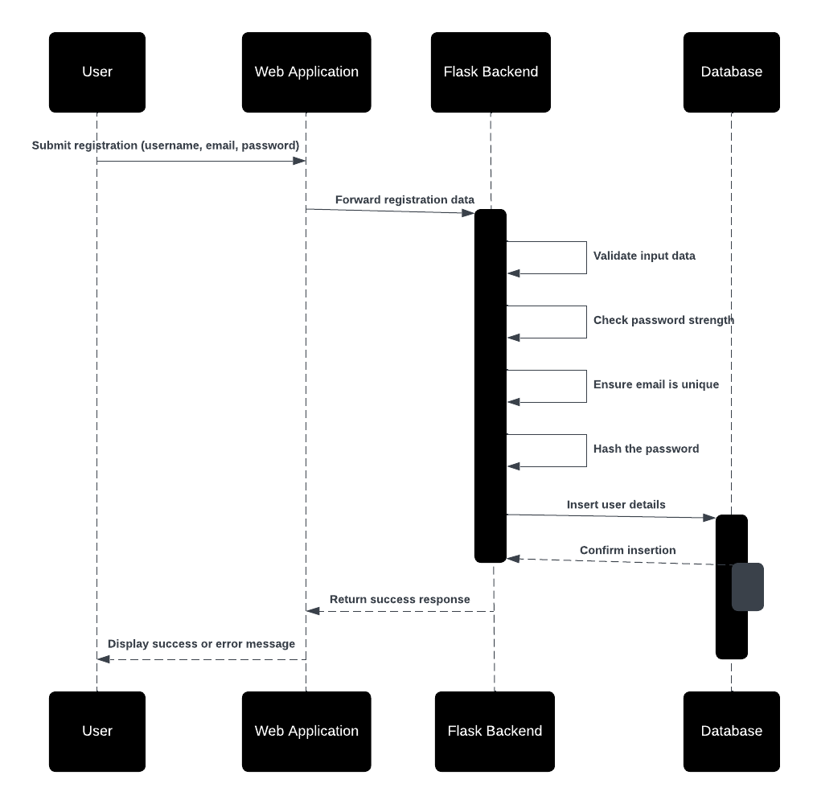

**Sequence Diagram: User Login**

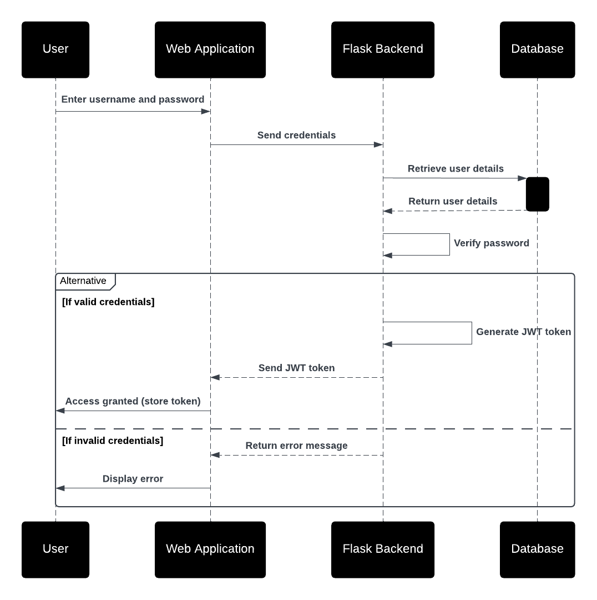

**Sequence Diagram: Manage Bank Users (Admin)**

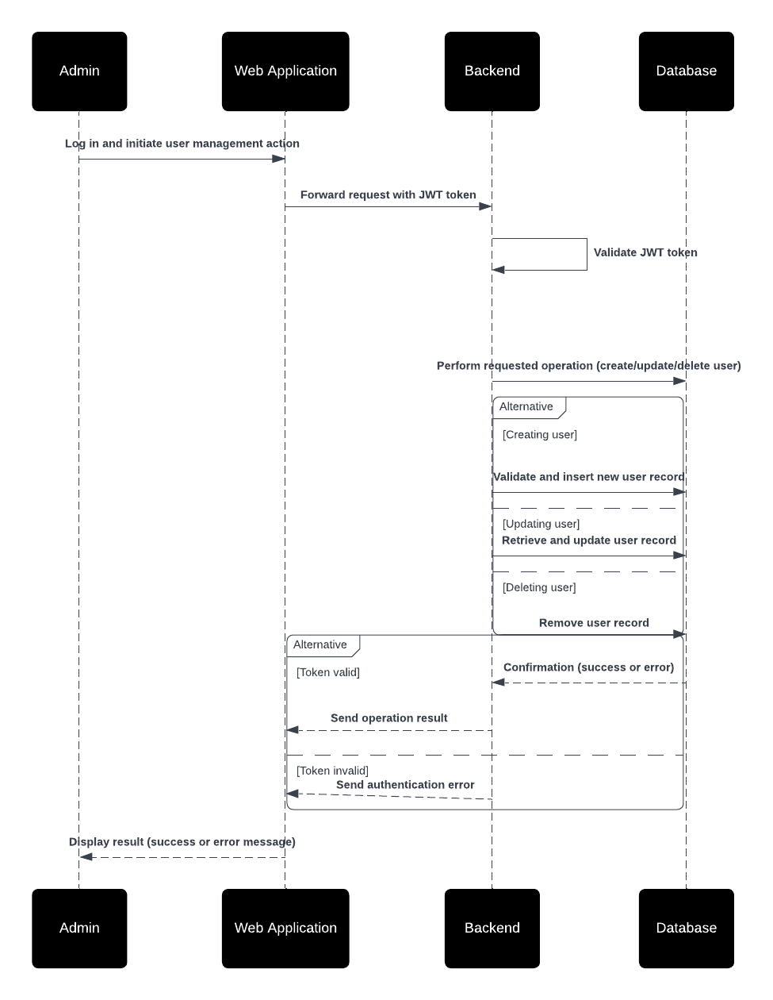

---

| **Use Case Name**                 | **Transfer Money Between Accounts**                                         | **Deposit Money**                                           | **View Account and Transaction History**                   |
|-----------------------------------|------------------------------------------------------------------------------|-------------------------------------------------------------|------------------------------------------------------------|
| **Description**                   | Users transfer funds between accounts within the bank.                      | Users deposit money into an account.                       | Users view details of their accounts, including transactions. |
| **Actors**                        | Bank User                                                                   | Bank User                                                   | Bank User                                                |
| **Primary Flow**                  | 1. User logs in. 2. Navigates to the "Transfer Funds" section. 3. Provides recipient account number and amount. 4. Submits the transfer request. 5. System validates and completes the transfer. | 1. User logs in. 2. Navigates to "Deposit Funds" section. 3. Provides account ID and deposit amount. 4. Submits the deposit request. 5. System validates and updates the account balance. | 1. User logs in. 2. Navigates to the "My Accounts" section. 3. Selects an account to view transaction history. 4. Transaction details are displayed. |
| **Alternate Flows**               | 1. Insufficient funds: System rejects transfer and notifies the user. 2. Invalid account number: System rejects the request. 3. Transfer limit exceeded: User is notified and action is denied. | 1. Invalid account ID: System rejects the request. 2. Negative deposit amount: System prompts the user to provide a positive value. 3. Database operation failure: System notifies the user of the issue. | 1. User has no accounts: System displays "No accounts found" message. 2. Transaction list is empty: System shows an appropriate message. |
| **System Requirements**           | - Validate recipient account before transfer. - Real-time balance updates. - Log all transactions for auditing purposes. | - Account validation must be performed. - Deposits must be logged for auditing. - Balance updates must occur in real-time. | - Transactions must be linked to accounts. - Secure access to account data is required. - Display should be user-friendly. |

---

**Sequence Diagram: Transfer Money Between Accounts**

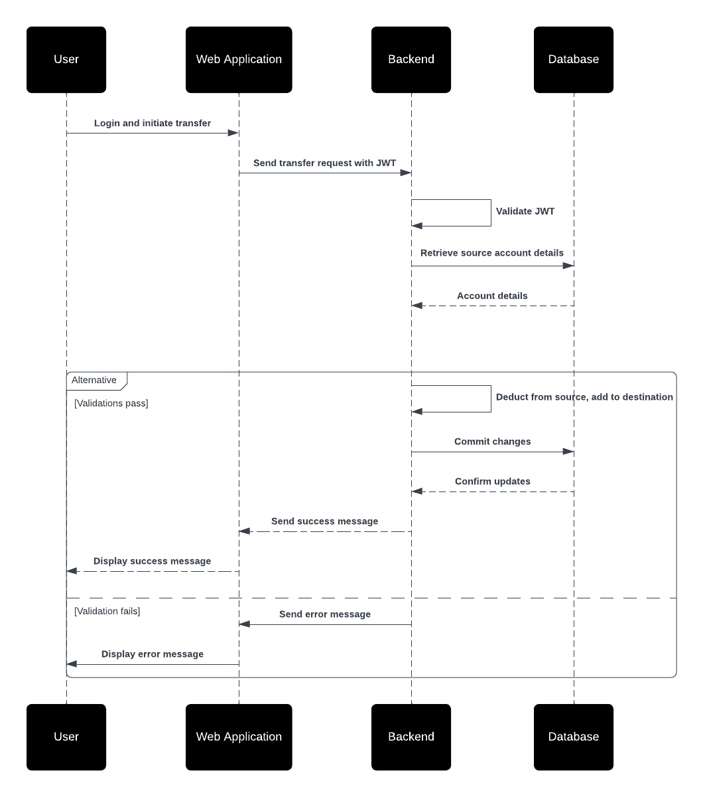

**Sequence Diagram: Deposit money in individual Account**

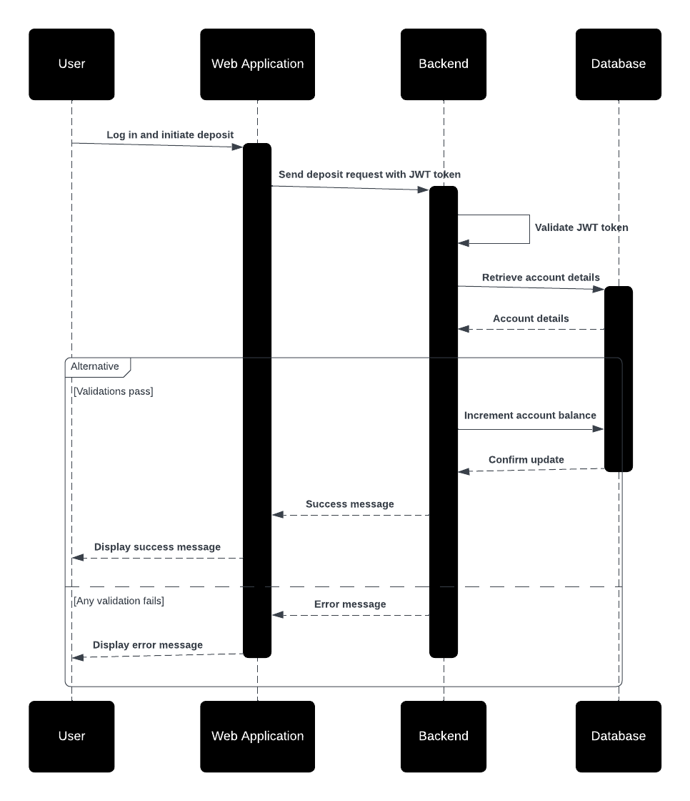

## Entity Relationship Diagram
- **Description**: Update and document the Entity Relationship Diagram for the database.
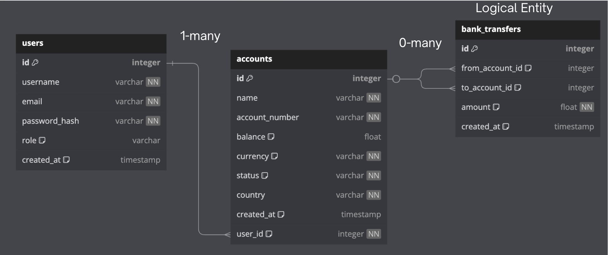

The Entity-Relationship Diagram (ERD) represents the logical structure and relationships of the database for the bank application. The diagram defines three main entities: **Users**, **Accounts**, and a **Logical Bank Transfers Entity**.

---

#### Users Table
- Represents the individuals interacting with the bank application, such as customers or administrators.
- **Attributes**:
  - **id (Primary Key):** Unique identifier for each user.
  - **username:** Unique name for the user.
  - **email:** Unique email address.
  - **password_hash:** Securely hashed password for authentication.
  - **role:** Defines the role of the user, such as "admin" or "user".
  - **created_at:** Timestamp indicating when the user was created.

---

#### Accounts Table
- Represents the bank accounts owned by users.
- **Attributes**:
  - **id (Primary Key):** Unique identifier for each account.
  - **name:** Name or label of the account.
  - **account_number:** Unique 20-digit account number.
  - **balance:** The current balance in the account.
  - **currency:** Currency type for the account (e.g., €, $, £).
  - **status:** Indicates if the account is active or inactive.
  - **country:** Country associated with the account.
  - **created_at:** Timestamp indicating when the account was created.
  - **user_id (Foreign Key):** Links the account to a user in the **Users** table.

---

#### Bank Transfers Logical Entity
- Represents the conceptual structure for transactions between accounts.
- **Attributes**:
  - **from_account_id (Foreign Key):** ID of the account from which money is sent.
  - **to_account_id (Foreign Key):** ID of the account to which money is received.
  - **amount:** Amount of money transferred.
  - **created_at:** Timestamp of the transaction.

---

### Relationships

#### User to Account
- **Type:** One-to-Many
- **Description:** Each user can own multiple bank accounts, but each account belongs to one specific user.
- **Implementation:** 
  - The `user_id` in the **Accounts** table serves as a foreign key referencing the `id` in the **Users** table.

---

#### Account to Bank Transfers
- **Type:** 0-to-Many
- **Description:** An account may participate in many bank transfers as a sender or a recipient. However, an account may also exist without participating in any transfer.
- **Implementation:**
  - `from_account_id` and `to_account_id` in the **Bank Transfers Logical Entity** are foreign keys referencing the `id` in the **Accounts** table.

---

### Key Features

#### Logical Entity for Bank Transfers
- This entity is logical and not stored as a separate table in the database. Instead, it provides a clear abstraction for managing account-to-account transactions.

#### Admin Role for Users
- The `role` attribute in the **Users** table allows distinguishing between administrative users and regular users.
- Admins can manage accounts, assign roles, and oversee user operations.

#### Scalability
- The One-to-Many relationship between **Users** and **Accounts** ensures scalability as users can have multiple accounts.
- The 0-to-Many relationship for **Bank Transfers** supports a flexible and dynamic transaction model.

#### Secure Data Handling
- Passwords are hashed securely in the **Users** table, ensuring data security.
- Transactions are validated before being logically processed in the **Bank Transfers** entity.

---

## Data Flow Diagram
- **Description**: Update and document the Data Flow Diagram for the application.
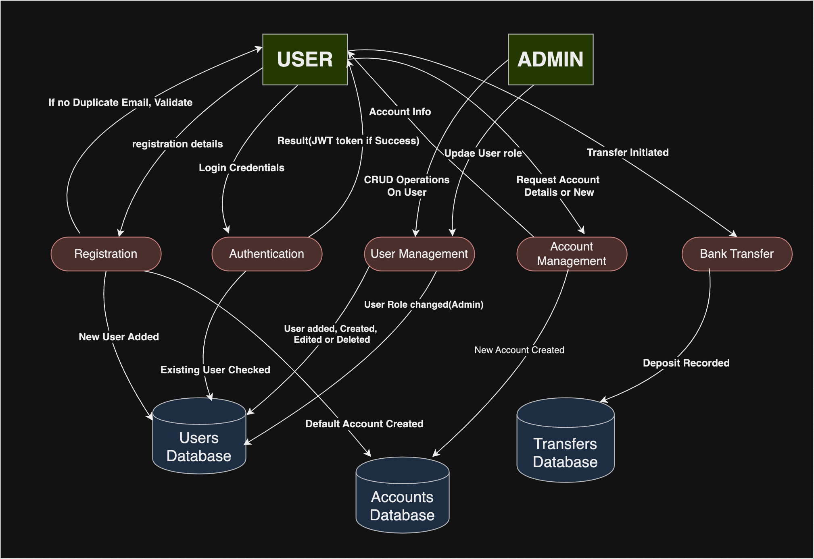

The Data Flow Diagram (DFD) illustrates the interaction between users, admins, processes, and data stores in the bank application. It captures key functionalities such as authentication, registration, user and account management, and bank transfers. The DFD highlights how data flows through the system.

---

### External Entities
1. **Bank User**
   - Represents the end users of the application (e.g., customers performing transactions or viewing accounts).
2. **Bank Admin**
   - Represents administrative users with elevated privileges for managing users and accounts.

---

### Processes
1. **Authentication**
   - Handles user login and session management.
   - Input: Login credentials (username, password).
   - Output: JWT Token issued to the user for session management.
2. **Registration**
   - Handles new user sign-ups.
   - Input: Registration details (username, email, password).
   - Output: New user created in the Users Database with a default account in the Accounts Database.
3. **User Management**
   - Allows Bank Admin to perform CRUD (Create, Read, Update, Delete) operations on users.
   - Input: Admin requests to manage users.
   - Output: Updates made to the Users Database.
4. **Account Management**
   - Handles operations such as account creation, updates, and retrieval.
   - Input: User or Admin requests for account-related operations.
   - Output: Updates to the Accounts Database.
5. **Bank Transfer**
   - Facilitates money transfers between user accounts.
   - Input: Transfer request specifying sender account, recipient account, and amount.
   - Output: Updated balances in the Accounts Database and a new transfer record in the Transfers Database.

---

### Data Stores
1. **Users Database**
   - Stores user credentials, hashed passwords, roles, and metadata.
2. **Accounts Database**
   - Stores account details such as balance, currency, status, and associated user.
3. **Transfers Database**
   - Logs bank transfers, including sender, recipient, amount, and timestamp.

---

### External Systems
1. **JWT System**
   - Used for authentication and authorization through token-based sessions.
2. **Email Service (Optional)**
   - Sends email notifications for registrations, transactions, or account updates.

---

### Data Flow Steps

#### 1. Authentication Process
- **Actors**: Bank User/Bank Admin
- **Steps**:
  1. The user/admin submits login credentials (username, password) to the **Authentication** process.
  2. The process validates the credentials against the **Users Database**.
  3. If successful, a **JWT Token** is issued and returned to the user/admin.

---

#### 2. Registration Process
- **Actors**: Bank User
- **Steps**:
  1. The user submits registration details (username, email, password) to the **Registration** process.
  2. The process validates the input (e.g., ensures unique email and strong password).
  3. A new user is created in the **Users Database**.
  4. A default bank account is created in the **Accounts Database**.

---

#### 3. User Management (Admin)
- **Actors**: Bank Admin
- **Steps**:
  1. The admin performs CRUD operations (e.g., add, update, delete users) via the **User Management** process.
  2. The process validates the admin's JWT token to confirm privileges.
  3. Changes are made to the **Users Database**.

---

#### 4. Account Management (User/Admin)
- **Actors**: Bank User/Bank Admin
- **Steps**:
  1. Users request account details or create/update accounts via the **Account Management** process.
  2. Admins manage accounts linked to users.
  3. The **Account Management** process interacts with the **Accounts Database** to retrieve or update data.

---

#### 5. Bank Transfer Process
- **Actors**: Bank User
- **Steps**:
  1. The user initiates a money transfer by specifying the sender account, recipient account, and amount.
  2. The **Bank Transfer** process validates:
     - The sender account belongs to the user.
     - Sufficient balance exists in the sender account.
     - The recipient account is valid.
  3. If valid:
     - The sender's balance is debited, and the recipient's balance is credited in the **Accounts Database**.
     - A record of the transfer is created in the **Transfers Database**.

### Key Features of the DFD

#### Authentication with JWT Tokens
- Tokens are issued upon successful login and used for session management.
#### Role-Based Access Control
- Admins can manage users and accounts, while regular users are limited to their accounts.
#### Scalability
- Multiple users and accounts can interact simultaneously with secure data flows.
#### Data Validation
- All processes validate inputs before updating the respective data stores.
#### Transaction Logging
- Transfers are securely logged in the Transfers Database, ensuring auditability.

---

## Twelve-Factor App Design
- **Description**: Document how the Twelve-Factor App principles are applied to the project.

---
