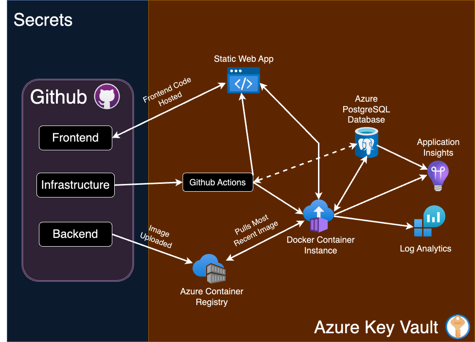

# Cloud Architect Documentation 

The Cloud Architect is responsible for designing and implementing scalable, reliable, and cost-effective cloud solutions that align with business and user needs. The role encompasses architecture design, infrastructure setup, collaboration with the team on implementation plans, and ensuring proper documentation throughout the project lifecycle.

---

## BigDawgBank Functional and Non-Functional Requirements

### Functional Requirements (FR)

The following functional requirements outline the behavior and features of the IE Bank Application. Each requirement is linked to the respective user story and associated test cases where applicable.

---

#### FR01: Default Admin Account
**Requirement:** The application must provide a default administrator account (username and password) upon system setup.  
**User Story:** As an admin, I want a default admin account to be created during system setup so that I can log in and start managing the system immediately.    

---

#### FR02: Admin User Management
**Requirement:** The admin portal must allow administrators to create, update, delete, and list user accounts.  
**User Story:** As an admin, I want to create, update, and delete user accounts so that I can manage access to the system.   

---

#### FR03: Password Reset for Users
**Requirement:** Administrators must be able to reset user passwords to assist users who cannot log in.  
**User Story:** As an admin, I want to reset user passwords so that I can assist users who cannot log in.    

---

#### FR04: Role and Permissions Management
**Requirement:** Administrators must be able to assign roles and permissions to users to control access to specific system parts.  
**User Story:** As an admin, I want to assign roles and permissions to users so that I can control their access to different parts of the system.  

---

#### FR05: New User Registration
**Requirement:** New bank users must be able to register using a registration form (username, password, and password confirmation). A default account with a random account number must be created upon successful registration.  
**User Story:** As a new user, I want to register for an account so that I can access the system.
- **Test:** [test_create_user](https://github.com/bigdawgbank/ie-bank/blob/main/backend/tests/unit/test_auth_model.py) 

---

#### FR06: Invalid Repeated Email Check
**Requirement:** The system must reject accounts that are created with the same email as another.  
**User Story:** As an admin, I want users who are creating two accounts to not be allowed the use of the same email when creating another one.  
- **Test:** [test_user_unique_email](https://github.com/bigdawgbank/ie-bank/blob/main/backend/tests/unit/test_auth_model.py)  

---

#### FR07: Multiple accounts per User
**Requirement:** The system must allow users to create more than one account under the assumption that they use different emails for the new accounts.  
**User Story:** As a user, I want to ensure that I can register multiple bank accounts to the system so I can better handle my finances.  
- **Test:** [test_register_duplicate_user](https://github.com/bigdawgbank/ie-bank/blob/main/backend/tests/functional/test_auth.py#test_register_duplicate_user)  

---

#### FR08: Secure User Login
**Requirement:** Bank users must log in securely using their username and password to access their accounts.  
**User Story:** As a user, I want to log in securely so that I can access my account.
- **Test:** [test_protected_route](https://github.com/bigdawgbank/ie-bank/blob/main/backend/tests/functional/test_auth.py)
- **Test:** [test_authentication_required](https://github.com/bigdawgbank/ie-bank/blob/main/backend/tests/functional/test_auth.py) 
- **Test:** [test_login_failure](https://github.com/bigdawgbank/ie-bank/blob/main/backend/tests/functional/test_auth.py)  

---

#### FR09: View Account and Transactions
**Requirement:** Bank users must view their accounts and associated transactions after logging in.  
**User Story:** As a user, I want to view my account details and recent transactions so that I can manage my finances effectively.  
**Test:**  To be Added!

---

#### FR10: Money Transfer
**Requirement:** Bank users must be able to transfer money to other accounts by entering the recipient’s account number and transfer amount. The transfer amount must not exceed the available balance.  
**User Story:** As a user, I want to transfer money to other accounts so that I can make payments easily.  
- **Test** [test_bank_transfer_process_route](https://github.com/bigdawgbank/ie-bank/blob/feat/money-transfer/backend/tests/functional/test_routes.py#test_bank_transfer_process_route)
- **Test** [test_bank_transfer_object_process](https://github.com/bigdawgbank/ie-bank/blob/feat/money-transfer/backend/tests/unit/test_bank_transfer_object.py)

---

#### FR11: Secure Password Handling
**Requirement:** All user passwords must be hashed and stored securely to prevent data breaches.  
**User Story:** As a developer, I want all passwords to be securely hashed so that user data is protected from breaches.  
- **Test:** [test_create_user](https://github.com/bigdawgbank/ie-bank/blob/main/backend/tests/unit/test_auth_model.py)  

---

#### FR12: Session Management
**Requirement:** User sessions must expire after inactivity to ensure account security.  
**User Story:** As a user, I want my session to expire after inactivity so that my account remains secure.  

---

#### FR13: Intuitive Admin UI
**Requirement:** The admin portal must have an intuitive UI for efficient user and permission management.  
**User Story:** As an admin, I want a clean and intuitive UI for the portal so that I can efficiently manage users and permissions.  

---

### Non-Functional Requirements (NFR)

The following non-functional requirements define the performance, security, and usability standards for the IE Bank Application. Where applicable, links to potential tests have been suggested.

---

#### NFR01: Basic Authentication
**Requirement:** The web application must implement a basic authentication system requiring username and password login. Credentials must be hashed and encrypted in the database.  
- **Test:** [test_authentication_required](https://github.com/bigdawgbank/ie-bank/blob/main/backend/tests/functional/test_auth.py)  

---

#### NFR02: Simple Frontend Interface
**Requirement:** The web application must have a simple and functional frontend UI without requiring advanced aesthetics or responsiveness.  

---

#### NFR03: System Availability
**Requirement:** The system must achieve 99.95% uptime in the production environment. Downtime should be limited to scheduled maintenance outside peak hours.  

---

#### NFR04: Cost Optimization
**Requirement:** Azure resources must be provisioned with cost-effective configurations, leveraging reserved instances and auto-scaling to manage resource costs.  

---

#### NFR05: Handling Peak Loads
**Requirement:** The system must support up to 500 concurrent users in the production environment without performance degradation.  

---

#### NFR06: Secure Secrets Management
**Requirement:** Secrets such as database connection strings and API keys must be stored securely using Azure Key Vault.  

---

#### NFR07: Logging and Monitoring
**Requirement:** The application must implement robust logging and monitoring through Azure Application Insights, ensuring errors and performance metrics are captured.  

---

#### NFR08: Compliance
**Requirement:** The application must comply with GDPR and other relevant data protection regulations to ensure user data privacy.  

---

#### NFR09: Scalability
**Requirement:** The application must support horizontal scaling for the frontend and backend to accommodate increased user demand.  

---

#### NFR10: Backup and Recovery
**Requirement:** The system must include point-in-time restore for the database and deployment rollback capabilities in case of failure.  

---

## Infrastructure Architecture Design

This section provides an in-depth overview of the infrastructure components and their configurations for the BigDawgBank MVP. The architecture ensures scalability, reliability, and security while adhering to cost-effective design principles.

---

### GitHub
#### Description
We will utilize GitHub as the central repository for version control, CI/CD pipelines, and documentation hosting. It integrates with Azure and other tools to streamline deployment and collaboration within our team. 

#### Key Features
- **Version Control**: 
  - Repositories for frontend, backend, and infrastructure code.
  - Supports feature branching for isolated code development.
- **GitHub Pages**: 
  - Hosts the Design Document for the project.
  - Provides role-based pages for team collaboration and documentation.
- **GitHub Actions**: 
  - Automates CI/CD pipelines for application and infrastructure.
  - Includes workflows for building, testing, and deploying to Azure environments(Dev, UAT and PROD).
- **Integration with Azure**:
  - Deploys infrastructure using Bicep templates.
  - Pushes Docker images to Azure Container Registry through Github actions.

---

### App Service for Containers
#### Description
We need and use the Azure App Service for Containers to host our backend Flask application, running in Docker containers. This service will allow us serverless scalability and ease of management.

#### Key Features
- **Containerized Backend**: 
  - Supports deploying custom-built Docker images.
  - Enables seamless updates through CI/CD pipelines.
- **Scaling Options**:
  - Auto-scaling based on HTTP traffic or CPU/memory utilization.
  - Manual scaling during predictable traffic spikes.
- **Configuration**:
  - Environment variables for secrets, database connections, and runtime settings.
  - Integrated with Azure Key Vault for secure credential storage.
- **Security**:
  - HTTPS enforced for secure communication.
  - Built-in Azure security monitoring and alerts.

---

### App Service Plan
#### Description
We're using the App Service Plan to provide us with the compute resources for hosting the App Service for Containers. It defines the cost and performance tiers for the backend.

#### Key Features
- **Pricing Tiers**:
  - Uses Basic (B1) or higher tier for cost-efficient development and testing.
  - Production environments may use Standard or Premium tiers for enhanced performance.
- **Auto-Scaling**:
  - Configured to scale out during high-traffic periods.
  - Scale-in rules to optimize costs during low usage.
- **Environment Isolation**:
  - Separate plans for Development, UAT, and Production environments.
- **Region-Specific Deployment**:
  - Hosted in Europe to ensure compliance with data protection regulations.

---

### PostgreSQL Database
#### Description
We will use Azure PostgreSQL Flexible Server as our managed database service for storing user profiles, account information, and transaction history.

### Key Features
- **High Availability**:
  - Configured with zone redundancy to ensure uptime during failures.
  - Automated failover for seamless recovery.
- **Data Encryption**:
  - SSL enforced for data in transit.
  - Transparent Data Encryption (TDE) for data at rest.
- **Performance**:
  - Optimized read and write performance with intelligent caching.
  - Configurable resource scaling for handling peak loads.
- **Configuration**:
  - Daily automated backups with a 30-day retention policy.
  - Role-based access control for secure database connections.

---

### Static Web App 
#### Description
We use the Azure Static Web Apps to host the Vue.js frontend of our banking application, ensuring fast and reliable delivery of the user interface.

#### Key Features
- **Global Content Delivery**:
  - Distributed through Azure CDN for low-latency access worldwide.
  - Redundant caching for improved page load speeds.
- **Custom Domains**:
  - Configured for easy branding with UAT and Production-specific domains.
  - SSL certificates for secure communication.
- **Automated Deployments**:
  - GitHub Actions automatically deploys changes upon commits to the `main` or `uat` branches.
- **Integrated Backend Routing**:
  - API endpoints for the backend are routed seamlessly.

---

### Azure Container Registry(ACR)
#### Description
We will use the Azure Container Registry(ACR) to effectively store and manage the Docker images used for our backend application.

#### Key Features
- **Private Registry**:
  - Secure storage for container images, accessible only to authorized Azure services.
- **Tagging and Versioning**:
  - Tags images with version numbers to ensure traceability and rollback capabilities.
- **Integration with CI/CD**:
  - Automatically updates with new images pushed from GitHub Actions.
- **Region-Specific Storage**:
  - Ensures low-latency access by hosting the registry in the same region as App Service.

---

### Key Vault
#### Description
Azure Key Vault securely manages sensitive information such as database credentials, API keys, and other secrets.

#### Key Features
- **Secrets Management**:
  - Stores PostgreSQL connection strings and admin credentials securely.
  - Automatically rotates keys to prevent stale secrets.
- **Access Control**:
  - Uses Managed Identity to grant App Services secure access without exposing credentials.
- **Audit Logging**:
  - Tracks access to secrets for compliance and monitoring purposes.

---

### Log Analytics Workspace
#### Description
We will use the Log Analytics Workspace to consolidate logs and metrics from Azure resources, giving centralized monitoring and diagnostics for BigDawgBank.

#### Key Features
- **Centralized Logging**:
  - Collects logs from App Services, PostgreSQL, and other Azure resources.
- **Querying Capabilities**:
  - Kusto Query Language (KQL) for creating advanced queries and visualizations.
- **Alerting**:
  - Real-time alerts for errors, unusual traffic patterns, and resource exhaustion.

---

### Application Insights
#### Description
We will use Azure Application Insights to provide us with real-time monitoring and telemetry for the BigDawgBank application, covering both frontend and backend performance.

#### Key Features
- **Performance Metrics**:
  - Tracks request latency, error rates, and resource consumption.
  - Provides dependency tracking for APIs and database queries.
- **Environment Segmentation**:
  - Configures separate Application Insights instances for Development, UAT, and Production.
- **Real-Time Dashboards**:
  - Displays key metrics for operational health and performance monitoring.

---

### Azure Workbook:
#### key Features

---
### Infra Architecture Design Diagram:

### INPUT DESCRIPTION HERE

---

## 3. Environment Design
- **Description**: Collaborate with the Infrastructure Developer and Full Stack Developer to document and update the environments required for development, UAT, and production. Include the configuration for each Azure service in each environment.

---

## Well-Architected Framework Design

### 1. Reliability Pillar
- **Description**: Collaborate with the Site Reliability Engineer to document decisions related to system reliability.

### 2. Security Pillar
- **Description**: Collaborate with the Cybersecurity Engineer to document security decisions.

### 3. Cost Optimization Pillar
- **Description**: Collaborate with the Infrastructure Developer to document cost optimization strategies.

### 4. Operational Excellence Pillar
- **Description**: Collaborate with the Full Stack Developer to document operational excellence strategies.

### 5. Performance Efficiency Pillar
- **Description**: Collaborate with the Infrastructure Developer and Site Reliability Engineer to document performance efficiency decisions.

---

## Test Driven Design(TDD)

---

## Release Strategy
- **Description**: Document the release strategy, including environment design, and ensure alignment with the DevOps checklist and GitHub Security best practices.

## Infrastructure Release Strategy
- **Description**: Document the infrastructure release strategy, including the use of IaC tools (e.g., Bicep templates, ARM templates) and GitHub Actions workflows. Detail the process for provisioning and updating infrastructure in each environment:
  - **Development Environment**: Describe experimental deployments and testing infrastructure configurations.
  - **UAT Environment**: Explain the controlled deployment of infrastructure for stakeholder testing.
  - **Production Environment**: Provide a strategy for deploying final, stable infrastructure to support the live application.
  - Highlight rollback mechanisms and disaster recovery strategies for infrastructure deployments.

---

### Development(Dev)

---

### User Acceptance Testing(UAT)

---

### Production(prod)

---

## 2. Use Case and Sequential Model Design
- **Description**: Update the use case and sequential model diagrams for each use case in the application.

| Use Case Name                       | **Create a New Bank Account**                                         | **Manage Bank Users (Admin)**                               | **View Accounts and Transactions**                           |
|------------------------|----------------------------------------------------------------------|-----------------------------------------------------------|-------------------------------------------------------------|
| **Description**        | A user creates a new account in the system.                         | The admin creates, updates, deletes, and views users.      | Users view details of their accounts, including transactions. |
| **Actors**             | Bank User                                                          | Admin User                                                | Bank User                                                   |
| **Primary Flow**       | 1. User navigates to the registration page. 2. Fills out the registration form with details. 3. Submits the form. 4. System creates a default account for the user. | 1. Admin logs into the admin portal. 2. Selects "Manage Users." 3. Performs actions such as creating, updating, or deleting users. | 1. User logs in. 2. Navigates to the "My Accounts" section. 3. Selects an account to view transaction history. 4. Transaction details are displayed. |
| **Alternate Flows**    | 1. Missing required fields: The system prompts the user to complete the form. 2. Invalid email format: System rejects submission with an error message. | 1. Invalid data provided: System rejects changes and shows error. 2. Unauthorized action: System restricts operations for unauthorized accounts. | 1. User has no accounts: System displays "No accounts found" message. 2. Transaction list is empty: System shows an appropriate message. |
| **System Requirements**| - User details must be validated. - Account number must be unique. - Default balance set to 0. | - Admin role must be validated for access. - Actions must trigger logs for auditing purposes. | - Transactions must be linked to accounts. - Secure access to account data is required. |

### INPUT SEQUENTIAL MODELS HERE FOR FIRST 3 USE CASES

|           Use Case Name             | **Transfer Funds**                                                  | **Admin Role Assignment**                                  | **User Login**                                              |
|------------------------|----------------------------------------------------------------------|-----------------------------------------------------------|-------------------------------------------------------------|
| **Description**        | Users transfer funds between accounts within the bank.             | Admin assigns roles and permissions to users.             | A registered user securely logs into their account.         |
| **Actors**             | Bank User                                                          | Admin User                                                | Bank User                                                   |
| **Primary Flow**       | 1. User logs in. 2. Navigates to the "Transfer Funds" section. 3. Provides recipient account number and amount. 4. Submits the transfer request. 5. System validates and completes the transfer. | 1. Admin logs in and navigates to "Manage Roles." 2. Selects a user and assigns roles and permissions. 3. Confirms the action. 4. System applies and logs the changes. | 1. User navigates to the login page. 2. Provides credentials. 3. System validates credentials. 4. On success, user is redirected to the dashboard. 5. Secure session is created for the user. |
| **Alternate Flows**    | 1. Insufficient funds: System rejects transfer and notifies the user. 2. Invalid account number: System rejects the request. 3. Transfer limit exceeded: User is notified and action is denied. | 1. Invalid role: System rejects the request with an error message. 2. Unauthorized action: Non-admin users are restricted from accessing this functionality. | 1. Invalid credentials: System denies access and shows an error. 2. Account locked: System notifies the user and suggests contacting support. 3. Session timeout: System logs out the user after inactivity. |
| **System Requirements**| - Validate recipient account before transfer. - Real-time balance updates. - Log all transactions for auditing purposes. | - Role-based access control must be enforced. - Changes to roles must be logged. - Admin validation required. | - Passwords must be securely hashed. - Session management must enforce expiration policies. |

### INPUT SEQUENTIAL MODELS HERE FOR SECOND 3 USE CASES

## 3. Entity Relationship Diagram
- **Description**: Update and document the Entity Relationship Diagram for the database.

## 4. Data Flow Diagram
- **Description**: Update and document the Data Flow Diagram for the application.

## 5. Twelve-Factor App Design
- **Description**: Document how the Twelve-Factor App principles are applied to the project.

---