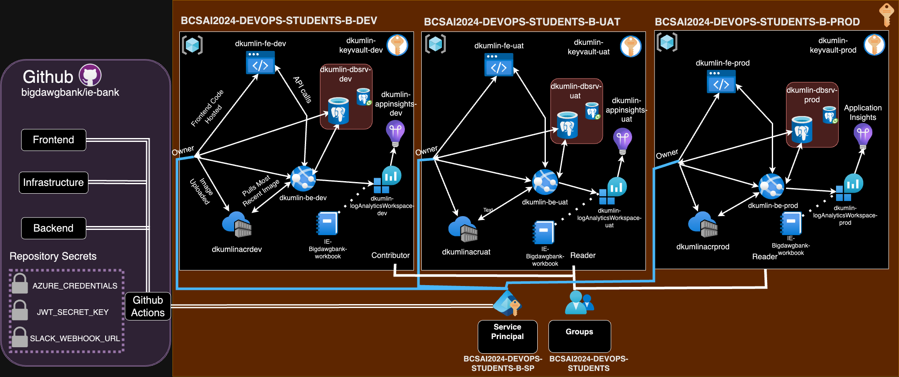

# Cloud Architect Documentation 

The Cloud Architect is responsible for designing and implementing scalable, reliable, and cost-effective cloud solutions that align with business and user needs. The role encompasses architecture design, infrastructure setup, collaboration with the team on implementation plans, and ensuring proper documentation throughout the project lifecycle.

---

## BigDawgBank Functional and Non-Functional Requirements

### Functional Requirements (FR)

The following functional requirements outline the behavior and features of the IE Bank Application. Each requirement is linked to the respective user story and associated test cases where applicable.

---

#### FR01: Default Admin Account
**Requirement:** The application must provide a default administrator account (username and password) upon system setup.  
**User Story:** As an admin, I want a default admin account to be created during system setup so that I can log in and start managing the system immediately.    

---

#### FR02: Admin User Management
**Requirement:** The admin portal must allow administrators to create, update, delete, and list user accounts.  
**User Story:** As an admin, I want to create, update, and delete user accounts so that I can manage access to the system.   

---

#### FR03: Password Reset for Users
**Requirement:** Administrators must be able to reset user passwords to assist users who cannot log in.  
**User Story:** As an admin, I want to reset user passwords so that I can assist users who cannot log in.    

---

#### FR04: Role and Permissions Management
**Requirement:** Administrators must be able to assign roles and permissions to users to control access to specific system parts.  
**User Story:** As an admin, I want to assign roles and permissions to users so that I can control their access to different parts of the system.  

---

#### FR05: New User Registration
**Requirement:** New bank users must be able to register using a registration form (username, password, and password confirmation). A default account with a random account number must be created upon successful registration.  
**User Story:** As a new user, I want to register for an account so that I can access the system.
- **Test:** [test_create_user](https://github.com/bigdawgbank/ie-bank/blob/main/backend/tests/unit/test_auth_model.py) 

---

#### FR06: Invalid Repeated Email Check
**Requirement:** The system must reject accounts that are created with the same email as another.  
**User Story:** As an admin, I want users who are creating more than one user to not be allowed the use of the same email when creating another one.  
- **Test:** [test_user_unique_email](https://github.com/bigdawgbank/ie-bank/blob/main/backend/tests/unit/test_auth_model.py)  
- **Test:** [test_register_duplicate_user](https://github.com/bigdawgbank/ie-bank/blob/main/backend/tests/functional/test_auth.py#test_register_duplicate_user)  

---

#### FR07: Multiple accounts per User
**Requirement:** The system must allow users to create more than one account under the assumption that they use different emails for the new accounts.  
**User Story:** As a user, I want to ensure that I can register multiple bank accounts to the system so I can better handle my finances.  

---

#### FR08: Secure User Login
**Requirement:** Bank users must log in securely using their username and password to access their accounts.  
**User Story:** As a user, I want to log in securely so that I can access my account.
- **Test:** [test_protected_route](https://github.com/bigdawgbank/ie-bank/blob/main/backend/tests/functional/test_auth.py)
- **Test:** [test_authentication_required](https://github.com/bigdawgbank/ie-bank/blob/main/backend/tests/functional/test_auth.py) 
- **Test:** [test_login_failure](https://github.com/bigdawgbank/ie-bank/blob/main/backend/tests/functional/test_auth.py)  

---

#### FR09: View Account and Transactions
**Requirement:** Bank users must view their accounts and associated transactions after logging in.  
**User Story:** As a user, I want to view my account details and recent transactions so that I can manage my finances effectively.  
**Test:**  To be Added!

---

#### FR10: Money Transfer
**Requirement:** Bank users must be able to transfer money to other accounts by entering the recipient’s account number and transfer amount. The transfer amount must not exceed the available balance.  
**User Story:** As a user, I want to transfer money to other accounts so that I can make payments easily.  
- **Test** [test_bank_transfer_process_route](https://github.com/bigdawgbank/ie-bank/blob/feat/money-transfer/backend/tests/functional/test_routes.py#test_bank_transfer_process_route)
- **Test** [test_bank_transfer_object_process](https://github.com/bigdawgbank/ie-bank/blob/feat/money-transfer/backend/tests/unit/test_bank_transfer_object.py)

---

#### FR11: Secure Password Handling
**Requirement:** All user passwords must be hashed and stored securely to prevent data breaches.  
**User Story:** As a developer, I want all passwords to be securely hashed so that user data is protected from breaches.  
- **Test:** [test_create_user](https://github.com/bigdawgbank/ie-bank/blob/main/backend/tests/unit/test_auth_model.py)  

---

#### FR12: Session Management
**Requirement:** User sessions must expire after inactivity to ensure account security.  
**User Story:** As a user, I want my session to expire after inactivity so that my account remains secure.  

---

#### FR13: Intuitive Admin UI
**Requirement:** The admin portal must have an intuitive UI for efficient user and permission management.  
**User Story:** As an admin, I want a clean and intuitive UI for the portal so that I can efficiently manage users and permissions.  

---

### Non-Functional Requirements (NFR)

The following non-functional requirements define the performance, security, and usability standards for the IE Bank Application. Where applicable, links to potential tests have been suggested.

---

#### NFR01: Basic Authentication
**Requirement:** The web application must implement a basic authentication system requiring username and password login. Credentials must be hashed and encrypted in the database.  
- **Test:** [test_authentication_required](https://github.com/bigdawgbank/ie-bank/blob/main/backend/tests/functional/test_auth.py)  

---

#### NFR02: Simple Frontend Interface
**Requirement:** The web application must have a simple and functional frontend UI without requiring advanced aesthetics or responsiveness.  

---

#### NFR03: System Availability
**Requirement:** The system must achieve 99.95% uptime in the production environment. Downtime should be limited to scheduled maintenance outside peak hours.  

---

#### NFR04: Cost Optimization
**Requirement:** Azure resources must be provisioned with cost-effective configurations, leveraging reserved instances and auto-scaling to manage resource costs.  

---

#### NFR05: Handling Peak Loads
**Requirement:** The system must support up to 500 concurrent users in the production environment without performance degradation.  

---

#### NFR06: Secure Secrets Management
**Requirement:** Secrets such as database connection strings and API keys must be stored securely using Azure Key Vault.  

---

#### NFR07: Logging and Monitoring
**Requirement:** The application must implement robust logging and monitoring through Azure Application Insights, ensuring errors and performance metrics are captured.  

---

#### NFR08: Compliance
**Requirement:** The application must comply with GDPR and other relevant data protection regulations to ensure user data privacy.  

---

#### NFR09: Scalability
**Requirement:** The application must support horizontal scaling for the frontend and backend to accommodate increased user demand.  

---

#### NFR10: Backup and Recovery
**Requirement:** The system must include point-in-time restore for the database and deployment rollback capabilities in case of failure.  

---

## Infrastructure Architecture Design

This section provides an in-depth overview of the infrastructure components and their configurations for the BigDawgBank MVP. The architecture ensures scalability, reliability, and security while adhering to cost-effective design principles.

---

### GitHub
#### Description
We will utilize GitHub as the central repository for version control, CI/CD pipelines, and documentation hosting. It integrates with Azure and other tools to streamline deployment and collaboration within our team. 

#### Key Features
- **Version Control**: 
  - Repositories for frontend, backend, and infrastructure code.
  - Supports feature branching for isolated code development.
- **GitHub Pages**: 
  - Hosts the Design Document for the project.
  - Provides role-based pages for team collaboration and documentation.
- **GitHub Actions**: 
  - Automates CI/CD pipelines for application and infrastructure.
  - Includes workflows for building, testing, and deploying to Azure environments(Dev, UAT and PROD).
- **Integration with Azure**:
  - Deploys infrastructure using Bicep templates.
  - Pushes Docker images to Azure Container Registry through Github actions.

---

### App Service for Containers
#### Description
We need and use the Azure App Service for Containers to host our backend Flask application, running in Docker containers. This service will allow us serverless scalability and ease of management.

#### Key Features
- **Containerized Backend**: 
  - Supports deploying custom-built Docker images.
  - Enables seamless updates through CI/CD pipelines.
- **Scaling Options**:
  - Auto-scaling based on HTTP traffic or CPU/memory utilization.
  - Manual scaling during predictable traffic spikes.
- **Configuration**:
  - Environment variables for secrets, database connections, and runtime settings.
  - Integrated with Azure Key Vault for secure credential storage.
- **Security**:
  - HTTPS enforced for secure communication.
  - Built-in Azure security monitoring and alerts.

---

### App Service Plan
#### Description
We're using the App Service Plan to provide us with the compute resources for hosting the App Service for Containers. It defines the cost and performance tiers for the backend.

#### Key Features
- **Pricing Tiers**:
  - Uses Basic (B1) or higher tier for cost-efficient development and testing.
  - Production environments may use Standard or Premium tiers for enhanced performance.
- **Auto-Scaling**:
  - Configured to scale out during high-traffic periods.
  - Scale-in rules to optimize costs during low usage.
- **Environment Isolation**:
  - Separate plans for Development, UAT, and Production environments.
- **Region-Specific Deployment**:
  - Hosted in Europe to ensure compliance with data protection regulations.

---

### PostgreSQL Database
#### Description
We will use Azure PostgreSQL Flexible Server as our managed database service for storing user profiles, account information, and transaction history.

### Key Features
- **High Availability**:
  - Configured with zone redundancy to ensure uptime during failures.
  - Automated failover for seamless recovery.
- **Data Encryption**:
  - SSL enforced for data in transit.
  - Transparent Data Encryption (TDE) for data at rest.
- **Performance**:
  - Optimized read and write performance with intelligent caching.
  - Configurable resource scaling for handling peak loads.
- **Configuration**:
  - Daily automated backups with a 30-day retention policy.
  - Role-based access control for secure database connections.

---

### Static Web App 
#### Description
We use the Azure Static Web Apps to host the Vue.js frontend of our banking application, ensuring fast and reliable delivery of the user interface.

#### Key Features
- **Global Content Delivery**:
  - Distributed through Azure CDN for low-latency access worldwide.
  - Redundant caching for improved page load speeds.
- **Custom Domains**:
  - Configured for easy branding with UAT and Production-specific domains.
  - SSL certificates for secure communication.
- **Automated Deployments**:
  - GitHub Actions automatically deploys changes upon commits to the `main` or `uat` branches.
- **Integrated Backend Routing**:
  - API endpoints for the backend are routed seamlessly.

---

### Azure Container Registry(ACR)
#### Description
We will use the Azure Container Registry(ACR) to effectively store and manage the Docker images used for our backend application.

#### Key Features
- **Private Registry**:
  - Secure storage for container images, accessible only to authorized Azure services.
- **Tagging and Versioning**:
  - Tags images with version numbers to ensure traceability and rollback capabilities.
- **Integration with CI/CD**:
  - Automatically updates with new images pushed from GitHub Actions.
- **Region-Specific Storage**:
  - Ensures low-latency access by hosting the registry in the same region as App Service.

---

### Key Vault
#### Description
Azure Key Vault securely manages sensitive information such as database credentials, API keys, and other secrets.

#### Key Features
- **Secrets Management**:
  - Stores PostgreSQL connection strings and admin credentials securely.
  - Automatically rotates keys to prevent stale secrets.
- **Access Control**:
  - Uses Managed Identity to grant App Services secure access without exposing credentials.
- **Audit Logging**:
  - Tracks access to secrets for compliance and monitoring purposes.

---

### Log Analytics Workspace
#### Description
We will use the Log Analytics Workspace to consolidate logs and metrics from Azure resources, giving centralized monitoring and diagnostics for BigDawgBank.

#### Key Features
- **Centralized Logging**:
  - Collects logs from App Services, PostgreSQL, and other Azure resources.
- **Querying Capabilities**:
  - Kusto Query Language (KQL) for creating advanced queries and visualizations.
- **Alerting**:
  - Real-time alerts for errors, unusual traffic patterns, and resource exhaustion.

---

### Application Insights
#### Description
We will use Azure Application Insights built on top of our Log Analytics to provide us with real-time monitoring and telemetry for the BigDawgBank application, covering both frontend and backend performance.

#### Key Features
- **Performance Metrics**:
  - Tracks request latency, error rates, and resource consumption.
  - Provides dependency tracking for APIs and database queries.
- **Environment Segmentation**:
  - Configures separate Application Insights instances for Development, UAT, and Production.
- **Real-Time Dashboards**:
  - Displays key metrics for operational health and performance monitoring.

---

### Azure Workbook:
#### key Features

---
### Infra Architecture Design Diagram:

### INPUT DESCRIPTION HERE

---

# Environment Design

## Description
Collaborate with the Infrastructure Developer and Full Stack Developer to document and update the environments required for development, UAT, and production. This section includes the configuration for each Azure service in each environment.

---

## Environments

### Development Environment
The development environment is used as a controlled environment for building and testing BigDawgBank's new features. It is used for experimental deployments and testing infrastructure configurations. It is designed to be flexible and allow for rapid changes.

- **Azure App Service**: 
  - **Configuration**: 
    - Plan: Basic
    - Instance Count: 1
    - SKU: B1
    - Location: `westeurope`
    - Environment Variables:
      - `ENV`: Development
      - `DBHOST`: Development Database Host
      - `DBNAME`: Development Database Name
      - `DBPASS`: Development Database Password
      - `DBUSER`: Development Database User
      - `FLASK_APP`: Flask Application Name
      - `FLASK_DEBUG`: True
      - `JWT_SECRET_KEY`: Development JWT Secret Key

- **Azure Database for PostgreSQL**: 
  - **Configuration**: 
    - Server Name: `dev-postgres-server`
    - Database Name: `dev-db`
    - SKU: Basic
    - Backup Retention: 7 days
    - Location: `westeurope`

- **Azure Key Vault**: 
  - **Configuration**: 
    - Name: `dev-keyvault`
    - Location: `westeurope`
    - Access Policies: Development team access

- **Azure Log Analytics Workspace**: 
  - **Configuration**: 
    - Name: `dev-log-analytics`
    - Location: `westeurope`

- **Azure Application Insights**: 
  - **Configuration**: 
    - Name: `dev-app-insights`
    - Location: `westeurope`
    - Linked Log Analytics Workspace ID: `dev-log-analytics`
    - Retention In Days: 90
    - Ingestion Mode: LogAnalytics
    - Public Network Access for Ingestion: Enabled
    - Public Network Access for Query: Enabled

- **Azure Container Registry**: 
  - **Configuration**: 
    - Name: `dev-container-registry`
    - Location: `westeurope`
    - Admin Username: Stored in Key Vault
    - Admin Password: Stored in Key Vault

---

### UAT Environment
The UAT (User Acceptance Testing) environment is used by our team at BigDawgBank for extensive stakeholder testing. It mirrors the production environment closely to ensure that the application behaves as expected before going live, gauging errors and allowing us to fix any faulty functionality of the application.

- **Azure App Service**: 
  - **Configuration**: 
    - Plan: Standard
    - Instance Count: 2
    - SKU: S1
    - Location: `westeurope`
    - Environment Variables:
      - `ENV`: UAT
      - `DBHOST`: UAT Database Host
      - `DBNAME`: UAT Database Name
      - `DBPASS`: UAT Database Password
      - `DBUSER`: UAT Database User
      - `FLASK_APP`: Flask Application Name
      - `FLASK_DEBUG`: False
      - `JWT_SECRET_KEY`: UAT JWT Secret Key

- **Azure Database for PostgreSQL**: 
  - **Configuration**: 
    - Server Name: `uat-postgres-server`
    - Database Name: `uat-db`
    - SKU: Standard
    - Backup Retention: 14 days
    - Location: `westeurope`

- **Azure Key Vault**: 
  - **Configuration**: 
    - Name: `uat-keyvault`
    - Location: `westeurope`
    - Access Policies: UAT team access

- **Azure Log Analytics Workspace**: 
  - **Configuration**: 
    - Name: `uat-log-analytics`
    - Location: `westeurope`

- **Azure Application Insights**: 
  - **Configuration**: 
    - Name: `uat-app-insights`
    - Location: `westeurope`
    - Linked Log Analytics Workspace ID: `uat-log-analytics`
    - Retention In Days: 90
    - Ingestion Mode: LogAnalytics
    - Public Network Access for Ingestion: Enabled
    - Public Network Access for Query: Enabled

- **Azure Container Registry**: 
  - **Configuration**: 
    - Name: `uat-container-registry`
    - Location: `westeurope`
    - Admin Username: Stored in Key Vault
    - Admin Password: Stored in Key Vault

---

### Production Environment
The production environment is the live environment where the BigDawgBank application will be available to end-users. It is designed for high availability, scalability, and security.

- **Azure App Service**: 
  - **Configuration**: 
    - Plan: Premium
    - Instance Count: 3
    - SKU: P1V2
    - Location: `westeurope`
    - Environment Variables:
      - `ENV`: Production
      - `DBHOST`: Production Database Host
      - `DBNAME`: Production Database Name
      - `DBPASS`: Production Database Password
      - `DBUSER`: Production Database User
      - `FLASK_APP`: Flask Application Name
      - `FLASK_DEBUG`: False
      - `JWT_SECRET_KEY`: Production JWT Secret Key

- **Azure Database for PostgreSQL**: 
  - **Configuration**: 
    - Server Name: `prod-postgres-server`
    - Database Name: `prod-db`
    - SKU: Premium
    - Backup Retention: 35 days
    - Location: `westeurope`

- **Azure Key Vault**: 
  - **Configuration**: 
    - Name: `prod-keyvault`
    - Location: `westeurope`
    - Access Policies: Production team access

- **Azure Log Analytics Workspace**: 
  - **Configuration**: 
    - Name: `prod-log-analytics`
    - Location: `westeurope`

- **Azure Application Insights**: 
  - **Configuration**: 
    - Name: `prod-app-insights`
    - Location: `westeurope`
    - Linked Log Analytics Workspace ID: `prod-log-analytics`
    - Retention In Days: 90
    - Ingestion Mode: LogAnalytics
    - Public Network Access for Ingestion: Enabled
    - Public Network Access for Query: Enabled

- **Azure Container Registry**: 
  - **Configuration**: 
    - Name: `prod-container-registry`
    - Location: `westeurope`
    - Admin Username: Stored in Key Vault
    - Admin Password: Stored in Key Vault

---

## Configuration Variables
To determine different configuration options for each environment, we will make use of the files under the `parameters` folder.
- File `parameters/dev.parameters.json` contains the configuration for the development environment.
- File `parameters/uat.parameters.json` contains the configuration for the UAT environment.
- File `parameters/prod.parameters.json` contains the configuration for the production environment.

---

## Continuous Delivery
The CI/CD pipelines for each environment are defined in the following GitHub Actions workflow files:
- `.github/workflows/ie-bank-backend.yml` for the backend.
- `.github/workflows/ie-bank-frontend.yml` for the frontend.
- `.github/workflows/ie-bank-infra.yml` for the infrastructure.

### GitHub Secrets
The workflows use the following GitHub secrets:
- `AZURE_CREDENTIALS`: Azure credentials to authenticate to Azure via Service Principal.
- `DBUSER`: Username for the PostgreSQL server.
- `DBPASS`: Password for the PostgreSQL server.
- `DBHOST`: Hostname for the PostgreSQL server.
- `DBNAME`: Name for the PostgreSQL database.

---

### GitHub Variables
The workflows use the following GitHub variables:
- `ENV`: Environment name.
- `FLASK_APP`: Name of the Flask app to run.

---

This document provides a comprehensive overview of the environment design and configuration for each Azure service in the development, UAT, and production environments. It ensures that all team members are aligned and aware of the infrastructure setup and deployment processes.

## Well-Architected Framework Design

### 1. Reliability Pillar
- **Description**: Collaborate with the Site Reliability Engineer to document decisions related to system reliability.

### 2. Security Pillar
- **Description**: Collaborate with the Cybersecurity Engineer to document security decisions.

### 3. Cost Optimization Pillar
- **Description**: Collaborate with the Infrastructure Developer to document cost optimization strategies.

### 4. Operational Excellence Pillar
- **Description**: Collaborate with the Full Stack Developer to document operational excellence strategies.

### 5. Performance Efficiency Pillar
- **Description**: Collaborate with the Infrastructure Developer and Site Reliability Engineer to document performance efficiency decisions.

---

## Test Driven Design(TDD)

---

## Release Strategy
- **Description**: Document the release strategy, including environment design, and ensure alignment with the DevOps checklist and GitHub Security best practices.

## Infrastructure Release Strategy
- **Description**: Document the infrastructure release strategy, including the use of IaC tools (e.g., Bicep templates, ARM templates) and GitHub Actions workflows. Detail the process for provisioning and updating infrastructure in each environment:
  - **Development Environment**: Describe experimental deployments and testing infrastructure configurations.
  - **UAT Environment**: Explain the controlled deployment of infrastructure for stakeholder testing.
  - **Production Environment**: Provide a strategy for deploying final, stable infrastructure to support the live application.
  - Highlight rollback mechanisms and disaster recovery strategies for infrastructure deployments.

---

### Development(Dev)

---

### User Acceptance Testing(UAT)

---

### Production(prod)

---

## Use Case and Sequential Model Design

### Description
Use case and sequential model diagrams for each use case in the BigDawgBank application.

| **Use Case Name**                 | **Register for a New Bank Account**                                         | **User Login**                                              | **Manage Bank Users (Admin)**                              |
|-----------------------------------|------------------------------------------------------------------------------|-------------------------------------------------------------|------------------------------------------------------------|
| **Description**                   | A user creates a new account in the system.                                 | A registered user securely logs into their account.         | Admin manages users (create, update, delete) and assigns roles. |
| **Actors**                        | Bank User                                                                   | Bank User                                                   | Admin User                                                |
| **Primary Flow**                  | 1. User navigates to the registration page. 2. Fills out the registration form with details. 3. Submits the form. 4. System creates a default account for the user. | 1. User navigates to the login page. 2. Provides credentials. 3. System validates credentials. 4. On success, user is redirected to the dashboard. 5. Secure session is created for the user. | 1. Admin logs into the admin portal. 2. Selects "Manage Users" or "Manage Roles." 3. Performs actions such as creating, updating, deleting users, or assigning roles. 4. System validates JWT token for privileges and processes the request. 5. Database updates user data. |
| **Alternate Flows**               | 1. Missing required fields: The system prompts the user to complete the form. 2. Invalid email format: System rejects submission with an error message. | 1. Invalid credentials: System denies access and shows an error. 2. Account locked: System notifies the user and suggests contacting support. 3. Session timeout: System logs out the user after inactivity. | 1. Invalid role: System rejects the request with an error message. 2. Unauthorized action: Non-admin users are restricted from accessing this functionality. 3. Database operation failure: System notifies the admin of the issue. |
| **System Requirements**           | - User details must be validated. - Account number must be unique. - Default balance set to 0. | - Passwords must be securely hashed. - Session management must enforce expiration policies. | - Role-based access control must be enforced. - Changes to roles must be logged. - Admin validation required via JWT. |

**Sequence Diagram: Register for a New Bank Account**

**Sequence Diagram: User Login**

**Sequence Diagram: Manage Bank Users (Admin)**

---

| **Use Case Name**                 | **Transfer Money Between Accounts**                                         | **Deposit Money**                                           | **View Account and Transaction History**                   |
|-----------------------------------|------------------------------------------------------------------------------|-------------------------------------------------------------|------------------------------------------------------------|
| **Description**                   | Users transfer funds between accounts within the bank.                      | Users deposit money into an account.                       | Users view details of their accounts, including transactions. |
| **Actors**                        | Bank User                                                                   | Bank User                                                   | Bank User                                                |
| **Primary Flow**                  | 1. User logs in. 2. Navigates to the "Transfer Funds" section. 3. Provides recipient account number and amount. 4. Submits the transfer request. 5. System validates and completes the transfer. | 1. User logs in. 2. Navigates to "Deposit Funds" section. 3. Provides account ID and deposit amount. 4. Submits the deposit request. 5. System validates and updates the account balance. | 1. User logs in. 2. Navigates to the "My Accounts" section. 3. Selects an account to view transaction history. 4. Transaction details are displayed. |
| **Alternate Flows**               | 1. Insufficient funds: System rejects transfer and notifies the user. 2. Invalid account number: System rejects the request. 3. Transfer limit exceeded: User is notified and action is denied. | 1. Invalid account ID: System rejects the request. 2. Negative deposit amount: System prompts the user to provide a positive value. 3. Database operation failure: System notifies the user of the issue. | 1. User has no accounts: System displays "No accounts found" message. 2. Transaction list is empty: System shows an appropriate message. |
| **System Requirements**           | - Validate recipient account before transfer. - Real-time balance updates. - Log all transactions for auditing purposes. | - Account validation must be performed. - Deposits must be logged for auditing. - Balance updates must occur in real-time. | - Transactions must be linked to accounts. - Secure access to account data is required. - Display should be user-friendly. |

---

**Sequence Diagram: Transfer Money Between Accounts**

**Sequence Diagram: Deposit money in individual Account**

## Entity Relationship Diagram
- **Description**: Update and document the Entity Relationship Diagram for the database.

The Entity-Relationship Diagram (ERD) represents the logical structure and relationships of the database for the bank application. The diagram defines three main entities: **Users**, **Accounts**, and a **Logical Bank Transfers Entity**.

---

#### Users Table
- Represents the individuals interacting with the bank application, such as customers or administrators.
- **Attributes**:
  - **id (Primary Key):** Unique identifier for each user.
  - **username:** Unique name for the user.
  - **email:** Unique email address.
  - **password_hash:** Securely hashed password for authentication.
  - **role:** Defines the role of the user, such as "admin" or "user".
  - **created_at:** Timestamp indicating when the user was created.

---

#### Accounts Table
- Represents the bank accounts owned by users.
- **Attributes**:
  - **id (Primary Key):** Unique identifier for each account.
  - **name:** Name or label of the account.
  - **account_number:** Unique 20-digit account number.
  - **balance:** The current balance in the account.
  - **currency:** Currency type for the account (e.g., €, $, £).
  - **status:** Indicates if the account is active or inactive.
  - **country:** Country associated with the account.
  - **created_at:** Timestamp indicating when the account was created.
  - **user_id (Foreign Key):** Links the account to a user in the **Users** table.

---

#### Bank Transfers Logical Entity
- Represents the conceptual structure for transactions between accounts.
- **Attributes**:
  - **from_account_id (Foreign Key):** ID of the account from which money is sent.
  - **to_account_id (Foreign Key):** ID of the account to which money is received.
  - **amount:** Amount of money transferred.
  - **created_at:** Timestamp of the transaction.

---

### Relationships

#### User to Account
- **Type:** One-to-Many
- **Description:** Each user can own multiple bank accounts, but each account belongs to one specific user.
- **Implementation:** 
  - The `user_id` in the **Accounts** table serves as a foreign key referencing the `id` in the **Users** table.

---

#### Account to Bank Transfers
- **Type:** 0-to-Many
- **Description:** An account may participate in many bank transfers as a sender or a recipient. However, an account may also exist without participating in any transfer.
- **Implementation:**
  - `from_account_id` and `to_account_id` in the **Bank Transfers Logical Entity** are foreign keys referencing the `id` in the **Accounts** table.

---

### Key Features

#### Logical Entity for Bank Transfers
- This entity is logical and not stored as a separate table in the database. Instead, it provides a clear abstraction for managing account-to-account transactions.

#### Admin Role for Users
- The `role` attribute in the **Users** table allows distinguishing between administrative users and regular users.
- Admins can manage accounts, assign roles, and oversee user operations.

#### Scalability
- The One-to-Many relationship between **Users** and **Accounts** ensures scalability as users can have multiple accounts.
- The 0-to-Many relationship for **Bank Transfers** supports a flexible and dynamic transaction model.

#### Secure Data Handling
- Passwords are hashed securely in the **Users** table, ensuring data security.
- Transactions are validated before being logically processed in the **Bank Transfers** entity.

---

## Data Flow Diagram
- **Description**: Update and document the Data Flow Diagram for the application.

The Data Flow Diagram (DFD) illustrates the interaction between users, admins, processes, and data stores in the bank application. It captures key functionalities such as authentication, registration, user and account management, and bank transfers. The DFD highlights how data flows through the system.

---

### External Entities
1. **Bank User**
   - Represents the end users of the application (e.g., customers performing transactions or viewing accounts).
2. **Bank Admin**
   - Represents administrative users with elevated privileges for managing users and accounts.

---

### Processes
1. **Authentication**
   - Handles user login and session management.
   - Input: Login credentials (username, password).
   - Output: JWT Token issued to the user for session management.
2. **Registration**
   - Handles new user sign-ups.
   - Input: Registration details (username, email, password).
   - Output: New user created in the Users Database with a default account in the Accounts Database.
3. **User Management**
   - Allows Bank Admin to perform CRUD (Create, Read, Update, Delete) operations on users.
   - Input: Admin requests to manage users.
   - Output: Updates made to the Users Database.
4. **Account Management**
   - Handles operations such as account creation, updates, and retrieval.
   - Input: User or Admin requests for account-related operations.
   - Output: Updates to the Accounts Database.
5. **Bank Transfer**
   - Facilitates money transfers between user accounts.
   - Input: Transfer request specifying sender account, recipient account, and amount.
   - Output: Updated balances in the Accounts Database and a new transfer record in the Transfers Database.

---

### Data Stores
1. **Users Database**
   - Stores user credentials, hashed passwords, roles, and metadata.
2. **Accounts Database**
   - Stores account details such as balance, currency, status, and associated user.
3. **Transfers Database**
   - Logs bank transfers, including sender, recipient, amount, and timestamp.

---

### External Systems
1. **JWT System**
   - Used for authentication and authorization through token-based sessions.
2. **Email Service (Optional)**
   - Sends email notifications for registrations, transactions, or account updates.

---

### Data Flow Steps

#### 1. Authentication Process
- **Actors**: Bank User/Bank Admin
- **Steps**:
  1. The user/admin submits login credentials (username, password) to the **Authentication** process.
  2. The process validates the credentials against the **Users Database**.
  3. If successful, a **JWT Token** is issued and returned to the user/admin.

---

#### 2. Registration Process
- **Actors**: Bank User
- **Steps**:
  1. The user submits registration details (username, email, password) to the **Registration** process.
  2. The process validates the input (e.g., ensures unique email and strong password).
  3. A new user is created in the **Users Database**.
  4. A default bank account is created in the **Accounts Database**.

---

#### 3. User Management (Admin)
- **Actors**: Bank Admin
- **Steps**:
  1. The admin performs CRUD operations (e.g., add, update, delete users) via the **User Management** process.
  2. The process validates the admin's JWT token to confirm privileges.
  3. Changes are made to the **Users Database**.

---

#### 4. Account Management (User/Admin)
- **Actors**: Bank User/Bank Admin
- **Steps**:
  1. Users request account details or create/update accounts via the **Account Management** process.
  2. Admins manage accounts linked to users.
  3. The **Account Management** process interacts with the **Accounts Database** to retrieve or update data.

---

#### 5. Bank Transfer Process
- **Actors**: Bank User
- **Steps**:
  1. The user initiates a money transfer by specifying the sender account, recipient account, and amount.
  2. The **Bank Transfer** process validates:
     - The sender account belongs to the user.
     - Sufficient balance exists in the sender account.
     - The recipient account is valid.
  3. If valid:
     - The sender's balance is debited, and the recipient's balance is credited in the **Accounts Database**.
     - A record of the transfer is created in the **Transfers Database**.

---

## Twelve-Factor App Design
- **Description**: Document how the Twelve-Factor App principles are applied to the project.

---
