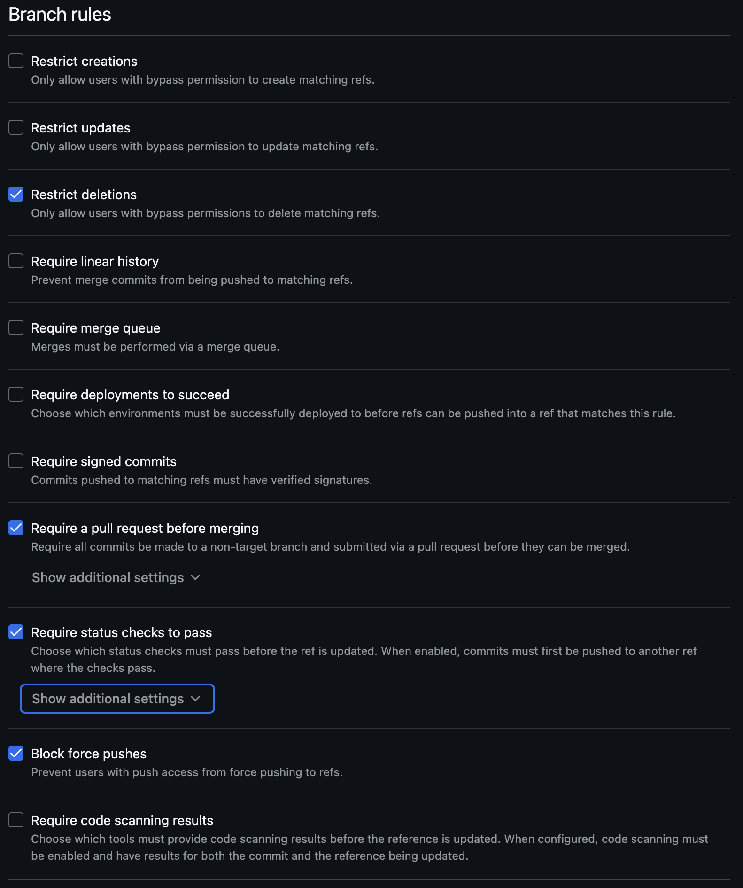

# IE Bank System GitHub Security Design Document

---

### **Introduction**

This document outlines the GitHub security strategy implemented for the IE Bank System. The goal is to ensure a robust and secure GitHub environment by leveraging advanced security features, implementing best practices, and aligning with industry standards such as OpenSSF and SAFECode frameworks.

---

## **1. GitHub Hardening Strategy**

### **1.1 Branch Protection Rules**

- **Description:**
  - Enforced branch protection rules on the `main` branch to ensure secure code development.
- **Enforced Rules:**
  - Require pull request reviews before merging.
  - Enforce signed commits for all contributors.
  - Require all status checks to pass before merging.
- **Impact:**
  - Prevented unauthorized modifications to the `main` branch.
  - Strengthened code quality by enforcing peer reviews.

---

### **1.2 Dependabot**
- **Description:**
  - Automated monitoring of dependencies to detect vulnerabilities and keep libraries updated.
- **Metrics:**
  - **Alerts:** 9 open, 3 resolved.
  - Vulnerabilities addressed include:
    - **High:** Flask-CORS, Werkzeug ReDoS.
    - **Moderate:** Bootstrap XSS.
- **Impact:**
  - Reduced risk of supply chain attacks and ensured compatibility with the latest security patches.

---

### **1.3 CodeQL Analysis**
- **Description:**
  - Integrated CodeQL workflows for semantic code analysis in both frontend (Vue.js) and backend (Python).
- **Metrics:**
  - Total workflows run: 139.
  - Issues identified: 7 (5 resolved, 2 active).
    - **High:** Flask app running in debug mode.
    - **Medium:** Information exposure through exceptions.
- **Impact:**
  - Proactively identified vulnerabilities during development, reducing risks in production.

---

### **1.4 OSSF Scorecard**
- **Description:**
  - Implemented OSSF Scorecard to evaluate repository security posture.
- **Status:**
  - Workflow integrated; initial scores pending.
- **Impact:**
  - Enabled evaluation of adherence to security best practices, guiding further improvements.

---

### **1.5 Secret Scanning & Push Protection**
- **Description:**
  - Configured secret scanning to detect and block sensitive data like API keys and tokens.
  - Enabled push protection to prevent secrets from being pushed to the repository.
- **Impact:**
  - Protected sensitive information from accidental exposure and minimized risk of credential leaks.

---

### **1.6 CODEOWNERS**
- **Description:**
  - Established a `CODEOWNERS` file to enforce accountability and streamline reviews.
- **File Details:**
  - Owners assigned for specific areas:
    - **Frontend/Backend:** `@RestartDK`, `@ADRIANDLT`
    - **Infra:** `@albipuliga`, `@paulopasso`
    - **Workflows (Security):** `@Wisammad`
  - Default owner: `@Wisammad`.
- **Impact:**
  - Improved review efficiency and accountability for changes in critical areas.

---

## **2. Secrets Management**

### **2.1 Azure Key Vault**
- **Description:**
  - Configured Azure Key Vault for secure storage of sensitive data like API keys and database credentials.
- **Implementation Details:**
  - Used a Bicep template to provision the Key Vault with the following features:
    - Role-Based Access Control (RBAC).
    - Enabled soft delete for recovery of deleted secrets.
    - Enabled integration with GitHub Actions workflows for automated deployment.
- **Impact:**
  - Protected critical credentials, minimized risk of leaks, and streamlined secure deployments.

---

## **3. Implemented Security Practices**

### **3.1 Practices from OpenSSF**

#### **1. Tools in CLI Pipeline to Detect Vulnerabilities**
- **Implementation:**
  - Integrated **CodeQL** and **OSSF Scorecard** into the CI/CD pipeline.
- **Impact:**
  - Automated vulnerability detection during development.

#### **2. Keep Dependencies Reasonably Up-to-Date**
- **Implementation:**
  - Enabled **Dependabot** for monitoring and automatic updates of dependencies.
- **Impact:**
  - Reduced exposure to outdated and insecure libraries.

#### **3. Do Not Push Secrets to a Repository**
- **Implementation:**
  - Configured **Secret Scanning** and **Push Protection** in GitHub to block secrets from entering the repository.
- **Impact:**
  - Prevented accidental exposure of sensitive data.

#### **4. Review Before Accepting Changes**
- **Implementation:**
  - Established a `CODEOWNERS` file and enforced branch protection rules for peer-reviewed changes.
- **Impact:**
  - Improved code quality and accountability.

#### **5. Regex for Input Practices**
- **Implementation:**
  - Used regex-based validation in the backend (Python) and frontend (Vue.js) to prevent injection attacks.
- **Impact:**
  - Reduced vulnerabilities like SQL injection and XSS.

---

### **3.2 Practices from SAFECode**

#### **1. Least Privilege: Operate Using the Least Set of Privileges Necessary**
- **Implementation:**
  - Restricted access using Azure Key Vault’s Role-Based Access Control (RBAC).
- **Impact:**
  - Reduced the attack surface by enforcing least privilege access.

#### **2. Design for Updating: Anticipate the Need for Future Security Updates**
- **Implementation:**
  - Leveraged **Dependabot** for continuous dependency updates.
- **Impact:**
  - Maintained a secure system with minimal effort.

#### **3. Key and Certificate Management**
- **Implementation:**
  - Stored keys and certificates securely in Azure Key Vault.
- **Impact:**
  - Enhanced security and compliance with best practices.

#### **4. Complete Mediation: Check Every Access to Every Object for Authorization**
- **Implementation:**
  - Enforced access control checks in APIs and endpoints.
- **Impact:**
  - Prevented unauthorized access to sensitive resources.

#### **5. Use Safe, Built-in Security Features**
- **Implementation:**
  - Adopted built-in security features in frameworks (e.g., Python’s `secrets` module, Vue.js CSP policies).
- **Impact:**
  - Reduced risks from insecure custom implementations.

---

## **4. Metrics and Results**

| **Tool**             | **Issues Found** | **Issues Resolved** | **Severity**      |
|-----------------------|------------------|---------------------|-------------------|
| **Dependabot**        | 12               | 3                   | High, Moderate    |
| **CodeQL**            | 7                | 5                   | High, Medium      |
| **Secret Scanning**   | 0                | 0                   | (No issues found) |

---

## **5. Challenges and Lessons Learned**

### **Challenges:**
- Setting up and debugging the OSSF Scorecard workflow.
- Managing dependency vulnerabilities across multiple repositories.

### **Lessons Learned:**
- Automation ensures consistency and scalability in security practices.
- Collaboration across roles (e.g., Cloud Architect, Security Engineer) is critical to success.

---

## **6. Future Recommendations**
- Extend branch protection rules to feature and development branches.
- Automate alert triage for Dependabot and CodeQL.
- Monitor OSSF Scorecard results and improve based on recommendations.

---

## **7. References**
- **CodeQL Workflow:** [View Workflow](#)
- **Dependabot Alerts:** [View Alerts](#)
- **OSSF Scorecard Workflow:** [View Workflow](#)
- **CODEOWNERS File:** [View CODEOWNERS](#)
- **Azure Key Vault Bicep File:** [View File](#)

---
