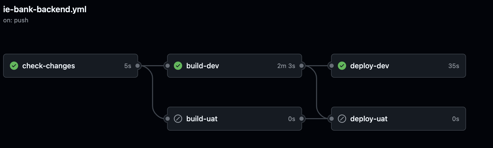

# Full Stack Engineer Documentation Template

The Full Stack Engineer is responsible for designing and implementing cloud solutions for both the frontend and backend of the application. This role requires skills in various platforms, languages, and frameworks to ensure the application is scalable, reliable, and cost-effective.

---

## Git Feature Branch Strategy

### Description of Git Feature Branch Strategy
- **Description**: The Git feature branch strategy is implemented to ensure a structured and efficient workflow for developing new features, fixing bugs, and maintaining the codebase. This strategy involves creating separate branches for each feature or bug fix, which are then merged into the main branch after thorough testing and code review.

1. **Main Branch**:
- The main branch contains the stable, production-ready code.
- Direct commits to the main branch are restricted to ensure stability. Code reviews need to be requested then approved in order to merge to main.

2. **Develop Branch**:
- The feature/develop branch serves as an integration branch for features and bug fixes.
- It is used for testing and validation before merging into the main branch.

3. **Feature Branches**:
- Feature branches are created from the main branch.
- Naming convention: feat/<feature-name>.
- Used for developing new features or enhancements.

4. **Bugfix Branches**:
Although we don´t have any bugfix branches, we would fix any bugs inside the feature branch before merging to main.
If we were to have bugfix branches, this would be our strategy:
- Bugfix branches are created from the develop/f branch.
- Naming convention: bugfix/<bug-description>.
- Used for fixing bugs and issues.

5. **Release Branches**:
Although, we also don´t have any release branches at the moment, they could be used in the future using the following strategy:
- Release branches are created from the develop branch.
- Naming convention: release/<version-number>.
- Used for preparing a new production release, including final testing and bug fixes.

### Configuration Applied to GitHub
1. **Branch Protection Rules**:
- Enable branch protection rules for the main and develop branches to prevent direct commits.
- Require pull request reviews before merging.
- Enforce status checks to pass before merging (e.g., CI tests).

2. **Pull Request Workflow**:
- All changes must be submitted via pull requests (PRs).
- PRs must be reviewed and approved by at least one other team member.
- Automated tests must pass before a PR can be merged.

3. **Commit Signing**:
- Enforce signed commits to ensure the authenticity and integrity of the code.

4. **Automated Testing**:
- Integrate CI/CD pipelines to automatically run tests on each PR.
- Use GitHub Actions to automate the build, test, and deployment processes.

### Alignment with DevOps Principles
- **Collaboration**: The feature branch strategy promotes collaboration by allowing multiple developers to work on different features simultaneously without conflicts.
- **Continuous Integration**: Automated testing and CI pipelines ensure that code changes are continuously integrated and tested, maintaining code quality.
- **Continuous Delivery**: The strategy supports continuous delivery by enabling frequent, reliable releases through structured branching and automated deployments.
- **Version Control**: The use of branches for features, bug fixes, and releases ensures a clear version control history, making it easier to track changes and roll back if necessary.
- **Security**: Branch protection rules and commit signing enhance the security of the codebase by preventing unauthorized changes and ensuring code integrity.

---

## Continuous Integration (CI) Workflows

### 1. CI Workflow for Frontend

**Description**  
The CI workflow for the frontend application automates the validation of code changes, ensuring any new features or updates are tested before being merged into the main branch.

**Workflow Steps**  

1. **Trigger**  
   - The workflow is triggered on:
     - Push events to the `frontend/**` directory across all branches.
     - Pull requests targeting the `main` branch.  
   - This ensures that changes to the frontend are validated at key integration points.

```yml
on:
push:
paths:
   - "frontend/**"
branches:
   - "*"
   - "!refs/pull/*"
pull_request:
branches:
   - main
paths:
   - "frontend/**"
```

2. **Checkout Code**  
   - The `actions/checkout@v3` action is used to retrieve the latest codebase, ensuring that subsequent steps operate on the most recent changes.

```yml
- uses: actions/checkout@v3
```

3. **Set Up Node.js**  
   - The workflow sets up the Node.js environment using the `actions/setup-node@v3` action.  
   - Ensures compatibility by specifying `NODE_VERSION` as `18.x`.
```yml
- name: Set up Node.js
uses: actions/setup-node@v3
with:
node-version: ${{ env.NODE_VERSION }}
```
4. **Install Dependencies**  
   - Dependencies are installed via `npm install` to ensure all required packages are available for testing and building.
```yml
- name: Install Dependencies
working-directory: ${{ env.APP_LOCATION }}
run: npm install
```
5. **Build Application**  
   - The application is built using `npm run build`, creating an optimized production build ready for deployment.
```yml
- name: Build Application
working-directory: ${{ env.APP_LOCATION }}
run: npm run build
```
---

### 2. CI Workflow for Backend

**Description**  
The backend CI workflow validates changes to backend services by running tests and static analysis, ensuring that the API and business logic remain stable.

**Workflow Steps**  

1. **Trigger**  
   - The workflow runs on:
     - Push events to the `backend/**` directory across all branches.
     - Pull requests targeting the `main` branch.
```yml
on:
push:
   paths: 
      - "backend/**"
   branches:
      - "*"
pull_request:
   branches: [ "main" ]
   paths:
      - "backend/**"
```
2. **Checkout Code**  
   - Similar to the frontend workflow, this retrieves the latest code for validation.

```yml
- uses: actions/checkout@v3
```

3. **Set Up Python Environment**  
   - Python 3.11 is configured using `actions/setup-python@v3`.  
   - Compatibility with the application is maintained.

```yml
- name: Set up Python 3.11
uses: actions/setup-python@v3
with:
   python-version: "3.11"
```

4. **Install Dependencies**  
   - Backend dependencies are installed using `pip install -r backend/requirements.txt`.

```yml
- name: Install dependencies
run: pip install -r backend/requirements.txt
```

5. **Run Linting and Tests**  
   - `flake8` is used for code linting, ensuring adherence to Python coding standards.  
   - `pytest` runs backend unit tests to validate API routes and business logic.

```yml
- name: Lint with flake8
run: 
   pip install flake8 pytest
   flake8 backend/ --count --select=E9,F63,F7,F82 --show-source --statistics
   flake8 backend/ --count --exit-zero --max-complexity=10 --max-line-length=127 --statistics
- name: Test with pytest
run: python -m pytest -v
```
---

## Test/Behavior-Driven Development Strategy
   
For developping our BigDawgBank Application, our team decided to adopt a more Test-Driven Development(TTD) approach in order to ensure the highest code quality, maintainability and reliability possible. TDD involves writing tests before writing the actual code, which helped in defining clear requirements and catching any of our issues early in the development process. We chose this approach over Behavior Driven Design (BDD) due to its focus on the technical aspects of the code and its ability to provide immediate feedback to our Fullstack developers. Our cycle involved first developping robust tests based on our precise User stories in the Azure Devops backlog which were developped in accordance with the new requirements of our application. After various meetings, it was agreed that the most important aspects to be tested was the authentication and the transaction process between accounts. This was because we strive for optimal user security in transport and account management considering the sensitivity of information within a bank.

The Following Table highlights our TTD approach by showcasing the various tests we implemented, along with the Functional Requirements that they were deveopped for and the related user story for said FR:

| **Functional Requirement (FR)** | **User Story** | **Test** |
|---------------------------------|----------------|----------|
| **FR05: New User Registration** | As a new user, I want to register for an account so that I can access the system. | [test_create_user](https://github.com/bigdawgbank/ie-bank/blob/main/backend/tests/unit/test_auth_model.py#L30) |
| **FR06: Invalid Repeated Email Check** | As an admin, I want users who are creating more than one user to not be allowed the use of the same email when creating another one. | [test_user_unique_email](https://github.com/bigdawgbank/ie-bank/blob/main/backend/tests/unit/test_auth_model.py#L50), [test_register_duplicate_user](https://github.com/bigdawgbank/ie-bank/blob/main/backend/tests/functional/test_auth.py#L70) |
| **FR08: Secure User Login** | As a user, I want to log in securely so that I can access my account. | [test_protected_route](https://github.com/bigdawgbank/ie-bank/blob/main/backend/tests/functional/test_auth.py#L90), [test_authentication_required](https://github.com/bigdawgbank/ie-bank/blob/main/backend/tests/functional/test_auth.py#L110), [test_login_failure](https://github.com/bigdawgbank/ie-bank/blob/main/backend/tests/functional/test_auth.py#L130) |
| **FR10: Money Transfer** | As a user, I want to transfer money to other accounts so that I can make payments easily. | [test_bank_transfer_process_route](https://github.com/bigdawgbank/ie-bank/blob/main/backend/tests/functional/test_routes.py#L50), [test_bank_transfer_object_process](https://github.com/bigdawgbank/ie-bank/blob/main/backend/tests/unit/test_bank_transfer_object.py#L10) |
| **FR11: Secure Password Handling** | As a developer, I want all passwords to be securely hashed so that user data is protected from breaches. | [test_create_user](https://github.com/bigdawgbank/ie-bank/blob/main/backend/tests/unit/test_auth_model.py#L70) |

We can see the immense focus our team had on ensuring the authentication aspect of our application was completely robust and error free. By adopting TDD, the BigDawgBank application ensures that all functional requirements are met with high code quality and reliability. The focus on writing tests before code helped our Fullstack team define clear requirements, catch issues early, and promote maintainable and modular code. This approach has proven to be effective in delivering a robust and secure banking application for our users.

### Use of Postman for API Testing

**Description**  
Postman is used extensively for testing the APIs of the BigDawgBank application. It allows us to automate the testing process, ensuring that our APIs are functioning correctly and meeting the specified requirements. By integrating Postman into our TDD workflow, we can validate the behavior of our APIs and catch these kinds of issues early in the development process.

### Postman Collections

Postman collections are used to group related API requests together. Each collection contains multiple requests, along with tests that validate the responses. For the BigDawgBank application, we have created a collection named "IE Bank" that includes various API endpoints such as login, accounts, and users.

#### 1. Login:
- **Method**: POST
- **URL**: `{{API_URL}}/login`
- **Description**: This endpoint is used to authenticate users. It accepts a username and password as form data and returns a JWT token upon successful authentication.
- **Tests**:
  - Verify that the response status code is 200.
  - Check that the response contains a token.
  - Save the token to the environment for use in subsequent requests.

#### 2. Accounts:
- **Method**: GET
- **URL**: `{{API_URL}}/accounts`
- **Description**: This endpoint retrieves a list of accounts associated with the authenticated user. It requires a bearer token for authentication.
- **Tests**:
  - Verify that the response status code is 200.
  - Check that the response contains an array of accounts.

#### 3. Users:
- **Method**: GET
- **URL**: `{{API_URL}}/users`
- **Description**: This endpoint retrieves a list of users. It requires a bearer token for authentication.
- **Tests**:
  - Verify that the response status code is 200.
  - Check that the response contains an array of users.

#### 4. Users (Unauthorized):
- **Method**: GET
- **URL**: `{{API_URL}}/users`
- **Description**: This endpoint attempts to retrieve a list of users without authentication. It is used to test the unauthorized access scenario.
- **Tests**:
  - Verify that the response status code is 401.
  - Check that the response contains an error message.

### Postman Environments

Postman environments allow us to manage different sets of variables for different environments (e.g., Development, UAT, Production). This enables us to run the same collection of tests against different environments without modifying the requests.

**Example Environment Configuration**  
```json
{
  "name": "UAT Environment",
  "values": [
    {
      "key": "API_URL",
      "value": "{{BACKEND_API_URL}}",
      "type": "default",
      "enabled": true
    },
    {
      "key": "ADMIN_USERNAME",
      "value": "{{ADMIN_USERNAME}}",
      "type": "default",
      "enabled": true
    },
    {
      "key": "ADMIN_PASSWORD",
      "value": "{{ADMIN_PASSWORD}}",
      "type": "secret",
      "enabled": true
    },
    {
      "key": "JWT_TOKEN",
      "value": "",
      "type": "secret",
      "enabled": true
    }
  ]
}
```
#### Explanation of Environment Variables

**API_URL:**
The base URL for the API endpoints. This variable allows us to switch between different environments (e.g., Development, UAT, Production) by changing the value of API_URL.

**ADMIN_USERNAME:**
The username for the admin user. This variable is used in the login request to authenticate the admin user.

**ADMIN_PASSWORD:**
The password for the admin user. This variable is used in the login request to authenticate the admin user.

**JWT_TOKEN:**
The JWT token obtained from the login request. This variable is used in subsequent requests to authenticate the user.

### Integration with CI/CD Pipeline

**Automated Testing with Newman**
Newman, the command-line companion for Postman, is used to run Postman collections as part of our CI/CD pipeline. This ensures that our API tests are executed automatically whenever changes are made to the codebase:
```yml
test-uat-api:
  needs: deploy-uat
  runs-on: ubuntu-latest
  environment:
    name: "UAT"
  steps:
    - uses: actions/checkout@v3

    - name: Install Newman
      run: npm install -g newman

    - name: Run API Tests
      run: |
        newman run [collection.json](http://_vscodecontentref_/0) \
          -e [uat.json](http://_vscodecontentref_/1) \
          --env-var "BACKEND_API_URL=${{ vars.VUE_APP_ROOT_API }}" \
          --env-var "ADMIN_USERNAME=${{ secrets.ADMIN_USERNAME }}" \
          --env-var "ADMIN_PASSWORD=${{ secrets.ADMIN_PASSWORD }}"

    - name: Upload test results
      if: always()
      uses: actions/upload-artifact@v4
      with:
        name: uat-api-test-results
        path: newman/
```

### Benefits of Using Postman for TDD

**Automated Testing:** Postman allows us to automate the testing of our APIs, ensuring that they function correctly and meet the specified requirements.
**Environment Management:** By using Postman environments, we can easily switch between different environments (e.g., Development, UAT, Production) without modifying the tests.
**Integration with CI/CD:** Integrating Postman with our CI/CD pipeline ensures that our API tests are executed automatically, providing early feedback on the quality of our APIs.
**Comprehensive Testing:** Postman supports a wide range of tests, including status code checks, response structure validation, and data validation, ensuring comprehensive testing of our APIs.

---

## Inner Loop and Outer Loop

### Inner Loop

The inner loop refers to the developer’s local development workflow.

1. **Code Development**: For writing and editing our code, we are using Visual Studio Code.
2. **Local Testing**: Ran Unit and Functional tests locally to ensure the code changes worked as expected.
3. **Debugging**: Debugged the code to fix any issues found during local testing. Simply used built-in VSC python debugger to add breakpoints etc..
4. **Version Control**: Created new branch for each new feature in our ie-bank Git Repository. Committed code changes in said branches before merging to main.
5. **Build and Run Locally**: Built and ran the application locally to verify the changes in a real environment.
6. **Used Docker for Debugging**: Utilized Docker to run and debug the application in a containerized environment, ensuring consistency with the production environment.

### Outer Loop

The outer loop refers to the integration, testing, and deployment workflow.

1. **Continuous Integration (CI)**:
   - **Build Automation**: Application automatically builds when changes are pushed to the repository.
   - **Automated Testing**: Tests are automatically ran to ensure code quality and functionality.
   - **Docker Image Creation**: Built Docker image for the backend.

2. **Continuous Deployment (CD)**:
   - **Deployed Backend Using Docker**: Deployed the backend application using Docker containers to ensure consistency and scalability.
   - **Deployed Frontend to Static Web App**: Deployed the frontend application to our ie-bank Azure Static Web App for efficient and scalable hosting.
   - **Environment Configuration**: Managed environment-specific configurations and secrets using tools such as Azure Key Vault and GitHub Secrets.

---

## Release Strategy
The release strategy for the BigDawgBank application is designed to ensure a smooth and secure deployment process across different environments. This strategy aligns with the DevOps checklist and GitHub Security best practices, including the enforcement of branch protection rules to prevent direct pushes to the `main` branch.
   
---

### Development (Dev)
The development environment is used for initial development and testing of new features. The following practices are implemented:
- **Environment**: Development
- **CI/CD Pipeline**: The `ie-bank-frontend.yml` and `ie-bank-backend.yml` workflows are triggered on pushes to any branch except pull request branches. This ensures that changes are tested in isolation before being merged.
- **Steps**:
   - Code is checked out and dependencies are installed.
   - Linting and testing are performed to ensure code quality.
   - Docker images are built and pushed to the development container registry.
   - The application is deployed to the Azure Web App for the development environment.



---

### User Acceptance Testing (UAT)
The UAT environment is used for stakeholder testing and validation of new features before they are released to production.
- **Environment**: UAT
- **CI/CD Pipeline**: The `ie-bank-frontend.yml` and `ie-bank-backend.yml` workflows are triggered on pull requests to the `main` branch and on pushes to the `main` branch, however pushes to the main branch aren't allowed due to the appropriate branch protection rules.
- **Steps**:
   - Code is checked out and dependencies are installed.
   - Linting and testing are performed to ensure code quality.
   - Docker images are built and pushed to the UAT container registry.
   - The application is deployed to the Azure Web App for the UAT environment.


---

### Production (Prod)
The production environment is used for the live application, serving end-users.
- **Environment**: Production
- **CI/CD Pipeline**: The `ie-bank-frontend.yml` and `ie-bank-backend.yml` workflows are triggered when pull requests are merged to the `main` branch or on manual triggers.
- **Steps**:
   - Code is checked out and dependencies are installed.
   - Linting and testing are performed to ensure code quality.
   - Docker images are built and pushed to the production container registry.
   - The application is deployed to the Azure Web App for the production environment.


---

## Continuous Delivery (CD) Workflows

### 1. CD Workflow for Frontend

**Description**  
This workflow automates the deployment of the frontend application to the **Development**, **UAT**, and **Production** environments. The build and deploy steps are combined into a single job to ensure that the deployment uses the exact build artifacts generated in the same job, reducing the risk of discrepancies.

**Workflow Steps**  

#### Build and Deploy to Development  

1. **Setup Node.js and Build**  
   - Configures Node.js and builds the application using `npm run build`.

2. **Login to Azure and Deploy**  
   - Authenticates with Azure using `azure/login@v2`.  
   - Retrieves a static web app deployment token using `az staticwebapp secrets list`.  
   - Deploys the application to the development static web app using `Azure/static-web-apps-deploy@v1`.

#### Build and Deploy to UAT  

1. **Prerequisites**  
   - Deployment only occurs for:
     - Pull requests.
     - Workflow dispatch events.
     - Pushes to the `main` branch.

2. **Process**  
   - Follows the same build and deployment steps as the development environment but targets the UAT static web app.

#### Build and Deploy to Production  

1. **Trigger**  
   - Occurs when:
     - A pull request is merged to `main`.
     - Manual workflow dispatch events.  
   - Ensures that only thoroughly tested code reaches production.

2. **Deployment**  
   - Similar to UAT deployment, but targeting the production static web app.

---

### 2. CD Workflow for Backend

**Description**  
The CD workflow for the backend application automates the deployment of the built backend services to different environments (Development, UAT, and Production). The build and deploy steps are combined into a single job to ensure that the deployment uses the exact build artifacts generated in the same job, reducing the risk of discrepancies.

**Workflow Steps**  

#### Build and Deploy to Development  

1. **Docker Image Build and Push**  
   - Builds a Docker image for the backend service using `docker build`.  
   - Pushes the image to the Azure Container Registry (ACR) for development.

2. **Deploy to Azure App Service**  
   - Deploys the Docker container to the development App Service using `azure/webapps-deploy@v2`.

#### Build and Deploy to UAT  

1. **Image Creation and Deployment**  
   - Similar to the development deployment, but with:
     - Credentials and registry specific to the UAT environment.
     - Deployment to the UAT App Service.

2. **Requirements for UAT**  
   - Deployment is dependent on:
     - Successful image creation.
     - Triggered workflow dispatch or PR events.

#### Build and Deploy to Production  

1. **Controlled Deployment**  
   - Triggers include:
     - Push to `main` branch.
     - Manual workflow dispatch.  
   - Ensures that only stable, thoroughly tested versions are deployed.

2. **Fault Tolerance and Rollback**  
   - Ensures deployment rollback capabilities by maintaining multiple image versions in the ACR.

---

## Key Features and Benefits of BigDawgBanks CI/CD for Frontend/Backend

- **End-to-End Automation**  
  Both frontend and backend CI/CD pipelines are fully automated, reducing manual intervention and ensuring consistency.

- **Multi-Environment Support**  
  Separate workflows for development, UAT, and production environments ensure thorough testing before production deployment.

- **Azure Integration**  
  Leveraging Azure services (App Service, Static Web Apps, Key Vault, and Container Registry) ensures secure and scalable deployment.

- **Error Detection**  
  Early-stage testing with `flake8` and `pytest` helps identify and resolve issues before deployment.

- **Version Control**  
  Docker image tagging and ACR usage maintain clear version history for rollbacks and debugging.

By combining CI/CD best practices with Azure services, **BigDawgBank** ensures a robust and efficient software delivery process.
