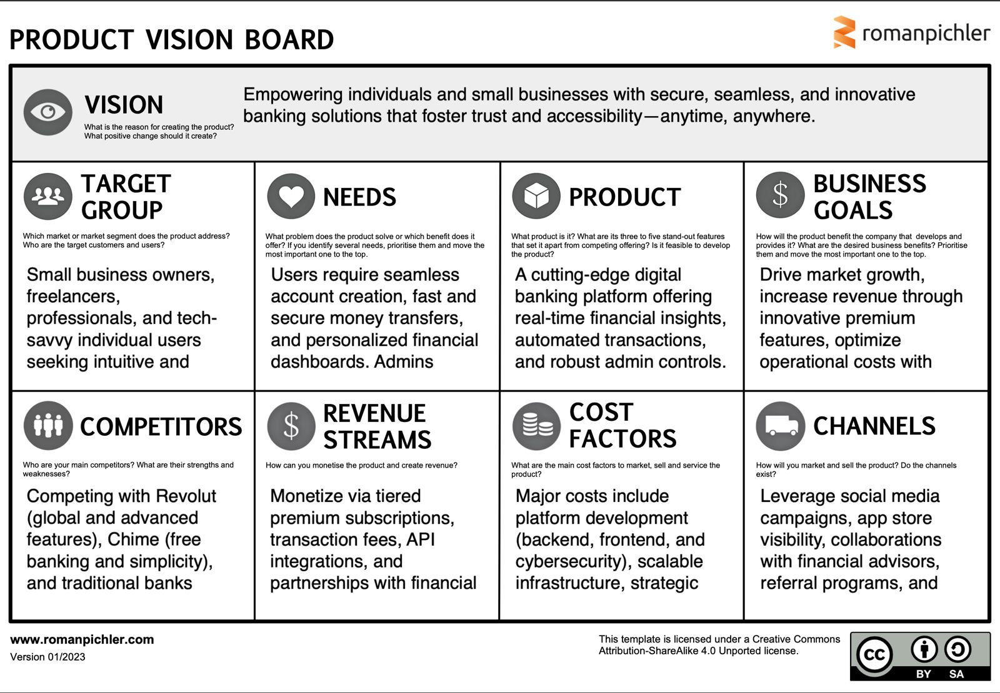

# Product Owner Documentation

The Product Owner is responsible for defining the product vision, managing the backlog, and collaborating with stakeholders to ensure the product delivers value to customers and aligns with business needs. They play a critical role in guiding the development team by setting priorities and ensuring objectives are met. This document outlines the Product Owner's tasks, deliverables, and documentation requirements for the IE Bank Application.

---

## Product Planning

The Product Owner oversees the planning phase of the product, ensuring all aspects of the product vision, roadmap, and requirements are well-documented.

### 1. Product Vision & Mission Statements
#### **Product Vision**
Big Dawg Bank aims to be the trusted partner for secure, seamless, and accessible banking—empowering small businesses, professionals, and individuals to take control of their finances anytime, anywhere.

#### **Product Mission**
To deliver a modern digital banking solution that prioritizes user needs by offering real-time insights, advanced security features, and automated tools, all while fostering trust and efficiency.

---

### 2. Product Vision Board

---

### 3. Minimum Viable Product (MVP)
#### **Definition**
The MVP for Big Dawg Bank will focus on delivering core functionality that addresses essential user and admin needs while ensuring security and scalability. This includes:
- A user-friendly admin portal for seamless management of users and permissions.
- A secure user portal for managing accounts, performing money transfers, and viewing dashboards.
- Enhanced security with biometric authentication and robust password management.

#### **Requirements**
Admin Portal:
- Manage users: View, create, update, and delete user accounts.
- Assign user roles and permissions for secure account management.
- Monitor system activity and generate basic reports.

User Portal:
- Registration: Enable secure and intuitive account creation for users.
- Login: Support biometric authentication and password-based secure login.
- Account Management: View account balances, transaction history, and personalized financial insights.
- Money Transfers: Perform secure peer-to-peer and external money transfers with transaction tracking.
- Dashboards: Provide real-time insights into account activity and financial performance.

---

### 4. Objectives and Key Results (OKRs):

Objectives and Key Results (OKRs)

Objective 1: Enhance User Experience
- KR 1.1: Reduce user onboarding time by 30% by introducing pre-filled forms and automated validations.
- KR 1.2: Deliver a mobile-first responsive design accessible across all devices and screen sizes.
- KR 1.3: Ensure the application loads in under 2.5 seconds for 95% of users.
- KR 1.4: Provide real-time feedback for money transfers and account operations with live status updates.
- KR 1.5: Achieve a 98% user satisfaction rate through surveys and feedback loops.

Objective 2: Strengthen Security
- KR 2.1: Encrypt all sensitive data using AES-256 standards and secure APIs for data exchange.
- KR 2.2: Implement biometric authentication and multi-factor authentication (MFA) for all user logins.
- KR 2.3: Ensure zero reported security vulnerabilities post-launch through active monitoring.
- KR 2.4: Conduct monthly vulnerability assessments and penetration testing.
- KR 2.5: Automate 95% of security monitoring and incident alerting using integrated tools.

Objective 3: Optimize Performance
- KR 3.1: Achieve 99.95% uptime in production environments.
- KR 3.2: Support 250 concurrent users during peak loads without degradation in performance.
- KR 3.3: Automate dynamic scaling to handle traffic spikes exceeding 80% capacity.
- KR 3.4: Optimize database queries, achieving an average query response time of <50ms.
- KR 3.5: Reduce API response times to <800ms for all endpoints.

Objective 4: Foster Collaboration
- KR 4.1: Fully integrate Slack with Azure Boards and GitHub for streamlined notifications and communication.
- KR 4.2: Maintain a 95% participation rate in bi-weekly stand-up meetings.
- KR 4.3: Automate milestone notifications to stakeholders via Slack and email.
- KR 4.4: Share detailed sprint reports with stakeholders weekly to ensure transparency.
- KR 4.5: Conduct retrospectives after every sprint and implement at least three actionable improvements per cycle.

Objective 5: Streamline Deployment
- KR 5.1: Deploy updates to the development and staging environments in under 7 minutes.
- KR 5.2: Achieve 100% pass rate on automated tests for all deployments.
- KR 5.3: Automate rollbacks for failed deployments within 30 seconds of detection.
- KR 5.4: Launch the MVP to production on schedule, meeting 100% of functional and security requirements.
- KR 5.5: Reduce deployment-related errors by 60% through improved CI/CD pipelines.

---

## Scrum Methodology

The Product Owner adopts the Scrum methodology to ensure the project follows agile principles, allowing flexibility and collaboration.

### 1. Backlog Grooming
- Session to refine and prioritize the backlog with input from the Cloud Architect.
- **Deliverable**: [Click Here](https://github.com/user-attachments/assets/79102738-8d94-456d-83a1-d398cb8976d5)

---

### 2. Sprint Planning
- Collaborate with the team to define sprint goals and assign tasks.
- **Deliverable**: [Click Here](https://github.com/user-attachments/assets/62e52f59-9051-4e77-a7d2-2da49745e9e7)

---

### 3. Daily Scrum/Standup
- Conduct at least three stand-up meetings to track progress and resolve blockers.
- **Deliverables**:

  - [Daily Scrum 1](https://github.com/user-attachments/assets/d831bbf6-f219-4165-a821-f2f32df31e09)

  - [Daily Scrum 2](https://github.com/user-attachments/assets/15d52ee1-8494-4108-85e4-c47f8de9388a)

  - [Daily Scrum 3](https://github.com/user-attachments/assets/3f85c4cf-0e50-4f63-8def-ebc4f672bc7a)

---

### 5. Sprint Retrospective
- Use Azure DevOps retrospective tools to analyze successes and areas for improvement.
- **Deliverable**: (https://dev.azure.com/BigDawgBank/Big%20Dawg%20Bank/_apps/hub/ms-devlabs.team-retrospectives.home#teamId=c38adc75-dacf-4a4b-940a-8c608421f8b3&boardId=d87d64e1-1bda-4e80-a172-a81683d610a2)

---

## DevOps Collaboration

### 1. Integration of Collaboration Tools
To enhance team productivity and ensure efficient communication, the following integrations have been implemented:
- GitHub & Azure DevOps:
Enables tracking of pull requests and backlog items, ensuring that development progress aligns with project goals. This integration provides a unified view of code changes and work items, streamlining collaboration between development and project management teams.
- Slack & Azure DevOps:
Automates notifications for task updates, such as status changes, comments, and assignments. Team members are promptly informed of developments, reducing delays and ensuring accountability across sprints.
- Slack & GitHub:
Keeps the team informed about code changes and pull requests. Notifications in Slack allow developers to quickly review, discuss, and merge changes, fostering a collaborative coding environment.
- Slack & Zoom:
Simplifies meeting management by enabling the scheduling and tracking of virtual meetings directly through Slack. This integration ensures smooth coordination of stand-ups, retrospectives, and ad hoc discussions.

### 2. Benefits of Integrated Collaboration
- Real-time updates and notifications across platforms improve transparency and decision-making.
- Reduced manual effort in tracking project updates, allowing the team to focus on core tasks.
- Centralized communication ensures that all stakeholders stay aligned on project progress and deadlines.
- Seamless meeting management encourages team participation and collaboration.

### 2. Monitoring and Alerts
**Azure Monitoring Alerts**  
To ensure the reliability and performance of the BigDawgBank application, we have implemented a comprehensive monitoring and alerting strategy using Azure Monitor. This strategy includes setting up alerts that notify the team of any issues in real-time, allowing for prompt resolution and minimal downtime.

**Integration with Slack**  
Alerts are connected to Slack through a Slack Action Group defined in the Bicep file. The `slackActionGroup` resource is configured with a `webhookReceivers` section, where the `serviceUri` is set to the Slack webhook URL. When an alert (such as `uptimeAlert`) is triggered, it uses this action group to send a notification to Slack via the specified webhook.

**SLACK_WEBHOOK_URL Secret**
The SLACK_WEBHOOK_URL is a GitHub secret used to securely store the Slack webhook URL required for sending alerts to Slack. This secret is referenced in the Bicep file and passed as the slackWebhookUrl parameter during deployments. By storing the webhook URL in GitHub secrets, we ensure it remains confidential and is not exposed in the source code. This integration allows alerts, such as uptimeAlert, to trigger notifications via Slack without revealing sensitive information.

