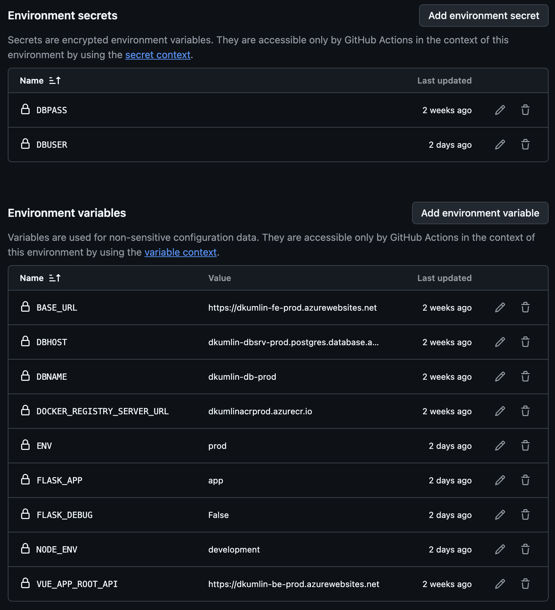
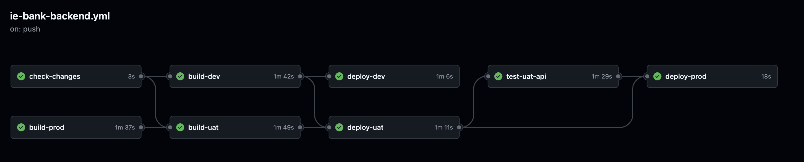
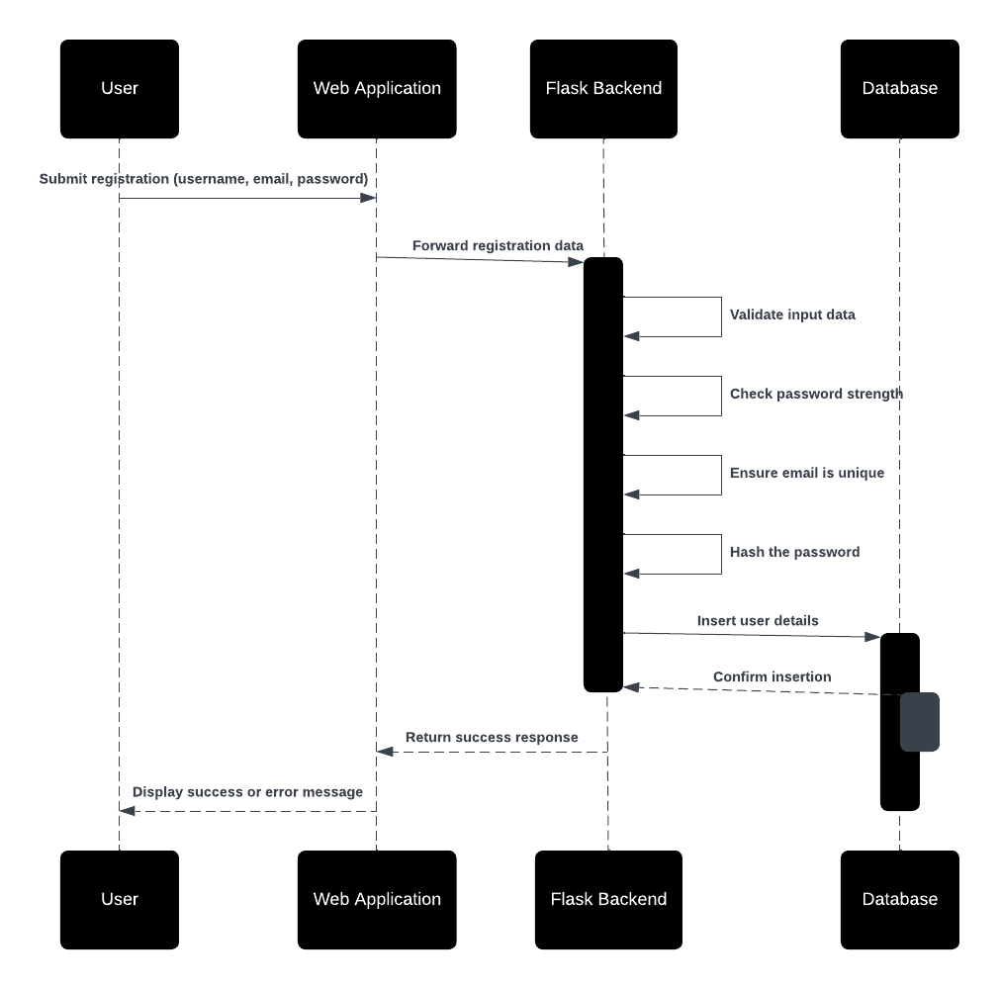
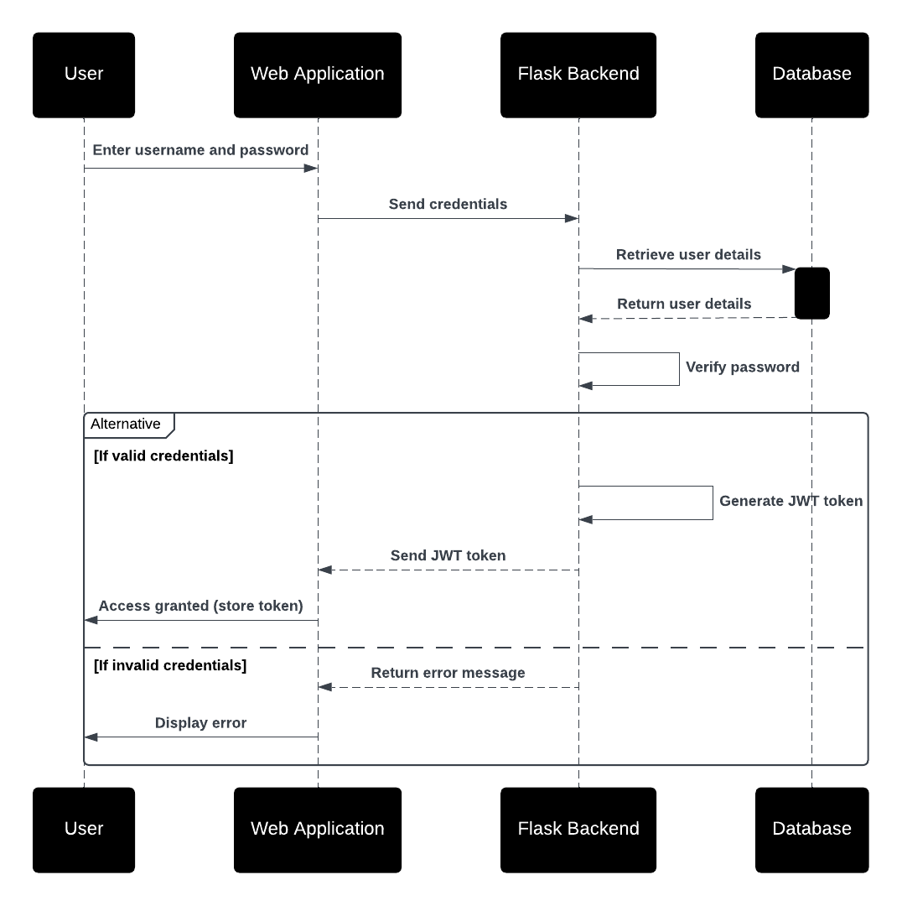
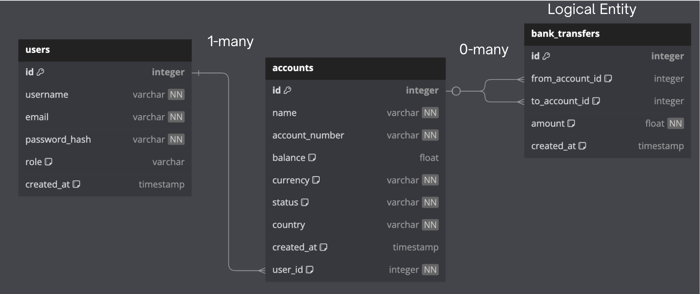
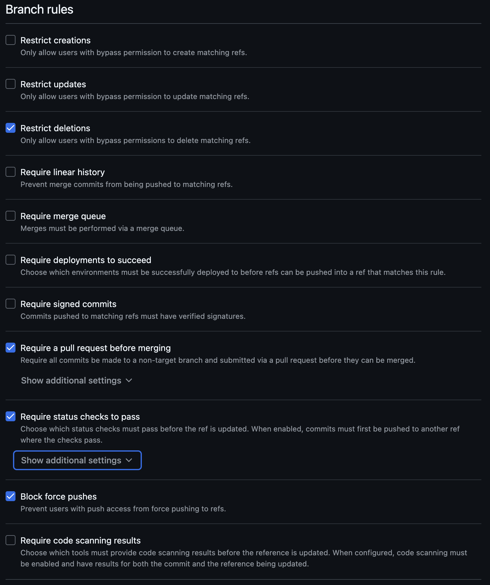

# BigDawg Bank Design Document

The BigDawg IE Bank Application builds upon the previous IE Bank Application developed during the first phase of the project. For the next phase, we aim to deliver a **Minimum Viable Product (MVP)** that includes additional features like the Admin Portal which is a user management system enabling administrators to create, update, and delete users, User Portal Enhancements which include Registration forms, bank account linking, and money transfer functionalities and Secure Deployment, which entails following DevOps best practices to automate CI/CD pipelines and ensure a robust DTAP (Development, Test, Acceptance, Production) workflow. This project emphasizes modularity, scalability, and security, ensuring compliance with financial industry standards and providing seamless user experiences.


## Table of Contents

1. [BigDawgBank Functional and Non-Functional Requirements](#bigdawgbank-functional-and-non-functional-requirements)
2. [Infrastructure Architecture Design](#infrastructure-architecture-design)
   - [GitHub](#github)
   - [App Service for Containers](#app-service-for-containers)
   - [App Service Plan](#app-service-plan)
   - [PostgreSQL Database](#postgresql-database)
   - [Static Web App](#static-web-app)
   - [Azure Container Registry(ACR)](#azure-container-registryacr)
   - [Key Vault](#key-vault)
   - [Log Analytics Workspace](#log-analytics-workspace)
   - [Application Insights](#application-insights)
   - [Azure Workbook](#azure-workbook)
   - [Infra Architecture Design Diagram](#infra-architecture-design-diagram)
3. [Environment Design](#environment-design)
   - [Description](#description)
   - [Environments](#environments)
     - [Development Environment](#development-environment)
     - [UAT Environment](#uat-environment)
     - [Production Environment](#production-environment)
   - [Configuration Variables](#configuration-variables)
   - [Continuous Delivery](#continuous-delivery)
   - [GitHub Secrets](#github-secrets)
   - [GitHub Variables](#github-variables)
4. [Well-Architected Framework Design](#well-architected-framework-design)
   - [1. Reliability Pillar](#1-reliability-pillar)
   - [2. Security Pillar](#2-security-pillar)
   - [3. Cost Optimization Pillar](#3-cost-optimization-pillar)
     - [Static Web App for Frontend](#static-web-app-for-frontend)
   - [4. Operational Excellence Pillar](#4-operational-excellence-pillar)
   - [5. Performance Efficiency Pillar](#5-performance-efficiency-pillar)
5. [Test Driven Development(TDD)](#test-driven-developmenttdd)
6. [Release Strategy](#release-strategy)
   - [Development (Dev)](#development-dev)
   - [User Acceptance Testing (UAT)](#user-acceptance-testing-uat)
   - [Production (Prod)](#production-prod)
   - [Infrastructure Release Strategy](#infrastructure-release-strategy)
   - [Rollback Mechanisms and Disaster Recovery](#rollback-mechanisms-and-disaster-recovery)
7. [Use Case and Sequential Model Design](#use-case-and-sequential-model-design)
8. [Entity Relationship Diagram](#entity-relationship-diagram)
   - [Users Table](#users-table)
   - [Accounts Table](#accounts-table)
   - [Bank Transfers Logical Entity](#bank-transfers-logical-entity)
   - [Relationships](#relationships)
     - [User to Account](#user-to-account)
     - [Account to Bank Transfers](#account-to-bank-transfers)
   - [Key Features](#key-features-of-the-ER)
9. [Data Flow Diagram](#data-flow-diagram)
   - [External Entities](#external-entities)
   - [Processes](#processes)
   - [Data Stores](#data-stores)
   - [External Systems](#external-systems)
   - [Data Flow Steps](#data-flow-steps)
   - [Key Features](#key-features-of-the-dfd)
10. [Twelve-Factor App Principles in BigDawgBank](#twelve-factor-app-principles-in-bigdawgbank)
   - [I. Codebase](#i-codebase)
   - [II. Dependencies](#ii-dependencies)
   - [III. Config](#iii-config)
   - [IV. Backing Services](#iv-backing-services)
   - [V. Build, Release, Run](#v-build-release-run)
   - [VI. Processes](#vi-processes)
   - [VII. Port Binding](#vii-port-binding)
   - [VIII. Concurrency](#viii-concurrency)
   - [IX. Disposability](#ix-disposability)
   - [X. Dev/Prod Parity](#x-devprod-parity)
   - [XI. Logs](#xi-logs)
   - [XII. Admin Processes](#xii-admin-processes)
11. [Team Documentation(PO)](#team-documentation)
12. [Modularization Strategy](#modularization-strategy)
   - [Description](#description)
   - [Key Decisions](#key-decisions)
   - [Naming Conventions](#naming-conventions)
   - [Implementation](#implementation)
   - [Team Collaboration](#team-collaboration)
   - [Conclusion](#conclusion)
13. [Git Feature Branch Strategy](#git-feature-branch-strategy)
   - [1. Description of Git Feature Branch Strategy](#1-description-of-git-feature-branch-strategy)
14. [Continuous Integration (CI) Workflows for Backend and Frontend](#continuous-integration-ci-workflows-for-backend-and-frontend)
   - [1. CI Workflow for Frontend](#1-ci-workflow-for-frontend)
   - [2. CI Workflow for Backend](#2-ci-workflow-for-backend)
15. [Inner Loop and Outer Loop](#inner-loop-and-outer-loop)
   - [Inner Loop](#inner-loop)
   - [Outer Loop](#outer-loop)
16. [Continuous Delivery (CD) Workflows for Backend and Frontend](#continuous-delivery-cd-workflows-for-backend-and-frontend)
   - [1. CD Workflow for Frontend](#1-cd-workflow-for-frontend)
   - [2. CD Workflow for Backend](#2-cd-workflow-for-backend)
17. [Key Features and Benefits of BigDawgBanks CI/CD for Frontend/Backend](#key-features-and-benefits-of-bigdawgbanks-cicd-for-frontendbackend)
18. [GitHub Hardening Strategy](#github-hardening-strategy)
   - [1.1 Branch Protection Rules](#11-branch-protection-rules)
   - [1.2 Dependabot](#12-dependabot)
   - [1.3 CodeQL Analysis](#13-codeql-analysis)
   - [1.4 OSSF Scorecard](#14-ossf-scorecard)
   - [1.5 Secret Scanning & Push Protection](#15-secret-scanning--push-protection)
   - [1.6 CODEOWNERS](#16-codeowners)
19. [Secrets Management](#secrets-management)
   - [2.1 Azure Key Vault](#21-azure-key-vault)
20. [Implemented Security Practices](#implemented-security-practices)
   - [3.1 Practices from OpenSSF](#31-practices-from-openssf)
   - [3.2 Practices from SAFECode](#32-practices-from-safecode)
21. [Metrics and Results](#metrics-and-results)
22. [Challenges and Lessons Learned](#challenges-and-lessons-learned)
   - [Challenges](#challenges)
   - [Lessons Learned](#lessons-learned)
23. [Future Recommendations](#future-recommendations)
24. [References](#references)
25. [Service Level Agreement (SLA)](#service-level-agreement-sla)
   - [1. SLA Definition](#1-sla-definition)
26. [Service Level Objectives (SLOs)](#service-level-objectives-slos)
   - [1. SLO Definitions](#1-slo-definitions)
27. [Service Level Indicators (SLIs)](#service-level-indicators-slis)
   - [1. SLI Definitions](#1-sli-definitions)
28. [Monitoring Strategy Design](#monitoring-strategy-design)
   - [1. Monitoring Strategy](#1-monitoring-strategy)
29. [Incident Response Design](#incident-response-design)
   - [1. Incident Response Plan](#1-incident-response-plan)
30. [Site Reliability Engineering Design](#site-reliability-engineering-design)
   - [1. SRE Design](#1-sre-design)


## BigDawgBank Functional and Non-Functional Requirements

### Functional Requirements (FR)

The following functional requirements outline the behavior and features of the IE Bank Application. Each requirement is linked to the respective user story and associated test cases where applicable.

---

#### FR01: Default Admin Account
**Requirement:** The application must provide a default administrator account (username and password) upon system setup.  
**User Story:** As an admin, I want a default admin account to be created during system setup so that I can log in and start managing the system immediately.    

---

#### FR02: Admin User Management
**Requirement:** The admin portal must allow administrators to create, update, delete, and list user accounts.  
**User Story:** As an admin, I want to create, update, and delete user accounts so that I can manage access to the system.   

---

#### FR03: Password Reset for Users
**Requirement:** Administrators must be able to reset user passwords to assist users who cannot log in.  
**User Story:** As an admin, I want to reset user passwords so that I can assist users who cannot log in.    

---

#### FR04: Role and Permissions Management
**Requirement:** Administrators must be able to assign roles and permissions to users to control access to specific system parts.  
**User Story:** As an admin, I want to assign roles and permissions to users so that I can control their access to different parts of the system.  

---

#### FR05: New User Registration
**Requirement:** New bank users must be able to register using a registration form (username, password, and password confirmation). A default account with a random account number must be created upon successful registration.  
**User Story:** As a new user, I want to register for an account so that I can access the system.
- **Test:** [test_create_user](https://github.com/bigdawgbank/ie-bank/blob/main/backend/tests/unit/test_auth_model.py) 

---

#### FR06: Invalid Repeated Email Check
**Requirement:** The system must reject accounts that are created with the same email as another.  
**User Story:** As an admin, I want users who are creating more than one user to not be allowed the use of the same email when creating another one.  
- **Test:** [test_user_unique_email](https://github.com/bigdawgbank/ie-bank/blob/main/backend/tests/unit/test_auth_model.py)  
- **Test:** [test_register_duplicate_user](https://github.com/bigdawgbank/ie-bank/blob/main/backend/tests/functional/test_auth.py#test_register_duplicate_user)  

---

#### FR07: Multiple accounts per User
**Requirement:** The system must allow users to create more than one account under the assumption that they use different emails for the new accounts.  
**User Story:** As a user, I want to ensure that I can register multiple bank accounts to the system so I can better handle my finances.  


---

#### FR08: Secure User Login
**Requirement:** Bank users must log in securely using their username and password to access their accounts.  
**User Story:** As a user, I want to log in securely so that I can access my account.
- **Test:** [test_protected_route](https://github.com/bigdawgbank/ie-bank/blob/main/backend/tests/functional/test_auth.py)
- **Test:** [test_authentication_required](https://github.com/bigdawgbank/ie-bank/blob/main/backend/tests/functional/test_auth.py) 
- **Test:** [test_login_failure](https://github.com/bigdawgbank/ie-bank/blob/main/backend/tests/functional/test_auth.py)  

---

#### FR09: View Account and Transactions
**Requirement:** Bank users must view their accounts and associated transactions after logging in.  
**User Story:** As a user, I want to view my account details and recent transactions so that I can manage my finances effectively.  
**Test:**  To be Added!

---

#### FR10: Money Transfer
**Requirement:** Bank users must be able to transfer money to other accounts by entering the recipient’s account number and transfer amount. The transfer amount must not exceed the available balance.  
**User Story:** As a user, I want to transfer money to other accounts so that I can make payments easily.  
- **Test** [test_bank_transfer_process_route](https://github.com/bigdawgbank/ie-bank/blob/feat/money-transfer/backend/tests/functional/test_routes.py#test_bank_transfer_process_route)
- **Test** [test_bank_transfer_object_process](https://github.com/bigdawgbank/ie-bank/blob/feat/money-transfer/backend/tests/unit/test_bank_transfer_object.py)

---

#### FR11: Secure Password Handling
**Requirement:** All user passwords must be hashed and stored securely to prevent data breaches.  
**User Story:** As a developer, I want all passwords to be securely hashed so that user data is protected from breaches.  
- **Test:** [test_create_user](https://github.com/bigdawgbank/ie-bank/blob/main/backend/tests/unit/test_auth_model.py)  

---

#### FR12: Session Management
**Requirement:** User sessions must expire after inactivity to ensure account security.  
**User Story:** As a user, I want my session to expire after inactivity so that my account remains secure.  

---

#### FR13: Intuitive Admin UI
**Requirement:** The admin portal must have an intuitive UI for efficient user and permission management.  
**User Story:** As an admin, I want a clean and intuitive UI for the portal so that I can efficiently manage users and permissions.  

---


### Non-Functional Requirements (NFR)

The following non-functional requirements define the performance, security, and usability standards for the IE Bank Application. Where applicable, links to potential tests have been suggested.

---

#### NFR01: Basic Authentication
**Requirement:** The web application must implement a basic authentication system requiring username and password login. Credentials must be hashed and encrypted in the database.  
- **Test:** [test_authentication_required](https://github.com/bigdawgbank/ie-bank/blob/main/backend/tests/functional/test_auth.py)  

---

#### NFR02: Simple Frontend Interface
**Requirement:** The web application must have a simple and functional frontend UI without requiring advanced aesthetics or responsiveness.  

---

#### NFR03: System Availability
**Requirement:** The system must achieve 99.95% uptime in the production environment. Downtime should be limited to scheduled maintenance outside peak hours.  

---

#### NFR04: Cost Optimization
**Requirement:** Azure resources must be provisioned with cost-effective configurations, leveraging reserved instances and auto-scaling to manage resource costs.  

---

#### NFR05: Handling Peak Loads
**Requirement:** The system must support up to 500 concurrent users in the production environment without performance degradation.  

---

#### NFR06: Secure Secrets Management
**Requirement:** Secrets such as database connection strings and API keys must be stored securely using Azure Key Vault.  

---

#### NFR07: Logging and Monitoring
**Requirement:** The application must implement robust logging and monitoring through Azure Application Insights, ensuring errors and performance metrics are captured.  

---

#### NFR08: Compliance
**Requirement:** The application must comply with GDPR and other relevant data protection regulations to ensure user data privacy.  

---

#### NFR09: Scalability
**Requirement:** The application must support horizontal scaling for the frontend and backend to accommodate increased user demand.  

---

#### NFR10: Backup and Recovery
**Requirement:** The system must include point-in-time restore for the database and deployment rollback capabilities in case of failure.  

---

## Infrastructure Architecture Design

This section provides an in-depth overview of the infrastructure components and their configurations for the BigDawgBank MVP. The architecture ensures scalability, reliability, and security while adhering to cost-effective design principles.

---

### GitHub
#### Description
We will utilize GitHub as the central repository for version control, CI/CD pipelines, and documentation hosting. It integrates with Azure and other tools to streamline deployment and collaboration within our team.

#### Key Features
- **Version Control**: 
  - Repositories for frontend, backend, and infrastructure code.
  - Supports feature branching for isolated code development.
- **GitHub Pages**: 
  - Hosts the Design Document for the project.
  - Provides role-based pages for team collaboration and documentation.
- **GitHub Actions**: 
  - Automates CI/CD pipelines for application and infrastructure.
  - Includes workflows for building, testing, and deploying to Azure environments (Dev, UAT, and PROD).
- **Integration with Azure**:
  - Deploys infrastructure using Bicep templates.
  - Pushes Docker images to Azure Container Registry through GitHub Actions.

---

### App Service for Containers
#### Description
We use Azure App Service for Containers to host our backend Flask application, running in Docker containers. This service allows serverless scalability and ease of management.

#### Key Features
- **Containerized Backend**: 
  - Supports deploying custom-built Docker images.
  - Enables seamless updates through CI/CD pipelines.
- **Scaling Options**:
  - Auto-scaling based on HTTP traffic or CPU/memory utilization.
  - Manual scaling during predictable traffic spikes.
- **Configuration**:
  - Environment variables for secrets, database connections, and runtime settings.
  - Integrated with Azure Key Vault for secure credential storage.
- **Security**:
  - HTTPS enforced for secure communication.
  - Built-in Azure security monitoring and alerts.

---

### App Service Plan
#### Description
We use the App Service Plan to provide compute resources for hosting the App Service for Containers. It defines the cost and performance tiers for the backend.

#### Key Features
- **Pricing Tiers**:
  - Uses Basic (B1) or higher tier for cost-efficient development and testing.
  - Production environments may use Standard or Premium tiers for enhanced performance.
- **Auto-Scaling**:
  - Configured to scale out during high-traffic periods.
  - Scale-in rules to optimize costs during low usage.
- **Environment Isolation**:
  - Separate plans for Development, UAT, and Production environments.
- **Region-Specific Deployment**:
  - Hosted in Europe to ensure compliance with data protection regulations.

---

### PostgreSQL Database
#### Description
We use Azure PostgreSQL Flexible Server as our managed database service for storing user profiles, account information, and transaction history.

#### Key Features
- **High Availability**:
  - Configured with zone redundancy to ensure uptime during failures.
  - Automated failover for seamless recovery.
- **Data Encryption**:
  - SSL enforced for data in transit.
  - Transparent Data Encryption (TDE) for data at rest.
- **Performance**:
  - Optimized read and write performance with intelligent caching.
  - Configurable resource scaling for handling peak loads.
- **Configuration**:
  - Daily automated backups with a 30-day retention policy.
  - Role-based access control for secure database connections.

---

### Static Web App 
#### Description
We use Azure Static Web Apps to host the Vue.js frontend of our banking application, ensuring fast and reliable delivery of the user interface.

#### Key Features
- **Global Content Delivery**:
  - Distributed through Azure CDN for low-latency access worldwide.
  - Redundant caching for improved page load speeds.
- **Custom Domains**:
  - Configured for easy branding with UAT and Production-specific domains.
  - SSL certificates for secure communication.
- **Automated Deployments**:
  - GitHub Actions automatically deploys changes upon commits to the `main` or `uat` branches.
- **Integrated Backend Routing**:
  - API endpoints for the backend are routed seamlessly.

---

### Azure Container Registry (ACR)
#### Description
We use Azure Container Registry (ACR) to effectively store and manage the Docker images used for our backend application.

#### Key Features
- **Private Registry**:
  - Secure storage for container images, accessible only to authorized Azure services.
- **Tagging and Versioning**:
  - Tags images with version numbers to ensure traceability and rollback capabilities.
- **Integration with CI/CD**:
  - Automatically updates with new images pushed from GitHub Actions.
- **Region-Specific Storage**:
  - Ensures low-latency access by hosting the registry in the same region as App Service.

---

### Key Vault
#### Description
Azure Key Vault securely manages sensitive information such as database credentials, API keys, and other secrets.

#### Key Features
- **Secrets Management**:
  - Stores PostgreSQL connection strings and admin credentials securely.
  - Automatically rotates keys to prevent stale secrets.
- **Access Control**:
  - Uses Managed Identity to grant App Services secure access without exposing credentials.
- **Audit Logging**:
  - Tracks access to secrets for compliance and monitoring purposes.

---

### Log Analytics Workspace
#### Description
We use Log Analytics Workspace to consolidate logs and metrics from Azure resources, providing centralized monitoring and diagnostics for BigDawgBank.

#### Key Features
- **Centralized Logging**:
  - Collects logs from App Services, PostgreSQL, and other Azure resources.
- **Querying Capabilities**:
  - Kusto Query Language (KQL) for creating advanced queries and visualizations.
- **Alerting**:
  - Real-time alerts for errors, unusual traffic patterns, and resource exhaustion.

---

### Application Insights
#### Description
We use Azure Application Insights built on top of our Log Analytics to provide real-time monitoring and telemetry for the BigDawgBank application, covering both frontend and backend performance.

#### Key Features
- **Performance Metrics**:
  - Tracks request latency, error rates, and resource consumption.
  - Provides dependency tracking for APIs and database queries.
- **Environment Segmentation**:
  - Configures separate Application Insights instances for Development, UAT, and Production.
- **Real-Time Dashboards**:
  - Displays key metrics for operational health and performance monitoring.

---

### Azure Workbook
#### Description
We have implemented Azure Workbook to provide a flexible canvas for data analysis and the creation of rich visual reports within the Azure portal. It allows us to combine text, queries, metrics, and parameters into interactive reports to monitor and analyze the performance and health of the BigDawgBank application and infrastructure.

#### Key Features
- **Customizable Reports**:
  - Create and customize reports using a variety of visualizations such as charts, graphs, and tables.
- **Interactive Data Exploration**:
  - Use parameters and filters to interactively explore data and gain insights.
- **Integration with Azure Services**:
  - Integrates seamlessly with Azure Monitor, Application Insights, and Log Analytics to visualize data from various sources.
- **Collaboration and Sharing**:
  - Share workbooks with team members and collaborate on data analysis.
- **Real-Time Monitoring**:
  - Monitor real-time data and set up alerts to stay informed about critical metrics and events.

---
### Infra Architecture Design Diagram:


### Use of JWTs (JSON Web Tokens)

**Description**  
We are using JWTs to ensure secure authentication and authorization within the BigDawgBank application. They provide a compact and self-contained way to transmit information between parties as a JSON object. This information can be verified and trusted because it is digitally signed. 

**How JWTs are Used**

1. **User Authentication**:
   - When a user logs in, the backend Flask application verifies the user's credentials.
   - Upon successful authentication, the server generates a JWT containing the user's information and signs it with a secret key.
   - The JWT is then sent back to the client (frontend) as part of the response.

2. **Token Storage**:
   - The client stores the JWT, typically in local storage or a cookie, for subsequent requests.

3. **Authorization**:
   - For each subsequent request to a protected endpoint, the client includes the JWT in the Authorization header as a Bearer token.
   - The backend application extracts the token from the request header and verifies its signature using the secret key.
   - If the token is valid, the server processes the request and grants access to the protected resource.

4. **Token Expiry and Refresh**:
   - JWTs have an expiration time (`exp` claim) to enhance security.
   - When the token expires, the client must re-authenticate to obtain a new token.

**Benefits of Using JWTs**:
- **Stateless Authentication**: JWTs are self-contained, eliminating the need for server-side session storage.
- **Scalability**: Stateless nature allows easy scaling of the application across multiple servers.
- **Security**: JWTs are signed and optionally encrypted, ensuring data integrity and confidentiality.
- **Flexibility**: JWTs can carry custom claims, allowing for flexible and fine-grained access control.

By leveraging JWTs, the BigDawgBank application ensures secure and efficient authentication and authorization, enhancing the overall security and user experience.

---

# Environment Design

## Description
Collaborate with the Infrastructure Developer and Full Stack Developer to document and update the environments required for development, UAT, and production. This section includes the configuration for each Azure service in each environment.


---

## Environments

### Development Environment
The development environment is used as a controlled environment for building and testing BigDawgBank's new features. It is used for experimental deployments and testing infrastructure configurations. It is designed to be flexible and allow for rapid changes.


- **Azure App Service**: 
  - **Configuration**: 
    - Plan: Basic
    - Instance Count: 1
    - SKU: B1
    - Location: `North Europe`
    - Name: `dkumlin-be-dev`
    - Environment Variables:
      - `ENV`: Development
      - `DBHOST`: Development Database Host
      - `DBNAME`: Development Database Name
      - `DBPASS`: Development Database Password
      - `DBUSER`: Development Database User
      - `FLASK_APP`: Flask Application Name
      - `FLASK_DEBUG`: True
      - `JWT_SECRET_KEY`: Development JWT Secret Key

- **Azure Database for PostgreSQL**: 
  - **Configuration**: 
    - Server Name: `dkumlin-dbsrv-dev`
    - Database Name: `dkumlin-db-dev`
    - SKU: Basic
    - Backup Retention: 7 days
    - Location: `North Europe`

- **Azure Key Vault**: 
  - **Configuration**: 
    - Name: `dkumlin-keyvault-dev`
    - Location: `North Europe`
    - Access Policies: Development team access

- **Azure Log Analytics Workspace**: 
  - **Configuration**: 
    - Name: `dkumlin-logAnalyticsWorkspace-dev`
    - Location: `North Europe`

- **Azure Application Insights**: 
  - **Configuration**: 
    - Name: `dkumlin-appInsights-dev`
    - Location: `North Europe`
    - Linked Log Analytics Workspace ID: `dkumlin-logAnalyticsWorkspace-dev`
    - Retention In Days: 90
    - Ingestion Mode: LogAnalytics
    - Public Network Access for Ingestion: Enabled
    - Public Network Access for Query: Enabled

- **Azure Container Registry**: 
  - **Configuration**: 
    - Name: `dkumlinacrdev`
    - Location: `North Europe`
    - Admin Username: Stored in Key Vault
    - Admin Password: Stored in Key Vault


### UAT Environment
The UAT (User Acceptance Testing) environment is used by our team at BigDawgBank for extensive stakeholder testing. It mirrors the production environment closely to ensure that the application behaves as expected before going live, gauging errors and allowing us to fix any faulty functionality of the application.


- **Azure App Service**: 
  - **Configuration**: 
    - Plan: Standard
    - Instance Count: 2
    - SKU: S1
    - Location: `North Europe`
    - Name: `dkumlin-be-uat`
    - Environment Variables:
      - `ENV`: UAT
      - `DBHOST`: UAT Database Host
      - `DBNAME`: UAT Database Name
      - `DBPASS`: UAT Database Password
      - `DBUSER`: UAT Database User
      - `FLASK_APP`: Flask Application Name
      - `FLASK_DEBUG`: False
      - `JWT_SECRET_KEY`: UAT JWT Secret Key

- **Azure Database for PostgreSQL**: 
  - **Configuration**: 
    - Server Name: `dkumlin-dbsrv-uat`
    - Database Name: `dkumlin-db-uat`
    - SKU: Standard
    - Backup Retention: 14 days
    - Location: `North Europe`

- **Azure Key Vault**: 
  - **Configuration**: 
    - Name: `dkumlin-keyvault-uat`
    - Location: `North Europe`
    - Access Policies: UAT team access

- **Azure Log Analytics Workspace**: 
  - **Configuration**: 
    - Name: `dkumlin-logAnalyticsWorkspace-uat`
    - Location: `North Europe`

- **Azure Application Insights**: 
  - **Configuration**: 
    - Name: `dkumlin-appInsights-uat`
    - Location: `North Europe`
    - Linked Log Analytics Workspace ID: `dkumlin-logAnalyticsWorkspace-uat`
    - Retention In Days: 90
    - Ingestion Mode: LogAnalytics
    - Public Network Access for Ingestion: Enabled
    - Public Network Access for Query: Enabled

- **Azure Container Registry**: 
  - **Configuration**: 
    - Name: `dkumlinacruat`
    - Location: `North Europe`
    - Admin Username: Stored in Key Vault
    - Admin Password: Stored in Key Vault

---

### Production Environment
The production environment is the live environment where the BigDawgBank application will be available to end-users. It is designed for high availability, scalability, and security.



- **Azure App Service**: 
  - **Configuration**: 
    - Plan: Premium
    - Instance Count: 3
    - SKU: P1V2
    - Location: `North Europe`
    - Name: `dkumlin-be-prod`
    - Environment Variables:
      - `ENV`: Production
      - `DBHOST`: Production Database Host
      - `DBNAME`: Production Database Name
      - `DBPASS`: Production Database Password
      - `DBUSER`: Production Database User
      - `FLASK_APP`: Flask Application Name
      - `FLASK_DEBUG`: False
      - `JWT_SECRET_KEY`: Production JWT Secret Key

- **Azure Database for PostgreSQL**: 
  - **Configuration**: 
    - Server Name: `dkumlin-dbsrv-prod`
    - Database Name: `dkumlin-db-prod`
    - SKU: Premium
    - Backup Retention: 35 days
    - Location: `North Europe`

- **Azure Key Vault**: 
  - **Configuration**: 
    - Name: `dkumlin-keyvault-prod`
    - Location: `North Europe`
    - Access Policies: Production team access

- **Azure Log Analytics Workspace**: 
  - **Configuration**: 
    - Name: `dkumlin-logAnalyticsWorkspace-prod`
    - Location: `North Europe`

- **Azure Application Insights**: 
  - **Configuration**: 
    - Name: `dkumlin-appInsights-prod`
    - Location: `North Europe`
    - Linked Log Analytics Workspace ID: `dkumlin-logAnalyticsWorkspace-prod`
    - Retention In Days: 90
    - Ingestion Mode: LogAnalytics
    - Public Network Access for Ingestion: Enabled
    - Public Network Access for Query: Enabled

- **Azure Container Registry**: 
  - **Configuration**: 
    - Name: `dkumlinacrprod`
    - Location: `North Europe`
    - Admin Username: Stored in Key Vault
    - Admin Password: Stored in Key Vault

---

### Configuration Variables
To determine different configuration options for each environment, we will make use of the files under the `parameters` folder.
- File `parameters/dev.parameters.json` contains the configuration for the development environment.
- File `parameters/uat.parameters.json` contains the configuration for the UAT environment.
- File `parameters/prod.parameters.json` contains the configuration for the production environment.

---

### Continuous Delivery
The CI/CD pipelines for each environment are defined in the following GitHub Actions workflow files:
- `.github/workflows/ie-bank-backend.yml` for the backend.
- `.github/workflows/ie-bank-frontend.yml` for the frontend.
- `.github/workflows/ie-bank-infra.yml` for the infrastructure.

### GitHub Secrets
The workflows use the following GitHub secrets:
- `AZURE_CREDENTIALS`: Azure credentials to authenticate to Azure via Service Principal.
- `DBUSER`: Username for the PostgreSQL server.
- `DBPASS`: Password for the PostgreSQL server.
- `DBHOST`: Hostname for the PostgreSQL server.
- `DBNAME`: Name for the PostgreSQL database.

---

### GitHub Variables
The workflows use the following GitHub variables:
- `ENV`: Environment name.
- `FLASK_APP`: Name of the Flask app to run.

---

Here we've showcased BigDawgBanks' environment design and configuration for each Azure service in the development, UAT, and production environments. It ensures that all our team members are aligned and aware of the infrastructure setup and deployment processes.

## Well-Architected Framework Design

### 1. Reliability Pillar
- **Description**: Collaborate with the Site Reliability Engineer to document decisions related to system reliability.

#### Points Considered When Taking Design Decisions
- **Design for Business Requirements**
- **Design for Resilience**
- **Design for Recovery**
- **Design for Operations**
- **Keep it Simple**

We have taken all of these points into deep consideration when Designing the reliability for our application, this was mainly done by our taleneted SRE.

#### Reliability Checklist With BigdawgBank:

- **RE:01.** Design your workload to align with business objectives and avoid unnecessary complexity or overhead.
  - The BigDawgBank application is designed to meet specific business objectives, such as providing a secure and user-friendly banking platform. The architecture avoids unnecessary complexity by using well-defined infrastructure components and services.

- **RE:02.** Identify and rate user and system flows.
  - User and system flows are identified and rated based on their importance and impact. For our team critical flows were identified, such as account management and money transfers, are prioritized to ensure reliability.

- **RE:03.** Use failure mode analysis (FMA) to identify and prioritize potential failures in your solution components.
  - BigDawgBank has not yet implemented this.

- **RE:04.** Define reliability and recovery targets for the components.
  - Reliability and recovery targets are defined for each component. For example, the frontend aims for 99.95% uptime, and the backend ensures API response times do not exceed 2 seconds.

- **RE:05.** Add redundancy at different levels, especially for critical flows.
  - Redundancy is added at various levels to ensure reliability. For instance, the database uses replicas, and load balancing is implemented for frontend and backend services.

- **RE:06.** Implement a timely and reliable scaling strategy at the application, data, and infrastructure levels.
  - A reliable scaling strategy is implemented to handle varying workloads. Horizontal scaling is used for the frontend and backend to accommodate increased user demand.

- **RE:07.** Strengthen the resiliency and recoverability of your workload by implementing self-preservation and self-healing measures.
  - Self-preservation and self-healing measures are implemented to enhance resiliency. BigDawgBank has an automated and clear release strategy in case of a crash. We also have Deployment rollback capabilities that are in place to recover from failures.

- **RE:08. NOT DONE** Test for resiliency and availability scenarios by applying the principles of chaos engineering in your test and production environments.
  - Chaos engineering principles are applied to test the system's behavior under failure conditions. This helps ensure that the application can handle unexpected disruptions.

- **RE:09. NOT DONE!!** Implement structured, tested, and documented business continuity and disaster recovery (BCDR) plans that align with the recovery targets.
  - Structured and documented BCDR plans are implemented and tested regularly. These plans align with the defined recovery targets to ensure minimal disruption during failures. 

- **RE:10.** Measure and model the solution's health signals.
  - The health of the solution in BigDawgBank is continuously measured and modeled using monitoring tools like Azure Monitor, Application Insights, Log Analytics and Azure Workbook. This helps detect and address issues proactively.


To ensure reliability for the  BigDawgBank application, several strategies and practices have been implemented across different parts of our organization. Here are some key aspects:

#### Service Level Objectives (SLOs) and Indicators (SLIs):
The Site Reliability Engineer (SRE) outlines specific SLOs and SLIs to measure and ensure reliability:
- **Frontend Availability**: Maintain 99.95% uptime for the frontend.
- **Backend Latency**: Ensure API response times do not exceed 2 seconds.
- **Database Performance**: Guarantee query response times of less than 500ms.
- **Error Rate**: Keep application error rates below 0.1% over a rolling 24-hour window.
- **Incident Resolution**: Resolve critical incidents within 1 hour of detection.

#### Monitoring and Alerts:
The monitoring strategy includes:
- **Monitoring Tools**: Use tools like Azure Monitor, Application Insights, and Log Analytics for tracking metrics.
- **Alerts**: Configure alerts for key performance indicators (e.g., high response times, downtime).
- **Dashboards**: Create real-time dashboards to visualize critical metrics.
- **Log Analysis**: Implement log monitoring for identifying trends and potential issues.

#### Incident Response Plan:
The incident response plan includes:
- **Incident Detection**: Use monitoring tools and alerts to detect incidents promptly.
- **Incident Triage**: Classify incidents based on severity and impact.
- **Incident Resolution**: Define procedures for diagnosing and resolving incidents quickly.
- **Post-Incident Review**: Conduct reviews to identify root causes and prevent recurrence.

#### Automated Testing and CI/CD Pipelines
Automated tests and CI/CD pipelines ensure that code changes do not introduce reliability issues:
- **Functional Tests**: Functional tests for routes like [`test_wire_transfer_money_route`](https://github.com/bigdawgbank/ie-bank/blob/main/backend/tests/functional/test_routes.py) and [`test_bank_transfer_process_route`](https://github.com/bigdawgbank/ie-bank/blob/main/backend/tests/functional/test_routes.py) ensure that critical functionalities work as expected.
- **CI/CD Pipelines**: GitHub Actions workflows like `.github/workflows/ie-bank-frontend.yml`and `.github/workflows/ie-bank-backend.yml` automate the build, test, and deployment processes, ensuring consistent and reliable deployments.

#### Infrastructure as Code (IaC):
Using Bicep templates for infrastructure provisioning ensures that the infrastructure is consistently deployed and configured:
- **Bicep Templates**: The `infra/main.bicep` file defines the infrastructure components, ensuring that the infrastructure is reproducible and reliable.

#### Scalability and Fault Tolerance:
The application is designed to handle peak loads and ensure fault tolerance:
- **Horizontal Scaling**: The application supports horizontal scaling for the frontend and backend to accommodate increased user demand.
- **Fault Tolerance**: Design fault-tolerant systems to minimize the impact of failures.

#### Backup and Recovery:
The system includes backup and recovery mechanisms:
- **Point-in-Time Restore**: Our PostgresSQL database supports point-in-time restore.
- **Deployment Rollback**: Deployment rollback capabilities are in place in case of failure.

#### Environment Design:
The environment design includes separate environments for development, UAT, and production, ensuring that changes are tested thoroughly before reaching production.

For more detailed Documentation of the Site Reliability in BigDawgBank, please refer to the SREs page:
- [Site Reliability Engineer(SRE)](./Sitereliable.md)

---
By implementing these strategies and practices, the BigDawgBank ensures the highest possible reliability, minimizing downtime and ensuring a consistent user experience which is what we strive for. For more in depth information please refer to [Site Reliability Engineer](./Sitereliable.md)

### 2. Security Pillar
- **Description**: Collaborate with the Cybersecurity Engineer to document security decisions.

#### Security Design Principles in BigDawgBank

- **Design to Protect Confidentiality**
- **Design to Protect Integrity**
- **Design to Protect Availability**
- **Sustain and Evolve Your Security Posture**

#### **Security Checklist**:

- **SE:01.** Establish a security baseline that's aligned to compliance requirements, industry standards, and platform recommendations.
  - The BigDawgBank application establishes a security baseline by adhering to industry standards and platform recommendations. This includes using HTTPS for all communications and enforcing encryption for data at rest and in transit.

- **SE:02.** Maintain a secure development lifecycle.
  - The development lifecycle includes security practices such as code reviews, automated security testing, and dependency scanning using Dependabot as configured in `.github/dependabot.yml`.

- **SE:03.** Classify and consistently apply sensitivity and information type labels.
  - BigDawgBank has not yet implemented this.

- **SE:04.** Create intentional segmentation and perimeters in your architecture design and in the workload's footprint on the platform.
  - The architecture design includes segmentation of different environments (development, UAT, production) and the use of network security groups (NSGs) to isolate backend resources from public access.

- **SE:05.** Implement strict, conditional, and auditable identity and access management (IAM) across all workload users, team members, and system components.
  - Role-Based Access Control (RBAC) is enforced in Azure, restricting administrative functions to authorized personnel. GitHub repository access is also controlled with appropriate permissions.

- **SE:06.** Isolate, filter, and control network traffic across both ingress and egress flows.
  - Network traffic is controlled using NSGs and firewalls to restrict access to the Azure Database for PostgreSQL to specific IP addresses.

- **SE:07.** Encrypt data by using modern, industry-standard methods to guard confidentiality and integrity.
  - Data is encrypted at rest using Azure-managed disk encryption and in transit using TLS for database and API communications.

- **SE:08.** Harden all workload components by reducing extraneous surface area and tightening configurations to increase attacker cost.
  - The GitHub repository is hardened with branch protection rules, signed commits, required pull request approvals, and automated checks before merging.

- **SE:09.** Protect application secrets by hardening their storage and restricting access and manipulation and by auditing those actions.
  - Secrets such as database credentials and API keys are securely managed using Azure Key Vault and GitHub repository secrets.

- **SE:10.** Implement a holistic monitoring strategy that relies on modern threat detection mechanisms that can be integrated with the platform.
  - Azure Security Center and Advanced Threat Protection are integrated for anomaly detection and alerts. Azure Monitor and Application Insights are used for real-time security monitoring.

- **SE:11.** Establish a comprehensive testing regimen.
  - Automated security testing is part of the CI/CD pipelines, including static code analysis and dependency scanning.

- **SE:12.** Define and test effective incident response procedures.
  - BigDawgBank has not yet implemented this.

For more detailed Documentation of the Security in BigDawgBank, please refer to the SREs page:
- [Cybersecurity Engineer](./Cybersecurity.md)

--- 

### 3. Cost Optimization Pillar
- **Description**: Collaborate with the Infrastructure Developer to document cost optimization strategies.

#### Cost Optimization Design Principles in BigDawgBank

- **Develop a Cost Management Discipline**
- **Design with a Cost-Efficiency Mindset**
- **Design for Usage Optimization**
- **Design for Rate Optimization**
- **Monitor and Optimize Over Time**

#### **Cost Optimization Checklist**:

- **CO:01.** Create a culture of financial responsibility.
  - The BigDawgBank team fosters a culture of financial responsibility by regularly reviewing budget, expenses, and cost tracking. This ensures that all team members are aware of the financial implications of their decisions.

- **CO:02.** Create and maintain a cost model. A cost model should estimate the initial cost, run rates, and ongoing costs.
  - BigDawgBank has not yet implemented this

- **CO:03.** Collect and review cost data. Data collection should capture daily costs.
  - Cost data is collected and reviewed regularly to capture daily costs. This helps in identifying areas where cost savings can be achieved.

- **CO:04.** Set spending guardrails.
  - Spending guardrails are set to ensure that the project stays within budget. This includes setting limits on spending for different components and environments.

- **CO:05.** Get the best rates from providers.
  - Our team negotiates with providers to get the best rates for services. This includes leveraging reserved instances and other cost-saving options offered by Azure.

- **CO:06.** Align usage to billing increments.
  - Usage is aligned to billing increments to ensure that resources are used efficiently and costs are minimized.

- **CO:07.** Optimize component costs.
  - Component costs are optimized by selecting cost-effective options for each component. For example, using Azure Static Web Apps for the frontend minimizes hosting costs.

- **CO:08.** Optimize environment costs. Align spending to prioritize preproduction, production, operations, and disaster recovery environments.
  - Environment costs are optimized by aligning spending to prioritize development, Testing and production. This ensures that resources are allocated efficiently.

- **CO:09.** Optimize flow costs. Align the cost of each flow with flow priority.
  - Flow costs are optimized by aligning the cost of each flow with its priority. This ensures that critical flows receive the necessary resources while minimizing costs for less critical flows, for example, more of BigDawgBanks resources will be allocated to bettering the auth and transfer flows.

- **CO:10.** Optimize data costs.
  - Data costs are optimized by implementing retention policies for logs and backups. This helps in managing storage costs effectively.

- **CO:11.** Optimize code costs. Evaluate and modify code to meet functional and nonfunctional requirements with fewer or cheaper resources.
  - Code costs are optimized by evaluating and modifying code to meet functional and nonfunctional requirements with fewer or cheaper resources. This includes optimizing database queries and container orchestration.

- **CO:12.** Optimize scaling costs. Evaluate alternative scaling within your scale units.
  - Scaling costs are optimized by evaluating alternative scaling options within scale units. This includes configuring auto-scaling rules for Azure App Services and databases based on performance metrics.

- **CO:13.** Optimize personnel time. Align the time personnel spends on tasks with the priority of the task. The goal is to reduce the time spent on tasks without degrading the outcome.
  - Personnel time is optimized by aligning the time spent on tasks with the priority of the task. This helps in reducing the time spent on tasks without degrading the outcome.

- **CO:14.** Consolidate resources and responsibility.
  - Resources and responsibilities are consolidated to ensure efficient use of resources and minimize costs.

#### Static Web App for Frontend

The BigDawgBank application leverages a **Static Web App** for its frontend, ensuring a cost-efficient and scalable solution while maintaining a high-quality user experience. Cost optimization is a critical design pillar, and using a static web app aligns with this principle by reducing operational expenses and resource usage.

- 1. **Pay-as-You-Go Pricing Model**
  - Azure Static Web Apps operate on a consumption-based pricing model, ensuring you only pay for the resources you use.
  - Ideal for workloads with varying traffic, as costs scale with demand.

- 2. **Free Tier for Basic Usage**
  - The free tier includes custom domain support, SSL certificates, and basic hosting for static content, which significantly reduces costs for development and testing environments.

- 3. **Elimination of Server Costs**
  - Static Web Apps do not require dedicated servers to host the frontend, as all content is pre-rendered and served via a global content delivery network (CDN).
  - This removes the need for virtual machines or traditional web servers, saving infrastructure costs.

- 4. **Integrated CI/CD Workflow**
  - Built-in GitHub Actions integration for CI/CD eliminates the need for external deployment tools, reducing additional expenses on third-party services.
  - Automated builds and deployments streamline the process without incurring extra operational overhead.

- 5. **Global Content Delivery**
  - Static Web Apps leverage Azure's global CDN to cache and serve content closer to end-users, minimizing latency and optimizing bandwidth usage.
  - Efficient delivery reduces data transfer costs, especially during high traffic periods.

- 6. **Reduced Maintenance Costs**
  - Static content requires minimal maintenance compared to dynamic servers, which reduces the time and resources spent on operational support.
  - Security updates, server patching, and backend dependencies are minimized, leading to long-term cost savings.

- 7. **Efficient Scaling**
  - Static Web Apps automatically scale based on demand without additional configuration or costs for scaling infrastructure.
  - This ensures consistent performance without incurring expenses associated with over-provisioning.
- **Other Key points:**
  - **Free SSL Certificates**
    - The frontend benefits from built-in SSL certificates at no additional cost, ensuring secure communications while keeping expenses low.

  - **Lightweight Design**
    - The static nature of the app ensures that only essential resources are loaded, reducing bandwidth usage and associated costs.

  - **Integrated Application Insights**
    - Performance monitoring and usage analytics are included without requiring a separate service, saving costs while enabling data-driven optimizations.

  - **Multi-Environment Deployment**
    - Separate instances for our **Development**, **UAT**, and **Production** environments are configured with cost-effective tiers, using the free tier where applicable for non-production environments to save significant costs.

---

### 4. Operational Excellence Pillar
- **Description**: Collaborate with the Full Stack Developer to document operational excellence strategies.

#### Operational Excellence Design Principles in BigDawgBank

- **Embrace DevOps Culture**
- **Establish Development Standards**
- **Evolve Operations with Observability**
- **Deploy with Confidence**
- **Automate for Efficiency**
- **Adopt Safe Deployment Practices**

#### **Operational Excellence Checklist**:

- **OE:01.** Determine workload team members' specializations and integrate them into a robust set of practices to design, develop, deploy, and operate your workload to specification.
  - The BigDawgBank team identifies and leverages the specializations of its members, integrating them into a cohesive set of practices for designing, developing, deploying, and operating the workload.

- **OE:02.** Formalize the way you run routine, as needed, and emergency operational tasks by using documentation, checklists, or automation.
  - Routine, as-needed, and emergency operational tasks are formalized through detailed documentation, checklists, and automation to ensure consistency and reliability.

- **OE:03.** Formalize software ideation and planning processes.
  - Software ideation and planning processes are formalized to ensure structured and efficient development cycles.

- **OE:04.** Optimize software development and quality assurance processes by following industry-proven practices for development and testing.
  - Software development and quality assurance processes are optimized by adhering to industry-proven practices, ensuring high-quality code and efficient testing.

- **OE:05.** Prepare resources and their configurations by using a standardized infrastructure as code (IaC) approach.
  - Resources and configurations are prepared using a standardized Infrastructure as Code (IaC) approach, ensuring consistency and repeatability in deployments.

- **OE:06.** Build a workload supply chain that drives proposed changes through predictable, automated pipelines.
  - Our Team has established a robus workload supply chain, enhancing efficiency and reducing manual intervention.

- **OE:07.** Design and implement a monitoring system to validate design choices and inform future design and business decisions.
  - A comprehensive monitoring system has been designed and implemented to validate design choices and inform future design and business decisions for the BigDawgBank application.

- **OE:08.** Develop an effective emergency operations practice.
  - This has not yet been implemented in the BigDawgBank Application.

- **OE:09.** Automate all tasks that don't benefit from the insight and adaptability of human intervention, are highly procedural, and have a shelf-life that yields a return on automation investment.
  - Tasks that do not benefit from human intervention, are highly procedural, and have a shelf-life that yields a return on automation investment are automated to improve efficiency and consistency.

- **OE:10.** Design and implement automation upfront for operations such as lifecycle concerns, bootstrapping, and applying governance and compliance guardrails.
  - Automation has been designed and implemented.

- **OE:11.** Clearly define your workload's safe deployment practices. Emphasize the ideals of small, incremental, quality-gated release methods.
  - Safe deployment practices are clearly defined, emphasizing small, incremental, quality-gated release methods to minimize risks.

- **OE:12.** Implement a deployment failure mitigation strategy that addresses unexpected mid-rollout issues with rapid recovery.
  - A deployment failure mitigation strategy is implemented to address unexpected mid-rollout issues and ensure rapid recovery.

The **BigDawgBank** application achieves operational excellence by leveraging the **Gateway Routing** cloud pattern, defined in the [Microsoft Well-Architectured Framework](https://learn.microsoft.com/en-us/azure/well-architected/operational-excellence/design-patterns). This design pattern supports efficient request management and ensures the modularity and scalability of the application. Gateway Routing is imperative for optimizing interactions between the frontend, backend, and database layers by centralizing API management and routing client requests to the appropriate backend services based on their intent.

By following this pattern, **BigDawgBank** achieves the core principles of optimization:

- **Efficiency**: Routing requests to specific backend services reduces overhead and ensures that only necessary components are utilized.
- **Scalability**: Decoupling the frontend and backend enables independent scaling, allowing each layer to handle increased loads effectively.
- **Security**: The centralized API layer provides a single point for implementing robust encryption (e.g., HTTPS) and secure authentication (e.g., JWT tokens).
- **Reliability**: Centralized handling of requests ensures consistent behavior across various components, reducing potential errors and ensuring smooth operations.

By integrating Gateway Routing into its architecture, **BigDawgBank** optimizes performance, simplifies request management, and strengthens security, demonstrating operational excellence in every aspect of its design.

---

### 5. Performance Efficiency Pillar
- **Description**: Collaborate with the Infrastructure Developer and Site Reliability Engineer to document performance efficiency decisions.

#### Performance Efficiency Design Principles in BigDawgBank

- **Define Performance Targets**
- **Design to Meet Capacity Requirements**
- **Achieve and Sustain Performance**
- **Improve Efficiency Through Optimization**

#### **Performance Efficiency Checklist**:

- **PE:01.** Define performance targets.
  - Performance targets are defined based on the intended user experience and pre-established business requirements. For example, the backend API response times are targeted to not exceed 2 seconds.

- **PE:02.** Conduct capacity planning.
  - Capacity planning is conducted to ensure that the system can handle anticipated demand. This includes planning for peak loads and ensuring that resources are available to meet user demand.

- **PE:03.** Select the right services. The services, infrastructure, and tier selections must support your ability to reach the workload's performance targets and accommodate expected capacity changes.
  - The BigDawgBank application uses Azure App Services and Azure Database for PostgreSQL to meet performance targets and accommodate expected capacity changes.

- **PE:04.** Collect performance data.
  - Performance data is collected using Azure Application Insights, which tracks metrics such as request latency, error rates, and resource consumption.

- **PE:05.** Optimize scaling and partitioning.
  - Auto-scaling rules are configured for Azure App Services and databases based on performance metrics to ensure efficient scaling and partitioning.

- **PE:06.** Test performance. Perform regular testing in an environment that matches the production environment.
  - Regular performance testing is conducted in the User Acceptance Testing (UAT) environment, which mimics the production environment.

- **PE:07.** Optimize code and infrastructure.
  - Code and infrastructure are optimized to meet performance targets. This includes optimizing database queries and container orchestration.

- **PE:08.** Optimize data usage.
  - Data usage is optimized by implementing retention policies for logs and backups, ensuring efficient storage management.

- **PE:09.** Prioritize the performance of critical flows.
  - The performance of critical flows, such as account management and money transfers, is prioritized to ensure a seamless user experience.

- **PE:10.** Optimize operational tasks.
  - Operational tasks are optimized through automation and efficient resource management.

- **PE:11.** Respond to live performance issues.
  - Not yet implemented in the BigDawgBank Application.

- **PE:12.** Continuously optimize performance.
  - Continuous performance optimization is achieved through regular monitoring and data-driven decision-making.

  By implementing these strategies and practices, the BigDawgBank application ensures performance efficiency, providing a responsive and reliable user experience while optimizing resource utilization and operational costs.

---

## Test Driven Development(TDD)

For developping our BigDawgBank Application, our team decided to adopt a more Test-Driven Development(TTD) approach in order to ensure the highest code quality, maintainability and reliability possible. TDD involves writing tests before writing the actual code, which helped in defining clear requirements and catching any of our issues early in the development process. We chose this approach over Behavior Driven Design (BDD) due to its focus on the technical aspects of the code and its ability to provide immediate feedback to our Fullstack developers. Our cycle involved first developping robust tests based on our precise User stories in the Azure Devops backlog which were developped in accordance with the new requirements of our application. After various meetings, it was agreed that the most important aspects to be tested was the authentication and the transaction process between accounts. This was because we strive for optimal user security in transport and account management considering the sensitivity of information within a bank.

The Following Table highlights our TTD approach by showcasing the various tests we implemented, along with the Functional Requirements that they were deveopped for and the related user story for said FR:

| **Functional Requirement (FR)** | **User Story** | **Test** |
|---------------------------------|----------------|----------|
| **FR05: New User Registration** | As a new user, I want to register for an account so that I can access the system. | [test_create_user](https://github.com/bigdawgbank/ie-bank/blob/main/backend/tests/unit/test_auth_model.py#L30) |
| **FR06: Invalid Repeated Email Check** | As an admin, I want users who are creating more than one user to not be allowed the use of the same email when creating another one. | [test_user_unique_email](https://github.com/bigdawgbank/ie-bank/blob/main/backend/tests/unit/test_auth_model.py#L50), [test_register_duplicate_user](https://github.com/bigdawgbank/ie-bank/blob/main/backend/tests/functional/test_auth.py#L70) |
| **FR08: Secure User Login** | As a user, I want to log in securely so that I can access my account. | [test_protected_route](https://github.com/bigdawgbank/ie-bank/blob/main/backend/tests/functional/test_auth.py#L90), [test_authentication_required](https://github.com/bigdawgbank/ie-bank/blob/main/backend/tests/functional/test_auth.py#L110), [test_login_failure](https://github.com/bigdawgbank/ie-bank/blob/main/backend/tests/functional/test_auth.py#L130) |
| **FR10: Money Transfer** | As a user, I want to transfer money to other accounts so that I can make payments easily. | [test_bank_transfer_process_route](https://github.com/bigdawgbank/ie-bank/blob/main/backend/tests/functional/test_routes.py#L50), [test_bank_transfer_object_process](https://github.com/bigdawgbank/ie-bank/blob/main/backend/tests/unit/test_bank_transfer_object.py#L10) |
| **FR11: Secure Password Handling** | As a developer, I want all passwords to be securely hashed so that user data is protected from breaches. | [test_create_user](https://github.com/bigdawgbank/ie-bank/blob/main/backend/tests/unit/test_auth_model.py#L70) |

We can see the immense focus our team had on ensuring the authentication aspect of our application was completely robust and error free. By adopting TDD, the BigDawgBank application ensures that all functional requirements are met with high code quality and reliability. The focus on writing tests before code helped our Fullstack team define clear requirements, catch issues early, and promote maintainable and modular code. This approach has proven to be effective in delivering a robust and secure banking application for our users.

### Use of Postman for API Testing

**Description**  
Postman is used extensively for testing the APIs of the BigDawgBank application. It allows us to automate the testing process, ensuring that our APIs are functioning correctly and meeting the specified requirements. By integrating Postman into our TDD workflow, we can validate the behavior of our APIs and catch these kinds of issues early in the development process.

### Postman Collections

Postman collections are used to group related API requests together. Each collection contains multiple requests, along with tests that validate the responses. For the BigDawgBank application, we have created a collection named "IE Bank" that includes various API endpoints such as login, accounts, and users.

#### 1. Login:
- **Method**: POST
- **URL**: `{{API_URL}}/login`
- **Description**: This endpoint is used to authenticate users. It accepts a username and password as form data and returns a JWT token upon successful authentication.
- **Tests**:
  - Verify that the response status code is 200.
  - Check that the response contains a token.
  - Save the token to the environment for use in subsequent requests.

#### 2. Accounts:
- **Method**: GET
- **URL**: `{{API_URL}}/accounts`
- **Description**: This endpoint retrieves a list of accounts associated with the authenticated user. It requires a bearer token for authentication.
- **Tests**:
  - Verify that the response status code is 200.
  - Check that the response contains an array of accounts.

#### 3. Users:
- **Method**: GET
- **URL**: `{{API_URL}}/users`
- **Description**: This endpoint retrieves a list of users. It requires a bearer token for authentication.
- **Tests**:
  - Verify that the response status code is 200.
  - Check that the response contains an array of users.

#### 4. Users (Unauthorized):
- **Method**: GET
- **URL**: `{{API_URL}}/users`
- **Description**: This endpoint attempts to retrieve a list of users without authentication. It is used to test the unauthorized access scenario.
- **Tests**:
  - Verify that the response status code is 401.
  - Check that the response contains an error message.

### Postman Environments

Postman environments allow us to manage different sets of variables for different environments (e.g., Development, UAT, Production). This enables us to run the same collection of tests against different environments without modifying the requests.

**Example Environment Configuration**  
```json
{
  "name": "UAT Environment",
  "values": [
    {
      "key": "API_URL",
      "value": "{{BACKEND_API_URL}}",
      "type": "default",
      "enabled": true
    },
    {
      "key": "ADMIN_USERNAME",
      "value": "{{ADMIN_USERNAME}}",
      "type": "default",
      "enabled": true
    },
    {
      "key": "ADMIN_PASSWORD",
      "value": "{{ADMIN_PASSWORD}}",
      "type": "secret",
      "enabled": true
    },
    {
      "key": "JWT_TOKEN",
      "value": "",
      "type": "secret",
      "enabled": true
    }
  ]
}
```
#### Explanation of Environment Variables

**API_URL:**
The base URL for the API endpoints. This variable allows us to switch between different environments (e.g., Development, UAT, Production) by changing the value of API_URL.

**ADMIN_USERNAME:**
The username for the admin user. This variable is used in the login request to authenticate the admin user.

**ADMIN_PASSWORD:**
The password for the admin user. This variable is used in the login request to authenticate the admin user.

**JWT_TOKEN:**
The JWT token obtained from the login request. This variable is used in subsequent requests to authenticate the user.

### Integration with CI/CD Pipeline

**Automated Testing with Newman**
Newman, the command-line companion for Postman, is used to run Postman collections as part of our CI/CD pipeline. This ensures that our API tests are executed automatically whenever changes are made to the codebase:
```yml
test-uat-api:
  needs: deploy-uat
  runs-on: ubuntu-latest
  environment:
    name: "UAT"
  steps:
    - uses: actions/checkout@v3

    - name: Install Newman
      run: npm install -g newman

    - name: Run API Tests
      run: |
        newman run [collection.json](http://_vscodecontentref_/0) \
          -e [uat.json](http://_vscodecontentref_/1) \
          --env-var "BACKEND_API_URL=${{ vars.VUE_APP_ROOT_API }}" \
          --env-var "ADMIN_USERNAME=${{ secrets.ADMIN_USERNAME }}" \
          --env-var "ADMIN_PASSWORD=${{ secrets.ADMIN_PASSWORD }}"

    - name: Upload test results
      if: always()
      uses: actions/upload-artifact@v4
      with:
        name: uat-api-test-results
        path: newman/
```

### Benefits of Using Postman for TDD

**Automated Testing:** Postman allows us to automate the testing of our APIs, ensuring that they function correctly and meet the specified requirements.
**Environment Management:** By using Postman environments, we can easily switch between different environments (e.g., Development, UAT, Production) without modifying the tests.
**Integration with CI/CD:** Integrating Postman with our CI/CD pipeline ensures that our API tests are executed automatically, providing early feedback on the quality of our APIs.
**Comprehensive Testing:** Postman supports a wide range of tests, including status code checks, response structure validation, and data validation, ensuring comprehensive testing of our APIs.

---

## Release Strategy
- **Description**: Document the release strategy, including environment design, and ensure alignment with the DevOps checklist and GitHub Security best practices.

The release strategy for the BigDawgBank application is designed to ensure a smooth and secure deployment process across different environments. This strategy aligns with the DevOps checklist and GitHub Security best practices, including the enforcement of branch protection rules to prevent direct pushes to the `main` branch.

---

### Development (Dev)
The development environment is used for initial development and testing of new features. The following practices are implemented:
- **Environment**: Development
- **CI/CD Pipeline**: The `ie-bank-frontend.yml` and `ie-bank-backend.yml` workflows are triggered on pushes to any branch except pull request branches. This ensures that changes are tested in isolation before being merged.
- **Steps**:
  - Code is checked out and dependencies are installed.
  - Linting and testing are performed to ensure code quality.
  - Docker images are built and pushed to the development container registry.
  - The application is deployed to the Azure Web App for the development environment.


---

### User Acceptance Testing (UAT)
The UAT environment is used for stakeholder testing and validation of new features before they are released to production.
- **Environment**: UAT
- **CI/CD Pipeline**: The `ie-bank-frontend.yml` and `ie-bank-backend.yml` workflows are triggered on pull requests to the `main` branch and on pushes to the `main` branch, however pushes to the main branch aren't allowed due to the appropriate branch protection rules.
- **Steps**:
  - Code is checked out and dependencies are installed.
  - Linting and testing are performed to ensure code quality.
  - Docker images are built and pushed to the UAT container registry.
  - The application is deployed to the Azure Web App for the UAT environment.


---

### Production (Prod)
The production environment is used for the live application, serving end-users.
- **Environment**: Production
- **CI/CD Pipeline**: The `ie-bank-frontend.yml` and `ie-bank-backend.yml` workflows are triggered when pull requests are merged to the `main` branch or on manual triggers.
- **Steps**:
  - Code is checked out and dependencies are installed.
  - Linting and testing are performed to ensure code quality.
  - Docker images are built and pushed to the production container registry.
  - The application is deployed to the Azure Web App for the production environment.



---

### Infrastructure Release Strategy
- **Description**: Document the infrastructure release strategy, including the use of IaC tools (e.g., Bicep templates, ARM templates) and GitHub Actions workflows. Detail the process for provisioning and updating infrastructure in each environment:

The infrastructure release strategy for the BigDawgBank application ensures a structured and secure deployment process across different environments. This strategy leverages Infrastructure as Code (IaC) tools such as Bicep templates and GitHub Actions workflows to automate the provisioning and updating of infrastructure. Our CI/CD strategy for managing Azure infrastructure as code follows a structured pipeline to ensure quality, consistency, and reliability across Development, UAT (User Acceptance Testing), and Production environments. This strategy is implemented using GitHub Actions, with workflows designed for both Continuous Integration (CI) and Continuous Delivery (CD), ensuring seamless infrastructure deployment while maintaining code quality and security standards.

### Continuous Integration (CI) Process
- **Check for Changes**: 
  - The process begins with a `check-changes` job that identifies modifications to infrastructure files in the `infra` directory. 
  - If changes are detected, the pipeline triggers a build job.

- **Validation Steps**: 
  - **Bicep Linter (`az bicep build`)**:
    - Validates the syntax of the templates to ensure adherence to best practices and syntax rules.
  - **Security Analysis (Checkov)**:
    - Scans templates for vulnerabilities, providing early feedback to developers.
  - These tasks help maintain a high standard of quality in the infrastructure code.

### Continuous Delivery (CD) Process
- **Validation Steps**:
  - Each environment (Development, UAT, and Production) has a dedicated validation step (`validate_X_template`, where X refers to the step in question).
  - Uses **Azure Resource Manager (ARM) templates** in Validate mode to simulate deployments without applying changes.
  - **Resource Drift Detection (`az deployment group what-if`)**:
    - Ensures alignment between the desired and actual resource states.

### Development Environment
The development environment is used for experimental deployments and testing infrastructure configurations.
- **Environment**: Development
- Changes are applied directly after a successful validation or push.

### User Acceptance Testing (UAT) Environment
The UAT environment is used for stakeholder testing and validation of infrastructure changes before they are released to production.
- **Environment**: UAT
- Deployments are triggered by pull requests to the `main` branch or manually initiated workflows.

### Production Environment
The production environment is used for the live application, serving end-users.
- **Environment**: Production
- Deployments proceed only after successful UAT testing and require either a pull request merge to the `main` branch or manual approval.


### Challenges in Implementation
- **Validation Process**:
  - Initial attempts to use `az deployment sub validate` for subscription-level validation did not suit the resource group-based deployment model.
  - Switching to `az deployment group validate` also posed challenges with parameter handling.
  - Solution:
    - Discovered a method from an article ([source](https://www.tpeczek.com/2023/06/devops-practices-for-azure.html)) using `deploymentMode: Validate` to simulate deployments without changes.
    - Enabled error detection before real deployments, streamlining the validation process and ensuring error-free deployments.

- **Resource Drift Detection**:
  - Introduced the use of `az deployment group what-if` to detect discrepancies between the actual and desired infrastructure states.
  - This step ensures the infrastructure remains consistent with Bicep templates, avoiding errors or conflicts caused by manual changes or untracked updates ([source](https://learn.microsoft.com/en-us/cli/azure/deployment/group?view=azure-cli-latest)).

### Collaboration and Alignment
- **Team Collaboration**:
  - Developed in collaboration with the cloud architect to align with release and repository management practices.
- **Key Features**:
  - Single repository structure.
  - Clear job definitions.
  - Automation tools for validation and security checks.
- **Outcome**:
  - Enhanced reliability, simplified infrastructure management, and improved team collaboration.

### Rollback Mechanisms and Disaster Recovery
To ensure the reliability and stability of the infrastructure, the following mechanisms are in place:
- **Rollback Mechanisms**: In case of deployment failures, the infrastructure can be rolled back to the previous stable state using the versioned Bicep templates and GitHub Actions workflows.
- **Disaster Recovery**: Regular backups and point-in-time restore capabilities are implemented for critical resources such as the PostgreSQL database to ensure data integrity and availability in case of failures.

By following this release strategy, the BigDawgBank application ensures a structured and secure deployment process, minimizing the risk of errors and ensuring that only thoroughly tested infrastructure changes reach the production environment. This strategy also aligns with GitHub Security best practices by preventing direct pushes to the `main` branch and enforcing code reviews through pull requests.

---

## Use Case and Sequential Model Design

### Description
Use case and sequential model diagrams for each use case in the BigDawgBank application.

| **Use Case Name**                 | **Register for a New Bank Account**                                         | **User Login**                                              | **Manage Bank Users (Admin)**                              |
|-----------------------------------|------------------------------------------------------------------------------|-------------------------------------------------------------|------------------------------------------------------------|
| **Description**                   | A user creates a new account in the system.                                 | A registered user securely logs into their account.         | Admin manages users (create, update, delete) and assigns roles. |
| **Actors**                        | Bank User                                                                   | Bank User                                                   | Admin User                                                |
| **Primary Flow**                  | 1. User navigates to the registration page.<br>2. Fills out the registration form with details.<br>3. Submits the form.<br>4. System creates a default account for the user. | 1. User navigates to the login page.<br>2. Provides credentials.<br>3. System validates credentials.<br>4. On success, user is redirected to the dashboard.<br>5. Secure session is created for the user. | 1. Admin logs into the admin portal.<br>2. Selects "Manage Users" or "Manage Roles."<br>3. Performs actions such as creating, updating, deleting users, or assigning roles.<br>4. System validates JWT token for privileges and processes the request.<br>5. Database updates user data. |
| **Alternate Flows**               | 1. Missing required fields: The system prompts the user to complete the form.<br>2. Invalid email format: System rejects submission with an error message. | 1. Invalid credentials: System denies access and shows an error.<br>2. Account locked: System notifies the user and suggests contacting support.<br>3. Session timeout: System logs out the user after inactivity. | 1. Invalid role: System rejects the request with an error message.<br>2. Unauthorized action: Non-admin users are restricted from accessing this functionality.<br>3. Database operation failure: System notifies the admin of the issue. |
| **System Requirements**           | - User details must be validated.<br>- Account number must be unique.<br>- Default balance set to 0. | - Passwords must be securely hashed.<br>- Session management must enforce expiration policies. | - Role-based access control must be enforced.<br>- Changes to roles must be logged.<br>- Admin validation required via JWT. |

**Sequence Diagram: Register for a New Bank Account**



**Sequence Diagram: User Login**



**Sequence Diagram: Manage Bank Users (Admin)**


---

| **Use Case Name**                 | **Transfer Money Between Accounts**                                         | **Deposit Money**                                           | **View Account and Transaction History**                   |
|-----------------------------------|------------------------------------------------------------------------------|-------------------------------------------------------------|------------------------------------------------------------|
| **Description**                   | Users transfer funds between accounts within the bank.                      | Users deposit money into an account.                       | Users view details of their accounts, including transactions. |
| **Actors**                        | Bank User                                                                   | Bank User                                                   | Bank User                                                |
| **Primary Flow**                  | 1. User logs in.<br>2. Navigates to the "Transfer Funds" section.<br>3. Provides recipient account number and amount.<br>4. Submits the transfer request.<br>5. System validates and completes the transfer. | 1. User logs in.<br>2. Navigates to "Deposit Funds" section.<br>3. Provides account ID and deposit amount.<br>4. Submits the deposit request.<br>5. System validates and updates the account balance. | 1. User logs in.<br>2. Navigates to the "My Accounts" section.<br>3. Selects an account to view transaction history.<br>4. Transaction details are displayed. |
| **Alternate Flows**               | 1. Insufficient funds: System rejects transfer and notifies the user.<br>2. Invalid account number: System rejects the request.<br>3. Transfer limit exceeded: User is notified and action is denied. | 1. Invalid account ID: System rejects the request.<br>2. Negative deposit amount: System prompts the user to provide a positive value.<br>3. Database operation failure: System notifies the user of the issue. | 1. User has no accounts: System displays "No accounts found" message.<br>2. Transaction list is empty: System shows an appropriate message. |
| **System Requirements**           | - Validate recipient account before transfer.<br>- Real-time balance updates.<br>- Log all transactions for auditing purposes. | - Account validation must be performed.<br>- Deposits must be logged for auditing.<br>- Balance updates must occur in real-time. | - Transactions must be linked to accounts.<br>- Secure access to account data is required.<br>- Display should be user-friendly. |

---

**Sequence Diagram: Transfer Money Between Accounts**


**Sequence Diagram: Deposit money in individual Account**


## Entity Relationship Diagram
- **Description**: Update and document the Entity Relationship Diagram for the database.


The Entity-Relationship Diagram (ERD) represents the logical structure and relationships of the database for the bank application. The diagram defines three main entities: **Users**, **Accounts**, and a **Logical Bank Transfers Entity**.

---

#### Users Table
- Represents the individuals interacting with the bank application, such as customers or administrators.
- **Attributes**:
  - **id (Primary Key):** Unique identifier for each user.
  - **username:** Unique name for the user.
  - **email:** Unique email address.
  - **password_hash:** Securely hashed password for authentication.
  - **role:** Defines the role of the user, such as "admin" or "user".
  - **created_at:** Timestamp indicating when the user was created.

---

#### Accounts Table
- Represents the bank accounts owned by users.
- **Attributes**:
  - **id (Primary Key):** Unique identifier for each account.
  - **name:** Name or label of the account.
  - **account_number:** Unique 20-digit account number.
  - **balance:** The current balance in the account.
  - **currency:** Currency type for the account (e.g., €, $, £).
  - **status:** Indicates if the account is active or inactive.
  - **country:** Country associated with the account.
  - **created_at:** Timestamp indicating when the account was created.
  - **user_id (Foreign Key):** Links the account to a user in the **Users** table.

---

#### Bank Transfers Logical Entity
- Represents the conceptual structure for transactions between accounts.
- **Attributes**:
  - **from_account_id (Foreign Key):** ID of the account from which money is sent.
  - **to_account_id (Foreign Key):** ID of the account to which money is received.
  - **amount:** Amount of money transferred.
  - **created_at:** Timestamp of the transaction.

---

### Relationships

#### User to Account
- **Type:** One-to-Many
- **Description:** Each user can own multiple bank accounts, but each account belongs to one specific user.
- **Implementation:** 
  - The `user_id` in the **Accounts** table serves as a foreign key referencing the `id` in the **Users** table.

---

#### Account to Bank Transfers
- **Type:** 0-to-Many
- **Description:** An account may participate in many bank transfers as a sender or a recipient. However, an account may also exist without participating in any transfer.
- **Implementation:**
  - `from_account_id` and `to_account_id` in the **Bank Transfers Logical Entity** are foreign keys referencing the `id` in the **Accounts** table.

---

### Key Features of the ER

#### Logical Entity for Bank Transfers
- This entity is logical and not stored as a separate table in the database. Instead, it provides a clear abstraction for managing account-to-account transactions.

#### Admin Role for Users
- The `role` attribute in the **Users** table allows distinguishing between administrative users and regular users.
- Admins can manage accounts, assign roles, and oversee user operations.

#### Scalability
- The One-to-Many relationship between **Users** and **Accounts** ensures scalability as users can have multiple accounts.
- The 0-to-Many relationship for **Bank Transfers** supports a flexible and dynamic transaction model.

#### Secure Data Handling
- Passwords are hashed securely in the **Users** table, ensuring data security.
- Transactions are validated before being logically processed in the **Bank Transfers** entity.

---

## Data Flow Diagram
- **Description**: Update and document the Data Flow Diagram for the application.


The Data Flow Diagram (DFD) illustrates the interaction between users, admins, processes, and data stores in the bank application. It captures key functionalities such as authentication, registration, user and account management, and bank transfers. The DFD highlights how data flows through the system.

---

### External Entities
1. **Bank User**
  - Represents the end users of the application (e.g., customers performing transactions or viewing accounts).
2. **Bank Admin**
  - Represents administrative users with elevated privileges for managing users and accounts.

---

### Processes
1. **Authentication**
  - Handles user login and session management.
  - Input: Login credentials (username, password).
  - Output: JWT Token issued to the user for session management.
2. **Registration**
  - Handles new user sign-ups.
  - Input: Registration details (username, email, password).
  - Output: New user created in the Users Database with a default account in the Accounts Database.
3. **User Management**
  - Allows Bank Admin to perform CRUD (Create, Read, Update, Delete) operations on users.
  - Input: Admin requests to manage users.
  - Output: Updates made to the Users Database.
4. **Account Management**
  - Handles operations such as account creation, updates, and retrieval.
  - Input: User or Admin requests for account-related operations.
  - Output: Updates to the Accounts Database.
5. **Bank Transfer**
  - Facilitates money transfers between user accounts.
  - Input: Transfer request specifying sender account, recipient account, and amount.
  - Output: Updated balances in the Accounts Database and a new transfer record in the Transfers Database.

---

### Data Stores
1. **Users Database**
  - Stores user credentials, hashed passwords, roles, and metadata.
2. **Accounts Database**
  - Stores account details such as balance, currency, status, and associated user.
3. **Transfers Database**
  - Logs bank transfers, including sender, recipient, amount, and timestamp.

---

### External Systems
1. **JWT System**
  - Used for authentication and authorization through token-based sessions.
2. **Email Service (Optional)**
  - Sends email notifications for registrations, transactions, or account updates.

---

### Data Flow Steps

#### 1. Authentication Process
- **Actors**: Bank User/Bank Admin
- **Steps**:
  1. The user/admin submits login credentials (username, password) to the **Authentication** process.
  2. The process validates the credentials against the **Users Database**.
  3. If successful, a **JWT Token** is issued and returned to the user/admin.

---

#### 2. Registration Process
- **Actors**: Bank User
- **Steps**:
  1. The user submits registration details (username, email, password) to the **Registration** process.
  2. The process validates the input (e.g., ensures unique email and strong password).
  3. A new user is created in the **Users Database**.
  4. A default bank account is created in the **Accounts Database**.

---

#### 3. User Management (Admin)
- **Actors**: Bank Admin
- **Steps**:
  1. The admin performs CRUD operations (e.g., add, update, delete users) via the **User Management** process.
  2. The process validates the admin's JWT token to confirm privileges.
  3. Changes are made to the **Users Database**.

---

#### 4. Account Management (User/Admin)
- **Actors**: Bank User/Bank Admin
- **Steps**:
  1. Users request account details or create/update accounts via the **Account Management** process.
  2. Admins manage accounts linked to users.
  3. The **Account Management** process interacts with the **Accounts Database** to retrieve or update data.

---

#### 5. Bank Transfer Process
- **Actors**: Bank User
- **Steps**:
  1. The user initiates a money transfer by specifying the sender account, recipient account, and amount.
  2. The **Bank Transfer** process validates:
    - The sender account belongs to the user.
    - Sufficient balance exists in the sender account.
    - The recipient account is valid.
  3. If valid:
    - The sender's balance is debited, and the recipient's balance is credited in the **Accounts Database**.
    - A record of the transfer is created in the **Transfers Database**.


### Key Features of the DFD

#### Authentication with JWT Tokens
- Tokens are issued upon successful login and used for session management.
#### Role-Based Access Control
- Admins can manage users and accounts, while regular users are limited to their accounts.
#### Scalability
- Multiple users and accounts can interact simultaneously with secure data flows.
#### Data Validation
- All processes validate inputs before updating the respective data stores.
#### Transaction Logging
- Transfers are securely logged in the Transfers Database, ensuring auditability.

---

## Twelve-Factor App Principles in BigDawgBank

The BigDawgBank application adheres to the Twelve-Factor App methodology to ensure a scalable, maintainable, and portable software-as-a-service application. Below is a detailed explanation of how each of the twelve factors is implemented in the BigDawgBank application.

### I. Codebase
**One codebase tracked in revision control, many deploys.**
- The BigDawgBank application uses Git for version control, with the same repo for the frontend, backend, and infrastructure code which allows for a centralized version control.
- Example: The frontend code is tracked in the `frontend` Folder, the backend code in the `backend` Folder, and the infrastructure code in the `infra` FOlder.

### II. Dependencies
**Explicitly declare and isolate dependencies.**
- Dependencies are explicitly declared and isolated using package managers.
- Example: The frontend uses `npm` to manage dependencies, as specified in the `package.json` file in the `frontend` directory. The backend uses `pip` to manage dependencies, as specified in the `requirements.txt` file in the `backend` directory.

### III. Config
**Store config in the environment.**
- Configuration is stored in environment variables to ensure that it can vary between deploys without changing the code.
- Example: The `ie-bank-backend.yml` GitHub Actions workflow uses environment variables to store configuration values such as `BACKEND_WEBAPP_DEV`, `CONTAINER_REGISTRY_SERVER_URL_DEV`, `IMAGE_NAME_DEV`, and `KEY_VAULT_NAME_DEV`. These variables are all defined for the DEV environment, defined on our Repo. These environment variables are defined in the `env` section of the workflow file, ensuring that configuration is managed separately from the code.

### IV. Backing Services
**Treat backing services as attached resources.**
- Backing services such as databases and message queues are treated as attached resources, accessed via URLs or credentials stored in the environment.
- Example: The PostgreSQL database is accessed using environment variables such as `DBHOST`, `DBNAME`, `DBUSER`, and `DBPASS` in the `infra/main.bicep` file.

### V. Build, Release, Run
**Strictly separate build and run stages.**
- The build, release, and run stages are strictly separated in the CI/CD pipelines.
- Example: The `ie-bank-frontend.yml` and `ie-bank-backend.yml` workflows define separate jobs for building, testing, and deploying the application.

### VI. Processes
**Execute the app as one or more stateless processes.**
- The application is executed as stateless processes, with state stored in backing services.
- Example: The backend services are deployed as Docker containers, ensuring that they are stateless and can be scaled horizontally.

### VII. Port Binding
**Export services via port binding.**
- The application exports services via port binding, making them accessible over the network.
- Example: The backend API is exposed via port binding in the Dockerfile, allowing it to be accessed by the frontend and other services.

### VIII. Concurrency
**Scale out via the process model.**
- The application scales out by running multiple instances of stateless processes.
- Example: Auto-scaling rules are configured for Azure App Services to handle increased load by scaling out the number of instances.

### IX. Disposability
**Maximize robustness with fast startup and graceful shutdown.**
- The application is designed for fast startup and graceful shutdown to maximize robustness.
- Example: Docker containers are used to ensure that services can be started and stopped quickly, and health checks are implemented to monitor the application's state.

### X. Dev/Prod Parity
**Keep development, staging, and production as similar as possible.**
- The development, UAT, and production environments are kept as similar as possible to minimize divergence.
- Example: The `infra/main.bicep` file defines the infrastructure for all environments, ensuring consistency across development, UAT, and production.

### XI. Logs
**Treat logs as event streams.**
- Logs are treated as event streams and aggregated for analysis.
- Example: Azure Log Analytics is used to collect and analyze logs from the application, providing insights into its performance and behavior.

### XII. Admin Processes
**Run admin/management tasks as one-off processes.**
- Admin and management tasks are run as one-off processes.
- Example: Database migrations and other administrative tasks are executed using GitHub Actions workflows, ensuring that they are run in a controlled and repeatable manner.

By adhering to the Twelve-Factor App principles, the BigDawgBank application ensures a scalable, maintainable, and portable architecture that can be easily deployed and managed across different environments.

---

## Modularization Strategy

---

### Description
Our modularization strategy focuses on isolating resources that do not have a parent-child relationship into separate module files within a directory named `modules`. This approach ensures simplicity and ease of interaction for team members working with the infrastructure. The main file, `main.bicep`, triggers the deployment of resources defined in the modules folder.

### Key Decisions
1. **Single Repository**:
   - We decided to keep all infrastructure code in a single repository rather than splitting it into separate repositories for Azure components, Backend, and Frontend. This decision simplifies the process for team members who need to interact with the infrastructure.

2. **Small Number of Modules**:
   - Given the relatively small number of modules, we maintained a flat structure with standardized and coherent file naming. This organization keeps the structure easy to navigate and manage.

3. **Future Scalability**:
   - If the project grows significantly in terms of resources and modules, we will consider classifying the modules one layer deeper under categories like Azure components, Backend, and Frontend.

### Naming Conventions
To ensure clarity and consistency, we standardized the naming conventions for project files:
- **Lowercase Letters with Hyphens**:
  - All file names use lowercase letters with hyphens (-) to separate words for readability.
- **Bicep Suffix**:
  - File names end with the `.bicep` suffix to indicate Bicep templates.
- **Descriptive Names**:
  - Each name starts with a descriptor that identifies the resource or functionality (e.g., `app-service-plan.bicep` for the service plan).
  - Related resources are grouped with shared prefixes (e.g., `app-service-be.bicep` for backend and `app-service-fe.bicep` for frontend).
  - Specific distinctions are made where necessary, such as between `postgre-sql-db.bicep` and `postgre-sql-server.bicep`, ensuring compact yet informative naming across the project.

### Implementation
- **Main File**:
  - The `main.bicep` file serves as the entry point, orchestrating the deployment of various resources by referencing the module files.
- **Modules Directory**:
  - The `modules` directory contains individual Bicep files for each resource, such as `app-service-plan.bicep`, `app-service-be.bicep`, `app-service-fe.bicep`, `postgre-sql-server.bicep`, and `postgre-sql-db.bicep`.

### Team Collaboration
This decision was made after discussions with the cloud architect and the full-stack developer, who emphasized the importance of keeping the structure straightforward and avoiding unnecessary organizational complexity. This approach aligns with our decision to merge all three repositories into one, ensuring consistency across the project.

### Conclusion
Although there were initial disagreements, the rationale behind this approach became clear, highlighting its potential to improve team members' understanding of the infrastructure repository. Ultimately, this was a team decision, prioritizing clarity and simplicity, especially since this exercise was conducted during a sprint.

---

## Git Feature Branch Strategy

### Description of Git Feature Branch Strategy
- **Description**: The Git feature branch strategy is implemented to ensure a structured and efficient workflow for developing new features, fixing bugs, and maintaining the codebase. This strategy involves creating separate branches for each feature or bug fix, which are then merged into the main branch after thorough testing and code review.

1. **Main Branch**:
- The main branch contains the stable, production-ready code.
- Direct commits to the main branch are restricted to ensure stability. Code reviews need to be requested then approved in order to merge to main.

2. **Develop Branch**:
- The feature/develop branch serves as an integration branch for features and bug fixes.
- It is used for testing and validation before merging into the main branch.

3. **Feature Branches**:
- Feature branches are created from the main branch.
- Naming convention: feat/<feature-name>.
- Used for developing new features or enhancements.

4. **Bugfix Branches**:
Although we don´t have any bugfix branches, we would fix any bugs inside the feature branch before merging to main.
If we were to have bugfix branches, this would be our strategy:
- Bugfix branches are created from the develop/f branch.
- Naming convention: bugfix/<bug-description>.
- Used for fixing bugs and issues.

5. **Release Branches**:
Although, we also don´t have any release branches at the moment, they could be used in the future using the following strategy:
- Release branches are created from the develop branch.
- Naming convention: release/<version-number>.
- Used for preparing a new production release, including final testing and bug fixes.

### Configuration Applied to GitHub
1. **Branch Protection Rules**:
- Enable branch protection rules for the main and develop branches to prevent direct commits.
- Require pull request reviews before merging.
- Enforce status checks to pass before merging (e.g., CI tests).

2. **Pull Request Workflow**:
- All changes must be submitted via pull requests (PRs).
- PRs must be reviewed and approved by at least one other team member.
- Automated tests must pass before a PR can be merged.

3. **Commit Signing**:
- Enforce signed commits to ensure the authenticity and integrity of the code.

4. **Automated Testing**:
- Integrate CI/CD pipelines to automatically run tests on each PR.
- Use GitHub Actions to automate the build, test, and deployment processes.

### Alignment with DevOps Principles
- **Collaboration**: The feature branch strategy promotes collaboration by allowing multiple developers to work on different features simultaneously without conflicts.
- **Continuous Integration**: Automated testing and CI pipelines ensure that code changes are continuously integrated and tested, maintaining code quality.
- **Continuous Delivery**: The strategy supports continuous delivery by enabling frequent, reliable releases through structured branching and automated deployments.
- **Version Control**: The use of branches for features, bug fixes, and releases ensures a clear version control history, making it easier to track changes and roll back if necessary.
- **Security**: Branch protection rules and commit signing enhance the security of the codebase by preventing unauthorized changes and ensuring code integrity.

---

## Continuous Integration (CI) Workflows for Backend and Frontend

### 1. CI Workflow for Frontend

**Workflow Steps**  

1. **Trigger**  
   - The workflow is triggered on:
     - Push events to the `frontend/**` directory across all branches.
     - Pull requests targeting the `main` branch.  
   - This ensures that changes to the frontend are validated at key integration points.

```yml
on:
push:
paths:
   - "frontend/**"
branches:
   - "*"
   - "!refs/pull/*"
pull_request:
branches:
   - main
paths:
   - "frontend/**"
```

2. **Checkout Code**  
   - The `actions/checkout@v3` action is used to retrieve the latest codebase, ensuring that subsequent steps operate on the most recent changes.

```yml
- uses: actions/checkout@v3
```

3. **Set Up Node.js**  
   - The workflow sets up the Node.js environment using the `actions/setup-node@v3` action.  
   - Ensures compatibility by specifying `NODE_VERSION` as `18.x`.
```yml
- name: Set up Node.js
uses: actions/setup-node@v3
with:
node-version: ${{ env.NODE_VERSION }}
```
4. **Install Dependencies**  
   - Dependencies are installed via `npm install` to ensure all required packages are available for testing and building.
```yml
- name: Install Dependencies
working-directory: ${{ env.APP_LOCATION }}
run: npm install
```
5. **Build Application**  
   - The application is built using `npm run build`, creating an optimized production build ready for deployment.
```yml
- name: Build Application
working-directory: ${{ env.APP_LOCATION }}
run: npm run build
```
---

### 2. CI Workflow for Backend

**Workflow Steps**  

1. **Trigger**  
   - The workflow runs on:
     - Push events to the `backend/**` directory across all branches.
     - Pull requests targeting the `main` branch.
```yml
on:
push:
   paths: 
      - "backend/**"
   branches:
      - "*"
pull_request:
   branches: [ "main" ]
   paths:
      - "backend/**"
```
2. **Checkout Code**  
   - Similar to the frontend workflow, this retrieves the latest code for validation.

```yml
- uses: actions/checkout@v3
```

3. **Set Up Python Environment**  
   - Python 3.11 is configured using `actions/setup-python@v3`.  
   - Compatibility with the application is maintained.

```yml
- name: Set up Python 3.11
uses: actions/setup-python@v3
with:
   python-version: "3.11"
```

4. **Install Dependencies**  
   - Backend dependencies are installed using `pip install -r backend/requirements.txt`.

```yml
- name: Install dependencies
run: pip install -r backend/requirements.txt
```

5. **Run Linting and Tests**  
   - `flake8` is used for code linting, ensuring adherence to Python coding standards.  
   - `pytest` runs backend unit tests to validate API routes and business logic.

```yml
- name: Lint with flake8
run: 
   pip install flake8 pytest
   flake8 backend/ --count --select=E9,F63,F7,F82 --show-source --statistics
   flake8 backend/ --count --exit-zero --max-complexity=10 --max-line-length=127 --statistics
- name: Test with pytest
run: python -m pytest -v
```
---

## Inner Loop and Outer Loop

### Inner Loop

The inner loop refers to the developer’s local development workflow.

1. **Code Development**: For writing and editing our code, we are using Visual Studio Code.
2. **Local Testing**: Ran Unit and Functional tests locally to ensure the code changes worked as expected.
3. **Debugging**: Debugged the code to fix any issues found during local testing. Simply used built-in VSC python debugger to add breakpoints etc..
4. **Version Control**: Created new branch for each new feature in our ie-bank Git Repository. Committed code changes in said branches before merging to main.
5. **Build and Run Locally**: Built and ran the application locally to verify the changes in a real environment.
6. **Used Docker for Debugging**: Utilized Docker to run and debug the application in a containerized environment, ensuring consistency with the production environment.

### Outer Loop

The outer loop refers to the integration, testing, and deployment workflow.

1. **Continuous Integration (CI)**:
   - **Build Automation**: Application automatically builds when changes are pushed to the repository.
   - **Automated Testing**: Tests are automatically ran to ensure code quality and functionality.
   - **Docker Image Creation**: Built Docker image for the backend.

2. **Continuous Deployment (CD)**:
   - **Deployed Backend Using Docker**: Deployed the backend application using Docker containers to ensure consistency and scalability.
   - **Deployed Frontend to Static Web App**: Deployed the frontend application to our ie-bank Azure Static Web App for efficient and scalable hosting.
   - **Environment Configuration**: Managed environment-specific configurations and secrets using tools such as Azure Key Vault and GitHub Secrets.).

---

## Continuous Delivery (CD) Workflows for Backend and Frontend

### 1. CD Workflow for Frontend

**Description**  
This workflow automates the deployment of the frontend application to the **Development**, **UAT**, and **Production** environments. The build and deploy steps are combined into a single job to ensure that the deployment uses the exact build artifacts generated in the same job, reducing the risk of discrepancies.

**Workflow Steps**  

#### Build and Deploy to Development  

1. **Setup Node.js and Build**  
   - Configures Node.js and builds the application using `npm run build`.

2. **Login to Azure and Deploy**  
   - Authenticates with Azure using `azure/login@v2`.  
   - Retrieves a static web app deployment token using `az staticwebapp secrets list`.  
   - Deploys the application to the development static web app using `Azure/static-web-apps-deploy@v1`.

#### Build and Deploy to UAT  

1. **Prerequisites**  
   - Deployment only occurs for:
     - Pull requests.
     - Workflow dispatch events.
     - Pushes to the `main` branch.

2. **Process**  
   - Follows the same build and deployment steps as the development environment but targets the UAT static web app.

#### Build and Deploy to Production  

1. **Trigger**  
   - Occurs when:
     - A pull request is merged to `main`.
     - Manual workflow dispatch events.  
   - Ensures that only thoroughly tested code reaches production.

2. **Deployment**  
   - Similar to UAT deployment, but targeting the production static web app.

---

### 2. CD Workflow for Backend
The CD workflow for the backend application automates the deployment of the built backend services to different environments (Development, UAT, and Production). The build and deploy steps are combined into a single job to ensure that the deployment uses the exact build artifacts generated in the same job, reducing the risk of discrepancies.
**Workflow Steps**  

#### Build and Deploy to Development  

1. **Docker Image Build and Push**  
   - Builds a Docker image for the backend service using `docker build`.  
   - Pushes the image to the Azure Container Registry (ACR) for development.

2. **Deploy to Azure App Service**  
   - Deploys the Docker container to the development App Service using `azure/webapps-deploy@v2`.

#### Build and Deploy to UAT  

1. **Image Creation and Deployment**  
   - Similar to the development deployment, but with:
     - Credentials and registry specific to the UAT environment.
     - Deployment to the UAT App Service.

2. **Requirements for UAT**  
   - Deployment is dependent on:
     - Successful image creation.
     - Triggered workflow dispatch or PR events.

#### Build and Deploy to Production  

1. **Controlled Deployment**  
   - Triggers include:
     - Push to `main` branch.
     - Manual workflow dispatch.  
   - Ensures that only stable, thoroughly tested versions are deployed.

2. **Fault Tolerance and Rollback**  
   - Ensures deployment rollback capabilities by maintaining multiple image versions in the ACR.

---

## Key Features and Benefits of BigDawgBanks CI/CD for Frontend/Backend

- **End-to-End Automation**  
  Both frontend and backend CI/CD pipelines are fully automated, reducing manual intervention and ensuring consistency.

- **Multi-Environment Support**  
  Separate workflows for development, UAT, and production environments ensure thorough testing before production deployment.

- **Azure Integration**  
  Leveraging Azure services (App Service, Static Web Apps, Key Vault, and Container Registry) ensures secure and scalable deployment.

- **Error Detection**  
  Early-stage testing with `flake8` and `pytest` helps identify and resolve issues before deployment.

- **Version Control**  
  Docker image tagging and ACR usage maintain clear version history for rollbacks and debugging.

By combining CI/CD best practices with Azure services, **BigDawgBank** ensures a robust and efficient software delivery process.

---

## **1. GitHub Hardening Strategy**

### **1.1 Branch Protection Rules**

- **Description:**
  - Enforced branch protection rules on the `main` branch to ensure secure code development.
- **Enforced Rules:**
  - Require pull request reviews before merging.
  - Enforce signed commits for all contributors.
  - Require all status checks to pass before merging.
- **Impact:**
  - Prevented unauthorized modifications to the `main` branch.
  - Strengthened code quality by enforcing peer reviews.

---

### **1.2 Dependabot**
- **Description:**
  - Automated monitoring of dependencies to detect vulnerabilities and keep libraries updated.
- **Metrics:**
  - **Alerts:** 9 open, 3 resolved.
  - Vulnerabilities addressed include:
    - **High:** Flask-CORS, Werkzeug ReDoS.
    - **Moderate:** Bootstrap XSS.
- **Impact:**
  - Reduced risk of supply chain attacks and ensured compatibility with the latest security patches.

---

### **1.3 CodeQL Analysis**
- **Description:**
  - Integrated CodeQL workflows for semantic code analysis in both frontend (Vue.js) and backend (Python).
- **Metrics:**
  - Total workflows run: 139.
  - Issues identified: 7 (5 resolved, 2 active).
    - **High:** Flask app running in debug mode.
    - **Medium:** Information exposure through exceptions.
- **Impact:**
  - Proactively identified vulnerabilities during development, reducing risks in production.

---

### **1.4 OSSF Scorecard**
- **Description:**
  - Implemented OSSF Scorecard to evaluate repository security posture.
- **Status:**
  - Workflow integrated; initial scores pending.
- **Impact:**
  - Enabled evaluation of adherence to security best practices, guiding further improvements.

---

### **1.5 Secret Scanning & Push Protection**
- **Description:**
  - Configured secret scanning to detect and block sensitive data like API keys and tokens.
  - Enabled push protection to prevent secrets from being pushed to the repository.
- **Impact:**
  - Protected sensitive information from accidental exposure and minimized risk of credential leaks.

---

### **1.6 CODEOWNERS**
- **Description:**
  - Established a `CODEOWNERS` file to enforce accountability and streamline reviews.
- **File Details:**
  - Owners assigned for specific areas:
    - **Frontend/Backend:** `@RestartDK`, `@ADRIANDLT`
    - **Infra:** `@albipuliga`, `@paulopasso`
    - **Workflows (Security):** `@Wisammad`
  - Default owner: `@Wisammad`.
- **Impact:**
  - Improved review efficiency and accountability for changes in critical areas.

---

## **2. Secrets Management**

### **2.1 Azure Key Vault**
- **Description:**
  - Configured Azure Key Vault for secure storage of sensitive data like API keys and database credentials.
- **Implementation Details:**
  - Used a Bicep template to provision the Key Vault with the following features:
    - Role-Based Access Control (RBAC).
    - Enabled soft delete for recovery of deleted secrets.
    - Enabled integration with GitHub Actions workflows for automated deployment.
- **Impact:**
  - Protected critical credentials, minimized risk of leaks, and streamlined secure deployments.

---

## **3. Implemented Security Practices**

### **3.1 Practices from OpenSSF**

#### **1. Tools in CLI Pipeline to Detect Vulnerabilities**
- **Implementation:**
  - Integrated **CodeQL** and **OSSF Scorecard** into the CI/CD pipeline.
- **Impact:**
  - Automated vulnerability detection during development.

#### **2. Keep Dependencies Reasonably Up-to-Date**
- **Implementation:**
  - Enabled **Dependabot** for monitoring and automatic updates of dependencies.
- **Impact:**
  - Reduced exposure to outdated and insecure libraries.

#### **3. Do Not Push Secrets to a Repository**
- **Implementation:**
  - Configured **Secret Scanning** and **Push Protection** in GitHub to block secrets from entering the repository.
- **Impact:**
  - Prevented accidental exposure of sensitive data.

#### **4. Review Before Accepting Changes**
- **Implementation:**
  - Established a `CODEOWNERS` file and enforced branch protection rules for peer-reviewed changes.
- **Impact:**
  - Improved code quality and accountability.

#### **5. Regex for Input Practices**
- **Implementation:**
  - Used regex-based validation in the backend (Python) and frontend (Vue.js) to prevent injection attacks.
- **Impact:**
  - Reduced vulnerabilities like SQL injection and XSS.

---

### **3.2 Practices from SAFECode**

#### **1. Least Privilege: Operate Using the Least Set of Privileges Necessary**
- **Implementation:**
  - Restricted access using Azure Key Vault’s Role-Based Access Control (RBAC).
- **Impact:**
  - Reduced the attack surface by enforcing least privilege access.

#### **2. Design for Updating: Anticipate the Need for Future Security Updates**
- **Implementation:**
  - Leveraged **Dependabot** for continuous dependency updates.
- **Impact:**
  - Maintained a secure system with minimal effort.

#### **3. Key and Certificate Management**
- **Implementation:**
  - Stored keys and certificates securely in Azure Key Vault.
- **Impact:**
  - Enhanced security and compliance with best practices.

#### **4. Complete Mediation: Check Every Access to Every Object for Authorization**
- **Implementation:**
  - Enforced access control checks in APIs and endpoints.
- **Impact:**
  - Prevented unauthorized access to sensitive resources.

#### **5. Use Safe, Built-in Security Features**
- **Implementation:**
  - Adopted built-in security features in frameworks (e.g., Python’s `secrets` module, Vue.js CSP policies).
- **Impact:**
  - Reduced risks from insecure custom implementations.

---

## **4. Metrics and Results**

| **Tool**             | **Issues Found** | **Issues Resolved** | **Severity**      |
|-----------------------|------------------|---------------------|-------------------|
| **Dependabot**        | 12               | 3                   | High, Moderate    |
| **CodeQL**            | 7                | 5                   | High, Medium      |
| **Secret Scanning**   | 0                | 0                   | (No issues found) |

---

## **5. Challenges and Lessons Learned**

### **Challenges:**
- Setting up and debugging the OSSF Scorecard workflow.
- Managing dependency vulnerabilities across multiple repositories.

### **Lessons Learned:**
- Automation ensures consistency and scalability in security practices.
- Collaboration across roles (e.g., Cloud Architect, Security Engineer) is critical to success.

---

## **6. Future Recommendations**
- Extend branch protection rules to feature and development branches.
- Automate alert triage for Dependabot and CodeQL.
- Monitor OSSF Scorecard results and improve based on recommendations.

---

## **7. References**
- **CodeQL Workflow:** [View Workflow](https://github.com/bigdawgbank/ie-bank/actions/workflows/github-code-scanning/codeql)
- **Dependabot Alerts:** [View Alerts](https://github.com/bigdawgbank/ie-bank/security/dependabot)
- **OSSF Scorecard Workflow:** [View Workflow](https://github.com/bigdawgbank/ie-bank/actions/workflows/scorecard.yml)
- **CODEOWNERS File:** [View CODEOWNERS](https://github.com/bigdawgbank/ie-bank/blob/main/.github/CODEOWNERS)
- **Azure Key Vault Bicep File:** [View File](https://github.com/bigdawgbank/ie-bank/blob/main/infra/modules/keyvault.bicep)

---

## **1. Service Level Agreement (SLA)**

### SLA Definition
The SLA defines the commitments to end-users regarding the application's performance, availability, and support.

**Commitments:**
- **Uptime Guarantee:** 99.9% availability per month, ensuring downtime does not exceed 43 minutes and 49 seconds monthly.
- **Response Time:** Backend API responses will maintain a maximum response time of less than 300ms for 95% of requests, measured monthly.
- **Support Availability:** High-priority incidents (e.g., service outages) will be resolved within 1 hour of detection.
- **Compensation Policy:** In case of SLA violations, service credits proportionate to downtime or degraded performance will be provided.

---

## **2. Service Level Objectives (SLOs)**

### SLO Definitions
SLOs are measurable targets to ensure the SLA commitments are achieved.

**Defined Objectives:**
1. **Application Availability:** Maintain 99.9% uptime on a monthly basis.
2. **Error Rate:** Keep system error rates below 1% for all user requests monthly.
3. **API Response Time:** Ensure average API response time is less than 200ms, measured hourly.
4. **HTTP 5xx Error Rate:** Maintain a maximum HTTP 5xx error rate of less than 0.5%, calculated daily.
5. **Critical Incident Resolution Time:** Resolve high-priority incidents within 1 hour of detection.

---

## **3. Service Level Indicators (SLIs)**

### SLI Definitions
SLIs are specific metrics to measure the achievement of SLOs.

**Defined SLIs:**
1. **Application Availability:**
   - **Indicator:** Percentage uptime, calculated as the ratio of successful requests (`requests.success == true`) to total requests, measured via Application Insights logs.
2. **Error Rate:**
   - **Indicator:** The percentage of failed requests (`requests.success == false`) to total requests, measured daily.
3. **API Response Time:**
   - **Indicator:** Average response time of all incoming requests (`requests.duration`), measured hourly.
4. **HTTP 5xx Error Rate:**
   - **Indicator:** Percentage of HTTP 5xx errors (`requests.resultCode startswith "5"`) to total requests, measured daily.
5. **Incident Resolution Time:**
   - **Indicator:** Time elapsed between incident detection and resolution, tracked via incident management tools.

---

## **4. Monitoring Strategy Design**

### Monitoring Strategy
A comprehensive monitoring strategy ensures the application meets SLAs and SLOs.

**Tools Used:**
- **Azure Application Insights:** For monitoring performance, requests, exceptions, and dependencies.
- **Azure Log Analytics Workspace:** Centralized log management and analysis.

**Metrics and Logs:**
- Key performance indicators like uptime, error rates, response times, and exception counts are visualized in **Azure Workbooks**.

**Alerts Configured:**
1. **Availability Alerts:** Triggered when uptime drops below 99.9%.
2. **Error Rate Alerts:** Triggered when error rates exceed 1%.
3. **Response Time Alerts:** Triggered when average response times exceed 200ms.

**Log Analysis:**
- Use **Kusto Query Language (KQL)** to query logs for trends and issues.

---

## **5. Incident Response Design**

### Incident Response Plan
The incident response plan outlines how we or I will handle failures efficiently, minimizing downtime and impact on users.

---

### **Incident Detection**

Detection begins with the monitoring tools configured in the Monitoring Strategy. Alerts are set up in **Azure Application Insights** to notify the team in real-time when predefined thresholds are breached.

- **How Notifications Work:**
  1. Alerts trigger when specific thresholds are violated (e.g., error rate > 1%, uptime < 99.9%).
  2. The alert system sends messages directly to the **team’s dedicated Slack channel** via the configured **Slack webhook URL**.
  3. Notifications include:
     - Name of the alert (e.g., `uptimeAlert-dev`).
     - The severity level (e.g., P1, P2).
     - A brief description of the issue.
     - A link to the relevant logs or metrics in Azure Application Insights for further investigation.

---

### **Incident Triage**

Once the alert is received in the Slack channel:
1. **Triage Process:**
   - Determine the severity level:
     - **P1 (Critical):** Complete outage or major failure impacting all users.
     - **P2 (High):** Significant degradation affecting multiple users.
     - **P3 (Medium):** Minor issues affecting a small subset of users.
   - Assign an incident lead who will coordinate the response efforts.

2. **Tools for Diagnosis:**
   - Use linked Azure Workbooks for visualizing the data.
   - Query detailed logs in **Azure Log Analytics Workspace** using KQL.
   - Examine metrics such as `requests.duration`, `requests.success`, and dependency failure rates.

---

### **Incident Resolution**

For P1 and P2 incidents:
1. **Immediate Actions:**
   - Notify the relevant stakeholders through Slack and email.
   - The incident lead coordinates with team members to:
     - Diagnose the root cause using metrics, logs, and dashboards.
     - Apply immediate fixes, such as:
       - Restarting services.
       - Scaling resources if under capacity.
       - Rolling back recent deployments if identified as the cause.
2. **Incident Timelines:**
   - **P1 incidents** are targeted for resolution within **1 hour**.
   - Detailed steps for resolution are logged in the incident management tool.

---

### **Post-Incident Review**

After resolution:
1. **Root Cause Analysis (RCA):**
   - Conduct RCA for all **P1 and P2** incidents to identify the root cause and contributing factors.
   - Document findings in a shared knowledge base for future reference.

2. **Preventive Measures:**
   - Implement permanent fixes to address root causes.
   - Update SLIs, SLOs, and monitoring alerts to prevent recurrence.

---

### **Communication Plan**

During and after incidents:
1. **Stakeholder Updates:**
   - The SRE team provides regular updates in the Slack channel for ongoing incidents.
   - After resolution, a summary is shared, including:
     - Incident details (what happened and when).
     - Resolution steps taken.
     - Impact on users.
     - Measures to prevent recurrence.

2. **End-User Communication:**
   - For major incidents, inform end-users via the application’s status page or email notifications.

**[Incident Response Design in Design Document](#incident-response-design)**

---

## **6. Site Reliability Engineering Design**

### SRE Design Principles
**Automation:**
- **Infrastructure as Code (IaC):** Use Bicep templates for repeatable deployments.
- **CI/CD Pipelines:** Automate build, test, and deployment processes using GitHub Actions.

**Resilience:**
- Fault-tolerant architecture with retry logic and fallback mechanisms.
- Redundant services deployed across Azure availability zones.

**Scalability:**
- Auto-scaling rules for Azure App Services and databases.
- Monitor CPU and memory usage to adjust capacity proactively.

**Collaboration:**
- Work closely with development and operations teams to integrate SRE practices.

**Continuous Improvement:**
- Use monitoring data and incident insights to refine SLAs, SLOs, and SLIs

